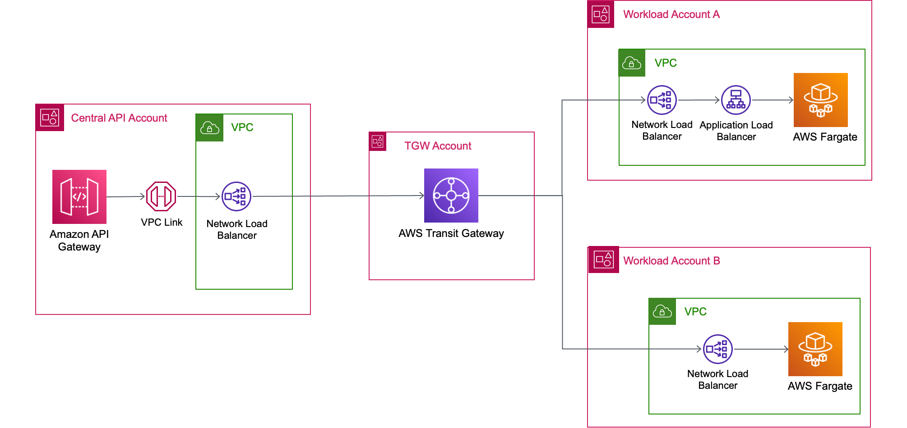
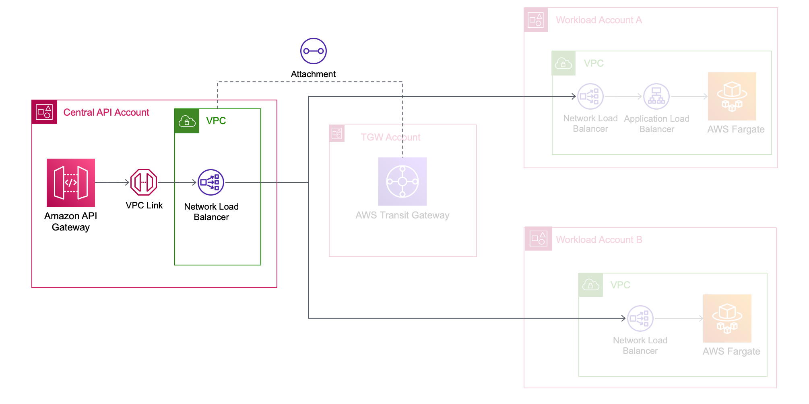
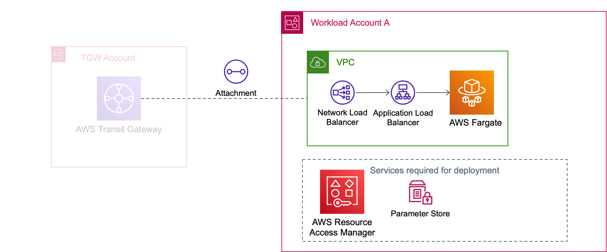
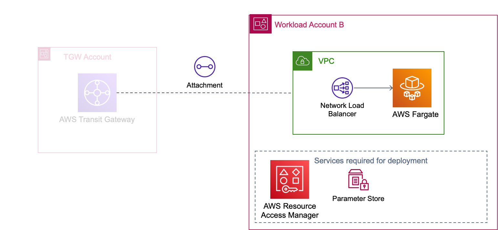
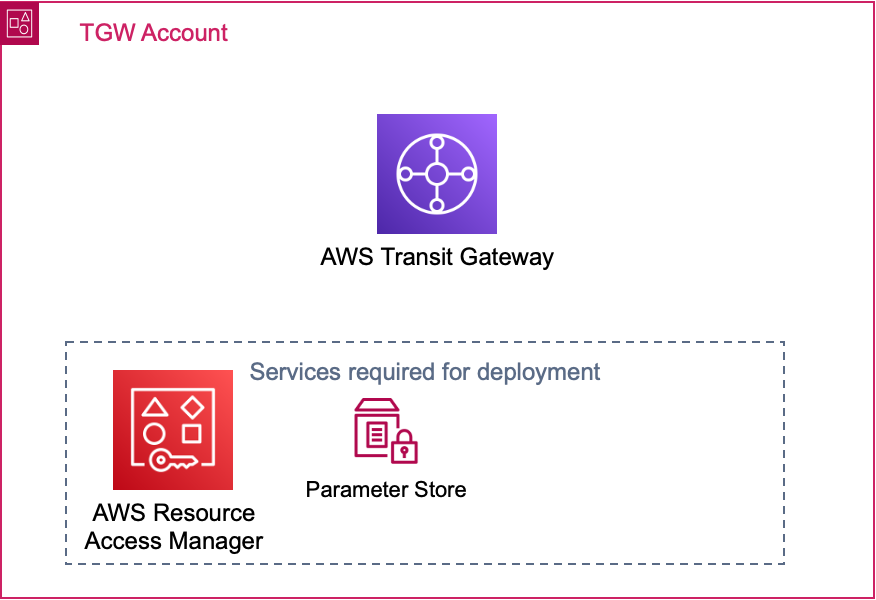

# Multi-account centralized API Gateway with private targets via Transit Gateway

This CDK template implements an Amazon API Gateway REST API, as a front door for two services residing in separate AWS accounts. The pattern shows how this can be implemented with the use of AWS Transit Gateway. The pattern allows for centralized governance and security and provides flexibility to development team to develop their applications in their own accounts.


## Architecture Overview



- The `Central API Account` hosts an API Gateway Regional API which acts as the central API for services in the two workload accounts. A VPC link is created in this account to enable the backend integration to the services in the workload accounts. The VPC link connectivity is established using an NLB, which has 2 target groups consisting of the Elastic Network Interfaces (ENIs) for the NLBs in each workload account.

- In `Workload Account A`, a service is hosted with a Fargate service and an ALB as the backend integration for the central API. An NLB is created to allow connectivity to the ALB of the Fargate service. The NLB is required as it has static IPs which can be used in the target group for the Central API VPC Link's NLB.

- In `Workload Account B`, the other service is hosted with a Fargate service and an NLB as the backend integration for the central API. The Elastic Network Interfaces (ENIs) of the NLB are used as targets for the Central API VPC Link's NLB.

- In the `TGW Account` the AWS Transit Gateway is hosted. The Transit Gateway contains the configurations required to allow connectivity between the VPCs in the Central API, Workload A and Workload B accounts.


## Requirements
* [Four AWS accounts](https://portal.aws.amazon.com/gp/aws/developer/registration/index.html) if you do not already have one and log in. The IAM user that you use must have sufficient permissions to make necessary AWS service calls and manage AWS resources.
* [AWS CLI](https://docs.aws.amazon.com/cli/latest/userguide/install-cliv2.html) installed and configured
* [Git](https://git-scm.com/book/en/v2/Getting-Started-Installing-Git)
* [Node and NPM](https://nodejs.org/en/download)
* [AWS Cloud Development Kit (AWS CDK)](https://docs.aws.amazon.com/cdk/v2/guide/getting_started.html)


## Deployment Instructions

1. Clone the repository
    ```
    git clone https://github.com/aws-samples/serverless-patterns
    ```

1. Navigate to the directory:
    ```
    cd multi-account-central-api-private-targets-tgw-cdk-typescript
    ```

1. Install dependencies:
    ```
    npm install
    ```

1. Open `src/config.json` and modify the cidrs if you require:
    ```
    ...
    "cidrs": {
    "serviceA": "10.5.0.0/16",
    "serviceB": "10.6.0.0/16",
    "centralAPI": "10.7.0.0/16"
    }
    ...
    ```

1. Set Environment Variables:
    ```
    export REGION=ca-central-1
    export CENTRAL_API_ACCOUNT_NUMBER=xxxxxxxxxxxx
    export SERVICE_A_ACCOUNT_NUMBER=xxxxxxxxxxxx
    export SERVICE_B_ACCOUNT_NUMBER=xxxxxxxxxxxx
    export TGW_ACCOUNT_NUMBER=xxxxxxxxxxxx
    ```

1. Configure AWS CDK for each AWS account:
    ```
    cdk bootstrap --profile <your-profile-name> $CENTRAL_API_ACCOUNT_NUMBER/$REGION 
    cdk bootstrap --profile <your-profile-name> $SERVICE_A_ACCOUNT_NUMBER/$REGION 
    cdk bootstrap --profile <your-profile-name> $SERVICE_B_ACCOUNT_NUMBER/$REGION 
    cdk bootstrap --profile <your-profile-name> $TGW_ACCOUNT_NUMBER/$REGION 
    ```

1. Deploy using AWS CDK:
    ```
    cdk deploy TgwStack --profile <your-profile-name>
    cdk deploy ServiceAStack --profile <your-profile-name>
    cdk deploy ServiceBStack --profile <your-profile-name>
    cdk deploy CentralApiStack --profile <your-profile-name>
    ```
## How it works

The CDK application consists of the following 4 stacks.

### CentralApiStack



In this stack, the central Regional REST API is deployed with the VPC, VPC Link, NLB, NLB targets, and the attachment to the Transit Gateway. 

### ServiceAStack



In this stack, the following are deployed: Fargate, ALB, NLB, and Transit Gateway attachment. In addition to these core components, an Advanced Parameter and an AWS Resource Access Manager Share are created to store the NLB ENIs and share them to the `Central API` Account. The Central API Account needs these ENIs to setup the target group for the VPC Link's NLB. 

### ServiceBStack



In this stack, the following are deployed: Fargate, NLB, and Transit Gateway attachment. In addition to these core components, an Advanced Parameter and an AWS Resource Access Manager Share are created to store the NLB ENIs and share them to the `Central API` Account. The Central API Account needs these ENIs to setup the target group for the VPC Link's NLB. 

### TgwStack



In this stack, the Transit Gateway is deployed and shared to the other accounts using AWS Resource Access Manager. In addition to these core components, an Advanced Parameter is created to store the Transit Gateway ID and share to the other accounts. The other accounts need the Transit Gateway ID to create their attachments.

## Testing

Use the following commands to get the Endpoint URL for Service A and Service B.

    ```
    export SERVICE_A_URL=$(aws cloudformation describe-stacks --stack-name CentralApiStack --query "Stacks[0].Outputs[?ExportName=='ServiceAEndpoint'].OutputValue" --output text --profile <your-profile-name>)

    export SERVICE_B_URL=$(aws cloudformation describe-stacks --stack-name CentralApiStack --query "Stacks[0].Outputs[?ExportName=='ServiceBEndpoint'].OutputValue" --output text --profile <your-profile-name>)

    ```


The APIs for both Service A and Service B are the same. Here is a list of available endpoints:

    ```
    GET /swagger (This is for the API definition)
    GET /Demo
    POST /Demo
    GET /Demo/{id}
    PUT /Demo/{id}
    DELETE /Demo/{id}
    ```

Here are example commands that can be used:


1. Get a list of items
    ```
    curl $SERVICE_A_URL/Demo
    curl $SERVICE_B_URL/Demo
    ```

1. Add an item to the data store
    ```
    curl -X POST $SERVICE_A_URL/Demo -d '{"id":"1234", "name":"Service A test"}' -H "Content-Type: application/json"
    curl -X POST $SERVICE_B_URL/Demo -d '{"id":"1234", "name":"Service B test"}' -H "Content-Type: application/json"
    ```

1. Get the item added in step 2
    ```
    curl $SERVICE_A_URL/Demo/1234
    curl $SERVICE_B_URL/Demo/1234
    ```

1. Update the item added in step 2
    ```
    curl -X PUT $SERVICE_A_URL/Demo/1234 -d '{"id":"1234", "name":"This is a test for Service A"}' -H "Content-Type: application/json"
    curl -X PUT $SERVICE_B_URL/Demo/1234 -d '{"id":"1234", "name":"This is a test for Service B"}' -H "Content-Type: application/json"
    ```

1. Delete the item added in step 2
    ```
    curl -X DELETE $SERVICE_A_URL/Demo/1234
    curl -X DELETE $SERVICE_B_URL/Demo/1234
    ```

## Cleanup

1. Destroy the stacks

    ```
    cdk destroy CentralApiStack --profile <your-profile-name>
    cdk destroy ServiceBStack --profile <your-profile-name>
    cdk destroy ServiceAStack --profile <your-profile-name>
    cdk destroy TgwStack --profile <your-profile-name>
    ```

1. Wait for the resources to delete and confirm their removal