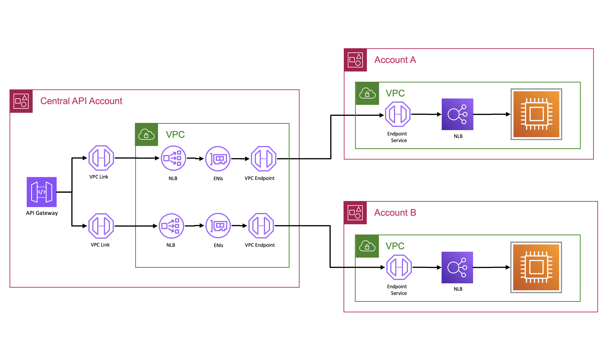

# Building private cross-account APIs using Amazon API Gateway and AWS PrivateLink



## Architecture Overview

This pattern demonstates how to use API Gateway with resources that exist in a different AWS accounts. This allows to expose multiple backend microservices running on various compute services such as Amazon EC2, Amazon Elastic Container Service (ECS), or Amazon Elastic Kubernetes Service.  It integrates securely with different backend services using VPC endpoints powered by AWS PrivateLink.

Learn more about this pattern at Serverless Land Patterns: << Add the live URL here >> 

Important: this application uses various AWS services and there are costs associated with these services after the Free Tier usage - please see the [AWS Pricing page](https://aws.amazon.com/pricing/) for details. You are responsible for any AWS costs incurred. No warranty is implied in this example.

### Requirements

- Three [AWS accounts](https://signin.aws.amazon.com/signup?request_type=register). IAM users or roles with sufficient permissions to make the necessary AWS service calls and manage AWS resources.
- [AWS CLI](https://docs.aws.amazon.com/cli/latest/userguide/getting-started-install.html) installed and configured.
- [AWS Serverless Application Model](https://docs.aws.amazon.com/serverless-application-model/latest/developerguide/install-sam-cli.html)  (AWS SAM) installed.
- Setup .aws/credentials [named profiles](https://docs.aws.amazon.com/cli/latest/userguide/cli-configure-files.html) namely **centralAccount**, **accountA** and **accountB** so you can run CLI and AWS SAM commands against them.

### Deployment Instructions

**Note**: Please make sure to follow the below steps in order to make sure the deployment is successful. 

1.  Create a new directory, navigate to that directory in a terminal and clone the GitHub repository:
    ``` bash
    git clone https://github.com/aws-samples/serverless-pattern
    ```
2. Change directory to the pattern directory:
    ```bash
    cd aws-samples/serverless-patterns/multi-account-private-apigw
    ```

#### AccountA

1. In account A, where you would like to create **ECS Cluster** with **ECS Fargate**, navigate to the `accountA` directory from the main directory and deploy using *(if you are in a different directory, then run `cd ..` before entering the below command)*:
    ```bash
    cd accountA
    
    sam deploy --guided --profile accountA
    ```
2. During the prompts:
    - Enter **Central ApiGateway Account ID**. This will be used to allow Central API Gateway account to access VPC Endpoint Service in this account

    -  Enter **stack name** and desired **AWS Region**.
    -  Allow SAM CLI to create IAM roles with the required permissions.
3. Note the outputs from the SAM deployment process. This contains the `VPCEndpointServiceId`, which will be used as inputs for central account's stack deployment.

<!-- #### AccountB
1. In account B, where you would like to create **private API Gateway** with **Lambda** integration, navigate to the `accountB` directory from the main directory and deploy using *(if you are in a different directory, then run `cd ..` before entering the below command)*:
    ```bash
    cd accountB
    
    sam deploy --guided --profile accountB
    ```
2. During the prompts:
    -  Enter **stack name** and desired **AWS Region**.
    -  Enter **Central Account's VPC ID**. This will be used in the Private API's resource policy. 
    -  Allow SAM CLI to create IAM roles with the required permissions.
3. Note the outputs from the SAM deployment process. This contains the `API Gateway's Invoke URL`, which will be used as inputs for central account's stack deployment. -->

#### Central Account
1. In Central Account, where you would like to create central ** API Gateway**, navigate to the `centralAccount` directory from the main directory and deploy using (if you are in different directory, then run `cd ..` before entering the below command):
    ```bash
    cd centralAccount
    
    sam deploy --guided --profile CentralAccount
    ```
2. During the prompts:
    -  Enter **stack name** and desired **AWS Region**.
    -  Enter **VPCEndpointServiceId** from AccountA
   
    -  Allow SAM CLI to create IAM roles with the required permissions.
3. Note the outputs from the SAM deployment process. This contains `Public API Gateway Endpoint`, 

## How it works
TODO: Update
This pattern utilizes three accounts and their respective templates. 

2. **Central API Account** : Hosts the central components required to manage and route API requests securely across multiple AWS accounts. This template contains:

    - **EC2 Instance**: Serves as an API client to initiate test requests.
    - **Amazon API Gateway (Private)**: A private API Gateway serves as the entry point for API requests.
    - **VPC Link(Private Link)**: Connects the API Gateway to an NLB within the Central Account's VPC, ensuring secure, private connectivity.
    - **Network Load Balancer (NLB)**: Routes incoming traffic from the VPC link to Elastic Network Interfaces (ENIs), forwarding requests to the target VPC Endpoint.
    - **VPC Endpoint**: The endpoint for routing/resolving incoming API requests and provides connectivity to downstream Private API Gateways in other AWS accounts (e.g., Account A and Account B).

3. **Account A** : Hosts a service that provides a simple HTTP response from an NGINX server running on ECS Fargate. This template contains:

    -  **Amazon API Gateway (Private)**: Receives requests from the Central API Account and forwards them as per configured paths and integration.
    -  **VPC Link**: Connects the API Gateway to an internal NLB within Account A.
    -  **Network Load Balancer (NLB)**: Routes traffic from the VPC link to the ECS Fargate service.
    -  **Elastic Container Service (ECS) Fargate**: A containerized NGINX application on ECS Fargate returns a basic HTTP response. This verifies the connectivity and functionality of the architecture.

4. **Account B** : Hosts a Lambda function that return a simple text response to the client. This template contains:
    
    -  **Amazon API Gateway (Private)**: Receives requests from the Central API Account and forwards them as per configured paths and integration.
    -  **AWS Lambda**: The Lambda function processes requests from the API Gateway and returns a simple text response to the client. 

5. **VPC (Optional)**: Creates a VPC with CIDR Range `10.1.0.0/16` with 1 Public subnet and 2 Private subnets. This template contains:
    -  **1 Public Subnet**: The subnet has a direct route to an [internet gateway](https://docs.aws.amazon.com/vpc/latest/userguide/VPC_Internet_Gateway.html). Resources in a public subnet can access the public internet.
    -  **2 Private subnets**: Resources in a private subnet use a [NAT gateway](https://docs.aws.amazon.com/vpc/latest/userguide/vpc-nat.html) to access the public internet.

## Testing
1. Once you have deployed all the Stacks, [connect to your EC2 instance using SSH](https://docs.aws.amazon.com/AWSEC2/latest/UserGuide/connect-to-linux-instance.html) or [using EC2 Instance Connect](https://docs.aws.amazon.com/AWSEC2/latest/UserGuide/connect-linux-inst-eic.html) in **Central Account**.

2. Once you have deployed all the Stacks, open URLs in browser, or run the following `curl` command to test the **/fargate** and **/lambda** path (*replace the URL with your own API GW URL*):
    ```bash
    curl --location 'https://abcdefghij.execute-api.eu-west-1.amazonaws.com/Prod/fargate'
    
    curl --location 'https://abcdefghij.execute-api.eu-west-1.amazonaws.com/Prod/lambda'
    ```

## Cleanup

To avoid incurring future charges, it's important to delete the resources in the correcct order. Follow these steps to clean up the resources created by the four templates *(Make sure to navigate to the directory containing the template before running the below commands)*:

1. Delete Central Account template
    ```bash
    sam delete --stack-name STACK_NAME_CENTRAL_ACCOUNT --profile centralAccount
    ```
2. Delete Account A template 
    ```bash
    sam delete --stack-name STACK_NAME --profile PROFILE_NAME
    ```
3. Delete Account B template 
    ```bash
    sam delete --stack-name STACK_NAME_ACCOUNT_B --profile accountB
    ```


