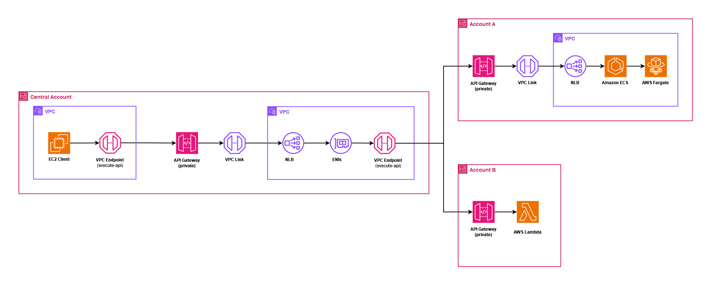

# Enabling East/West Communication in Multi-Account AWS Architectures with Amazon Private API Gateway.



## Architecture Overview

This architecture enables secure, centralized API communications across multiple AWS accounts, facilitating private east/west communication between services. The solution leverages [Amazon Private API Gateway](https://docs.aws.amazon.com/apigateway/latest/developerguide/apigateway-private-apis.html), [Execute-API VPC Endpoint](https://docs.aws.amazon.com/vpc/latest/privatelink/create-interface-endpoint.html),[VPC links](https://aws.amazon.com/blogs/compute/understanding-vpc-links-in-amazon-api-gateway-private-integrations/), and [Network Load Balancer (NLB)](https://docs.aws.amazon.com/elasticloadbalancing/latest/network/introduction.html) to establish a centralized API management model. 

Learn more about this pattern at [Serverless Land Patterns](https://serverlessland.com/patterns/multi-account-private-apigw).

You can update the template to add AWS resources through the same deployment process that updates your application code.

Important: This application uses various AWS Services and there are costs associated with these services after the Free Tier Usage - please see the [AWS Pricing Page](https://aws.amazon.com/pricing/) for more details. You are responsible for any AWS costs incurred. No warranty is implied in this example.

### Requirements

- Three [AWS accounts](https://signin.aws.amazon.com/signup?request_type=register). IAM users or roles with sufficient permissions to make the necessary AWS service calls and manage AWS resources.
- [AWS CLI](https://docs.aws.amazon.com/cli/latest/userguide/getting-started-install.html) installed and configured.
- [AWS Serverless Application Model](https://docs.aws.amazon.com/serverless-application-model/latest/developerguide/install-sam-cli.html)  (AWS SAM) installed.
- Setup .aws/credentials [named profiles](https://docs.aws.amazon.com/cli/latest/userguide/cli-configure-files.html) namely **centralAccount**, **accountA** and **accountB** so you can run CLI and AWS SAM commands against them.
- An [Amazon VPC](https://docs.aws.amazon.com/vpc/latest/userguide/what-is-amazon-vpc.html) with 1 public and 2 private subnets in each account. 

### Deployment Instructions

**Note**: Please make sure to follow the below steps in order to make sure the deployment is successful. 

1.  Create a new directory, navigate to that directory in a terminal and clone the GitHub repository:
    ``` bash
    git clone https://github.com/aws-samples/serverless-pattern
    ```
2. Change directory to the pattern directory:
    ```bash
    cd aws-samples/serverless-patterns/multi-account-private-apigw
    ```

#### VPC (Optional)
1. If you do not have VPCs in your accounts, navigate to the `vpc` directory using *(if you are in a different directory, then run `cd ..` before entering the below command)*:
    ```bash
    cd vpc
    ```
2. From the command line, use AWS SAM to deploy the AWS resources for the pattern as specified in the template.yaml file using **profiles** to specify the accounts:
    ```bash
    sam deploy --guided --profile PROFILE_NAME
    ```
3. During the prompts:
    - Enter **stack name** and desired **AWS Region**.
    - Enter **custom CIDR Ranges** for `VpcCidr`, `PublicSubnetCidr` and `PrivateSubnet1Cidr` or use the **default CIDR ranges** by simply pressing `Enter` key. 
    - Allow SAM CLI to create IAM roles with the required permissions.
    
Once you have run `sam deploy --guided --profile PROFILE_NAME` mode once and saved arguments to a configuration file (samconfig.toml), you can use `sam deploy --profile PROFILE_NAME` in future to use these defaults.

4. Note the outputs from the SAM deployment process. These contain the `VPCId`,`PublicSubnetId`,`PrivateSubnet1Id` and `PrivateSubnet2Id`. These will be used as inputs for other stack deployments. 

#### AccountA

1. In account A, where you would like to create **private API Gateway** with **ECS Fargate** integration, navigate to the `accountA` directory from the main directory and deploy using *(if you are in a different directory, then run `cd ..` before entering the below command)*:
    ```bash
    cd accountA
    
    sam deploy --guided --profile accountA
    ```
2. During the prompts:
    -  Enter **stack name** and desired **AWS Region**.
    -  Enter **current account's VPC ID** where NLB and ECS Fargate will be created. 
    -  Enter **1st and 2nd Private Subnet IDs**.
    -  Enter **Central Account's VPC ID**. This will be used in the Private API's resource policy. 
    -  Allow SAM CLI to create IAM roles with the required permissions.
3. Note the outputs from the SAM deployment process. This contains the `API Gateway Invoke URL`, which will be used as inputs for central account's stack deployment.

#### AccountB
1. In account B, where you would like to create **private API Gateway** with **Lambda** integration, navigate to the `accountB` directory from the main directory and deploy using *(if you are in a different directory, then run `cd ..` before entering the below command)*:
    ```bash
    cd accountB
    
    sam deploy --guided --profile accountB
    ```
2. During the prompts:
    -  Enter **stack name** and desired **AWS Region**.
    -  Enter **Central Account's VPC ID**. This will be used in the Private API's resource policy. 
    -  Allow SAM CLI to create IAM roles with the required permissions.
3. Note the outputs from the SAM deployment process. This contains the `API Gateway's Invoke URL`, which will be used as inputs for central account's stack deployment.

#### Central Account
1. In Central Account, where you would like to create central **private API Gateway**, navigate to the `centralAccount` directory from the main directory and deploy using (if you are in different directory, then run `cd ..` before entering the below command):
    ```bash
    cd centralAccount
    
    sam deploy --guided --profile CentralAccount
    ```
2. During the prompts:
    -  Enter **stack name** and desired **AWS Region**.
    -  Enter **Instance type** either `t2.micro` or `t2.small`
    -  Enter **unique [Amazon Linux 2023 AMI Id](https://docs.aws.amazon.com/AWSEC2/latest/UserGuide/finding-an-ami.html)** from AMI Catalog in the chosen region.
    -  Enter **Allowed IP** from where you can SSH into the EC2 Instance. If left empty, the default CIDR range will be **0.0.0.0/0**
    -  Enter **current account's VPC ID** where NLB and VPC Endpoint will be created.
    -  Enter **Public Subnet ID**.
    -  Enter **1st and 2nd Private Subnet IDs**.
    -  Enter **Account A's Api Gateway URL**. e.g. `https://abcdefghij.execute-api.eu-west-1.amazonaws.com/Prod/`
    -  Enter **Account B's Api Gateway URL**. e.g. `https://abcdefghij.execute-api.eu-west-1.amazonaws.com/Prod/`
    -  Allow SAM CLI to create IAM roles with the required permissions.
3. Note the outputs from the SAM deployment process. This contains `two API Gateway's Invoke URLs`, `EC2KeyPairName` to download key material and `EC2 Public IP` address. 
4. Follow the instructions to [store the key material from AWS System Manager parameter](https://docs.aws.amazon.com/AWSEC2/latest/UserGuide/create-key-pairs.html#create-key-pair-cloudformation) into your local machine. 

## How it works

This pattern utilizes three accounts and their respective templates. 

2. **Central API Account** : Hosts the central components required to manage and route API requests securely across multiple AWS accounts. This template contains:

    - **EC2 Instance**: Serves as an API client to initiate test requests.
    - **Amazon API Gateway (Private)**: A private API Gateway serves as the entry point for API requests.
    - **VPC Link(Private Link)**: Connects the API Gateway to an NLB within the Central Account's VPC, ensuring secure, private connectivity.
    - **Network Load Balancer (NLB)**: Routes incoming traffic from the VPC link to Elastic Network Interfaces (ENIs), forwarding requests to the target VPC Endpoint.
    - **VPC Endpoint**: The endpoint for routing/resolving incoming API requests and provides connectivity to downstream Private API Gateways in other AWS accounts (e.g., Account A and Account B).

3. **Account A** : Hosts a service that provides a simple HTTP response from an NGINX server running on ECS Fargate. This template contains:

    -  **Amazon API Gateway (Private)**: Receives requests from the Central API Account and forwards them as per configured paths and integration.
    -  **VPC Link**: Connects the API Gateway to an internal NLB within Account A.
    -  **Network Load Balancer (NLB)**: Routes traffic from the VPC link to the ECS Fargate service.
    -  **Elastic Container Service (ECS) Fargate**: A containerized NGINX application on ECS Fargate returns a basic HTTP response. This verifies the connectivity and functionality of the architecture.

4. **Account B** : Hosts a Lambda function that return a simple text response to the client. This template contains:
    
    -  **Amazon API Gateway (Private)**: Receives requests from the Central API Account and forwards them as per configured paths and integration.
    -  **AWS Lambda**: The Lambda function processes requests from the API Gateway and returns a simple text response to the client. 

5. **VPC (Optional)**: Creates a VPC with CIDR Range `10.1.0.0/16` with 1 Public subnet and 2 Private subnets. This template contains:
    -  **1 Public Subnet**: The subnet has a direct route to an [internet gateway](https://docs.aws.amazon.com/vpc/latest/userguide/VPC_Internet_Gateway.html). Resources in a public subnet can access the public internet.
    -  **2 Private subnets**: Resources in a private subnet use a [NAT gateway](https://docs.aws.amazon.com/vpc/latest/userguide/vpc-nat.html) to access the public internet.

## Testing
1. Once you have deployed all the Stacks, [connect to your EC2 instance using SSH](https://docs.aws.amazon.com/AWSEC2/latest/UserGuide/connect-to-linux-instance.html) or [using EC2 Instance Connect](https://docs.aws.amazon.com/AWSEC2/latest/UserGuide/connect-linux-inst-eic.html) in **Central Account**.

2. After connecting to the EC2 instance, run the following `curl` command to test the **/fargate** and **/lambda** path (*replace the URL with your own API GW URL*):
    ```bash
    curl --location 'https://abcdefghij.execute-api.eu-west-1.amazonaws.com/Prod/fargate'
    
    curl --location 'https://abcdefghij.execute-api.eu-west-1.amazonaws.com/Prod/lambda'
    ```

## Cleanup

To avoid incurring future charges, it's important to delete the resources in the correcct order. Follow these steps to clean up the resources created by the four templates *(Make sure to navigate to the directory containing the template before running the below commands)*:

1. Delete Account A template 
    ```bash
    sam delete --stack-name STACK_NAME --profile PROFILE_NAME
    ```
2. Delete Account B template 
    ```bash
    sam delete --stack-name STACK_NAME_ACCOUNT_B --profile accountB
    ```
3. Delete Central Account template
    ```bash
    sam delete --stack-name STACK_NAME_CENTRAL_ACCOUNT --profile centralAccount
    ```
