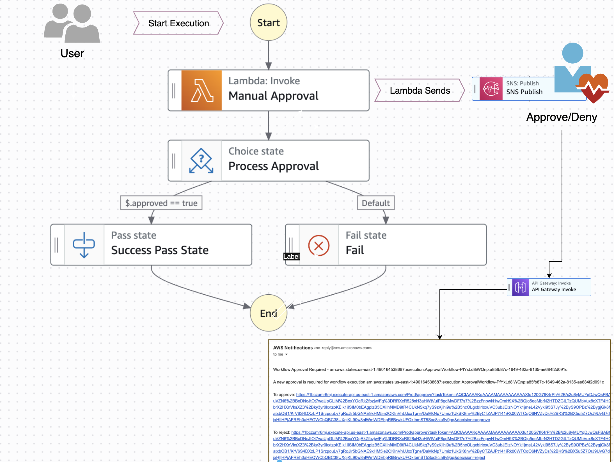

# One Click Manual Approval Workflow in Stepfunction

This pattern creates a serverless approval workflow using AWS Step Functions, Lambda, SNS, and API Gateway. The workflow sends approval requests via email and handles approvals through a REST API endpoint.

## Requirements

* An AWS account with appropriate IAM permissions
* AWS CLI installed and configured
* Git installed
* AWS Serverless Application Model (AWS SAM) CLI installed
* Python 3.13 or later
* A verified email address to receive approval requests

## Deployment Instructions

1. Clone the repository:
```bash
   git clone <repository-url>
   cd serverless-approval-workflow
```

2. Deploy the application:
```bash
    sam build --use-container
    sam deploy --guided
```

During the prompts:
   - Enter a stack name (e.g., approval-workflow)
   - Select your desired AWS Region
   - Enter the email address for receiving approval requests
   - Allow SAM CLI to create IAM roles with required permissions
   - After the initial deployment, subsequent deployments can use sam deploy with the saved configuration (samconfig.toml).

## How it works
1. The workflow starts when a Step Functions state machine execution is initiated
2. A Lambda function sends an approval request via SNS to the specified email address
3. The email contains approve/reject links that point to an API Gateway endpoint
4. When the recipient clicks either link, the API Gateway triggers a Lambda function
5. The Lambda function sends the approval/rejection response back to Step Functions
6. The workflow completes based on the approval decision


## Usage Example and Consideration

This pattern is particularly valuable when you need to incorporate human decision-making into your AWS Step Functions workflows. Here are key use cases and benefits in the context of Step Functions:
- Change management processes
- Release approvals
- Resource provisioning requests
- Access grant workflows
- Content moderation workflows

### Use Cases:
1. **Multi-stage Deployment Pipelines**
   - Pause an automated deployment for manual verification and approval before proceeding to production.

2. **Data Processing Workflows**
   - Allow human verification of processed data before triggering downstream systems.

3. **Resource Provisioning**
   - Require manual approval for provisioning high-cost or sensitive resources within an automated workflow.

4. **Compliance and Governance**
   - Enforce mandatory human sign-off for actions that require oversight due to regulatory or policy requirements eg: when updating IAM policy through Step Function.

5. **Error Handling and Remediation**
   - Incorporate human intervention in complex error scenarios where automated resolution is not possible.


This pattern demonstrates how to enhance your Step Functions workflows with manual approvals, striking a balance between automation and human oversight in critical processes.

Please review Step Functions, Lambda, and API Gateway service quotas before implementation.

## Testing
1. Start a workflow execution:
```bash
    # Get the State Machine ARN
    export STATE_MACHINE_ARN=$(aws cloudformation describe-stacks \
        --stack-name approval-workflow \
        --query "Stacks[0].Outputs[?OutputKey=='StateMachineArn'].OutputValue" \
        --output text)
```
```bash
    # Start execution
    aws stepfunctions start-execution \
        --state-machine-arn $STATE_MACHINE_ARN \
        --input "{\"key\": \"value\"}"
```
    

2. Check your email for the approval request

3. Click the approve or reject link in the email

4. Check the execution status:
```bash
    aws stepfunctions describe-execution --execution-arn <execution-arn>
```

    
## Expected Output

Clicking the API Gateway Url from the approval mail will have below output based on approval status:

API response when approved:
```bash
{
  "message": "Workflow approved successfully"
}
```

API response when rejected
```bash
{
  "message": "Workflow rejected"
}
```
    
## Cleanup
Delete the stack using SAM:

```bash   
sam delete
```   
Note:

- Confirm when prompted to delete the stack and its resources
- You may need to manually delete any SNS subscriptions
- Use sam delete --no-prompts to skip confirmation steps

Important: This application uses various AWS services that may incur costs beyond the AWS Free Tier. Please review the AWS Pricing page for details. You are responsible for any AWS costs incurred. No warranty is implied in this example.

For additional information about AWS Step Functions service integrations, see the [AWS Step Functions Developer Guide](https://docs.aws.amazon.com/step-functions/latest/dg/connect-to-resource.html).