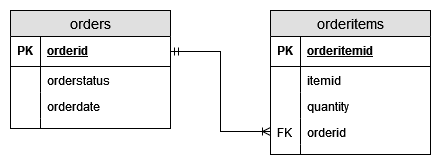
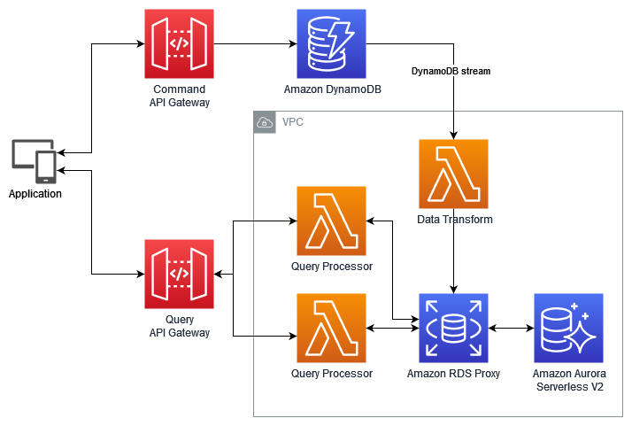
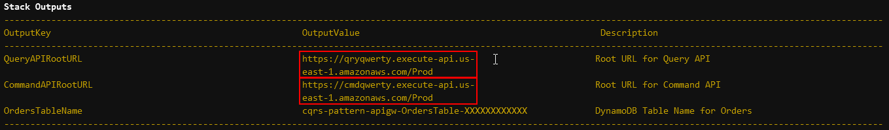

# CQRS Design Pattern

This pattern demonstrates how to implement [the command query responsibility segregation (CQRS) design pattern](https://docs.aws.amazon.com/prescriptive-guidance/latest/modernization-data-persistence/cqrs-pattern.html) using [Serverless services](https://aws.amazon.com/serverless/).

The Architecture consist of two [Amazon API Gateway](https://aws.amazon.com/api-gateway/)s: One for Command and one for Query service. Command service uses a [Amazon DynamoDB](https://aws.amazon.com/dynamodb/) table to persist command data directly from API Gateway. An [AWS Lambda](https://aws.amazon.com/lambda/) function then gets the updates from a [Amazon DynamoDB Streams](https://docs.aws.amazon.com/amazondynamodb/latest/developerguide/Streams.html) and transforms the model to relational form and stores data in [Amazon Aurora Serverless](https://aws.amazon.com/rds/aurora/serverless/) DB instance. On the query service, API Gateway exposes two sample methods which integrate with two Lambda functions. Lambda functions executes queries from Aurora Serverless DB and returns query results as response to API requests. [Amazon RDS Proxy](https://aws.amazon.com/rds/proxy/) is used in front of Aurora Serverless to increase scalibility and security.

Important: this application uses various AWS services and there are costs associated with these services after the Free Tier usage - please see the [AWS Pricing page](https://aws.amazon.com/pricing/) for details. You are responsible for any AWS costs incurred. No warranty is implied in this example.

## Requirements

* [Create an AWS account](https://portal.aws.amazon.com/gp/aws/developer/registration/index.html) if you do not already have one and log in. The IAM user that you use must have sufficient permissions to make necessary AWS service calls and manage AWS resources.
* [AWS Command Line Interface (AWS CLI)](https://docs.aws.amazon.com/cli/latest/userguide/install-cliv2.html) installed and configured
* [Git Installed](https://git-scm.com/book/en/v2/Getting-Started-Installing-Git)
* [AWS Serverless Application Model](https://docs.aws.amazon.com/serverless-application-model/latest/developerguide/serverless-sam-cli-install.html) (AWS SAM) installed

## Deployment Instructions

1. Create a new directory, navigate to that directory in a terminal and clone the GitHub repository:
    ``` 
    git clone https://github.com/aws-samples/serverless-patterns
    ```
1. Change directory to the pattern directory:
    ```
    cd cqrs-pattern-apigw
    ```
1. From the command line, use AWS SAM to deploy the AWS resources for the workflow as specified in the template.yaml file:
    ```
    sam build
    sam deploy --guided
    ```
1. During the prompts:
    * Enter a stack name
    * Enter the desired AWS Region
    * Allow SAM CLI to create IAM roles with the required permissions.

    Once you have run `sam deploy --guided` mode once and saved arguments to a configuration file (samconfig.toml), you can use `sam deploy` in future to use these defaults.

1. Note the outputs from the SAM deployment process. These contain the resource names and/or ARNs which are used for testing. Aurora Serverless DB Instance provisioning may take some time to complete and your `sam deploy --guided` command may time out due to expired token. This would not prevent deployment as stack creation will continue in the background. If that happens, you may check the deployment status in the [AWS CloudFormation](https://aws.amazon.com/cloudformation/) console. Once the deployment is completed, you can run `sam list stack-outputs --stack-name <stack-name>` command to see the outputs.

## How it works

The scenario includes a basic order creation and reporting application. Orders are received as a POST request to a REST API, including line items and persisted on a data store. Queries are exposed with a different REST API as a GET request and queried from the data source and results are returned as JSON. For the purpose of CQRS pattern, queries has data access patterns different than the order structure.

A sample order data would look like below:

```json
{
	"orderId": "6119",
	"items" : [
		{
		 "itemid": "z3333",
		 "quantity": 6
		},
		{
		 "itemid": "z4444",
		 "quantity": 3
		}
    ]
}

```

As example queries has data access requirements using order items as primary entity and requires aggregation, data will be copied to a relational database for easier processing. After normalizing the order data, the resulting database schema on the relational database would look like below:



On the query side, there are two queries defined. *Item Sales Report* is just a simplified query that lists all the `itemid`’s and the total quantities ordered:

```sql
SELECT a.itemid, SUM(a.quantity) as totalordered, DATE_FORMAT(MAX(b.orderdate),'%Y-%m-%d') as lastorderdate
FROM orderitems a LEFT JOIN orders b ON a.orderid = b.orderid
GROUP BY a.itemid;

```

A second query includes the parameter of `itemid`, and gets all the item sales per month:

```sql
SELECT DATE_FORMAT(b.orderdate,'%M %Y') as monthyear, SUM(a.quantity) as monthlyordered
FROM orderitems a LEFT JOIN orders b ON a.orderid = b.orderid
WHERE itemid = <itemid parameter>
GROUP BY year(b.orderdate),month(b.orderdate)
ORDER BY b.orderdate DESC;

```
The overall architecture of the solution is explained below:



CQRS pattern seperates command part of a system from the query part. It is useful for scenarios where updates and queries have different requirements in terms of throughput, latency, or consistency. In order to achieve the seperation, two API Gateways are used in this architecture. 

Command service in this architecture is simplified to a API Gateway that receives order details as a POST request, transforms and persist data in a DynamoDB table. 

For report queries, a relational database would provide more flexibility so Aurora Serverless v2 is chosen. In order to capture changes on DynamoDB table, DynamoDB Streams is used. A Lambda function, triggered by events on DynamoDB stream, performs the required transformation on the data and inserts it to Aurora Serverless. For simplicity only processing of INSERT events is implemented. 

Query service of the pattern consists of an API Gateway and two Lambda functions. Query requests are received as GET requests and executed by two Lambda functions, which run queries against Aurora Serverless database.

A RDS Proxy is used between all Lambda functions and Aurora Serverless to provide scalibility for database connections and additional layer of security. 

As in any architectural pattern, CQRS can help you to solve specific problems but may not be suitable for all cases. It is useful for scenarios where write operations are considerably complex, read queries may benefit from a different schema then the write model or if your system has different scalibility, reliablity or latency requirements. However it also increases the complexity of the system considerably and usually brings in eventually consistent read store. For those reasons, use of CQRS needs to be cautiously evaluated and ideally applied only specific subdomains of your system that would benefit from it.

## Testing

To test the deployed architecture, you will need to make HTTP POST and GET request to the Command and Query endpoints. Examples provided below uses Curl, but you can use any other tool as well.

You will need the URL's for Command and Query API Gateway endpoints to make the requests. You can get those information from the output of the `sam deploy` or `sam list stack-outputs --stack-name <stack-name>` command specified with *CommandAPIRootURL* and *QueryAPIRootURL* keys:



or from the CloudFormation stack outputs: 


You can find the commands to send example command and query below. To use those commands, you need to set an environment variable that holds API Gateway URLs. Use the command for your platform below and replace `<Root URL for Command API>` and `<oot URL for Query API>` with respective values you have obtained in the previous step:

***For Linux and MacOS:***

```bash
export AWS_CQRS_COMMAND_ROOT_URL=<Root URL for Command API>
export AWS_CQRS_QUERY_ROOT_URL=<Root URL for Query API>
```

***For Windows Command Prompt:***

```cmd
set AWS_CQRS_COMMAND_ROOT_URL=<Root URL for Command API>
set AWS_CQRS_QUERY_ROOT_URL=<Root URL for Query API>
```

After setting the API Gateway URLs, you can run the commands below to send the example events. For a request that will insert the Order to DynamoDB, you can use the command below:

***For Linux and MacOS:***

```bash
curl -H "Content-Type: application/json" -X POST -d "{\"orderId\":\"6119\",\"items\":[{\"itemid\":\"z3333\",\"quantity\":6},{\"itemid\":\"z4444\",\"quantity\":3}]}" $AWS_CQRS_COMMAND_ROOT_URL
```

***For Windows Command Prompt:***

```cmd
curl -H "Content-Type: application/json" -X POST -d "{\"orderId\":\"6119\",\"items\":[{\"itemid\":\"z3333\",\"quantity\":6},{\"itemid\":\"z4444\",\"quantity\":3}]}" %AWS_CQRS_COMMAND_ROOT_URL%
```

You can check the DynamoDB table to confirm the order sent is inserted.

In order to send a request for Query, you can use the example commands below:

***For Linux and MacOS:***

```bash
curl ${AWS_CQRS_QUERY_ROOT_URL}/itemSalesReport
curl ${AWS_CQRS_QUERY_ROOT_URL}/monthlySalesByItem/z3333
```

***For Windows Command Prompt:***

```cmd
curl %AWS_CQRS_QUERY_ROOT_URL%/itemSalesReport
curl %AWS_CQRS_QUERY_ROOT_URL%/monthlySalesByItem/z3333
```

## Cleanup
 
1. Delete the stack
    ```bash
    sam delete
    ```
1. Confirm the stack has been deleted
    ```bash
    aws cloudformation list-stacks --query "StackSummaries[?contains(StackName,'STACK_NAME')].StackStatus"
    ```

Please note that CloudFormation stack deletion may take some time due to cleanup of VPC connected Lambda functions. 

----
Copyright 2022 Amazon.com, Inc. or its affiliates. All Rights Reserved.

SPDX-License-Identifier: MIT-0
