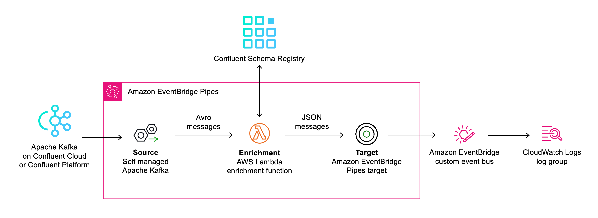

# Event schema validation for Apache Kafka with EventBridge Pipes and Confluent Schema Registry

This pattern allows you to perform event schema validation for events consumed by [Amazon EventBridge Pipes](https://docs.aws.amazon.com/eventbridge/latest/userguide/eb-pipes.html) from a [self managed Apache Kafka stream as source](https://docs.aws.amazon.com/eventbridge/latest/userguide/eb-pipes-kafka.html) using [Confluent Schema Registry](https://gitlab.aws.dev/pbv/pipes-schema-validation).

Learn more about this pattern at Serverless Land Patterns: https://serverlessland.com/patterns/pipes-schema-validation-confluent

Important: this application uses various AWS services and there are costs associated with these services after the Free Tier usage - please see the [AWS Pricing page](https://aws.amazon.com/pricing/) for details. You are responsible for any AWS costs incurred. No warranty is implied in this example.

## Requirements

- [Create an AWS account](https://portal.aws.amazon.com/gp/aws/developer/registration/index.html) if you do not already have one and log in. The IAM user that you use must have sufficient permissions to make necessary AWS service calls and manage AWS resources.
- [AWS CLI](https://docs.aws.amazon.com/cli/latest/userguide/install-cliv2.html) installed and configured
- [Git Installed](https://git-scm.com/book/en/v2/Getting-Started-Installing-Git)
- [AWS Cloud Development Kit (AWS CDK)](https://aws.amazon.com/cdk/) installed
- [Confluent Cloud](https://www.confluent.io/confluent-cloud/) or [Confluent Platform](https://docs.confluent.io/platform/current/platform.html) Kafka cluster with [Confluent Schema Registry](https://docs.confluent.io/platform/current/schema-registry/index.html) set up.

## Deployment instructions

### Create Confluent secrets

1. Store your Confluent secrets in a secret called `confluent-secret` in AWS Secrets Manager in the AWS Region you want to set up the EventBridge pipe.

   Make sure the plaintext secret matches the following format:

   ```json
   {
     "username": "<username>",
     "password": "<password>"
   }
   ```

   For Confluent Cloud, the `username` and `password` correspond to API `Key` and `Secret` respectively. See [API Keys to Control Access in Confluent Cloud](https://docs.confluent.io/cloud/current/access-management/authenticate/api-keys/api-keys.html) for details.

1. Create a secret called `confluent-schema-registry-secret` for the Confluent Cloud Schema Registry endpoint and credentials in the AWS Region you want to set up the EventBridge pipe.

   Make sure the plaintext secret fits the following format:

   ```json
   {
     "url": "https://<schema registry endpoint>",
     "username": "<username>",
     "password": "<password>"
   }
   ```

See the [EventBridge Pipes User Guide](https://docs.aws.amazon.com/eventbridge/latest/userguide/eb-pipes-kafka.html) for more authentication options.

### Deploy with CDK

1. Create a new directory, navigate to that directory in a terminal and clone the GitHub repository:

   ```bash
   git clone https://github.com/aws-samples/serverless-patterns
   ```

1. Change directory to the pattern directory:

   ```bash
   cd pipes-schema-validation-confluent
   ```

1. Create a `virtualenv`:

   ```bash
   python3 -m venv .venv
   ```

1. Activate the `virtualenv`:

   ```bash
   source .venv/bin/activate
   ```

1. Once the `virtualenv` is activated, install the required dependencies:

   ```bash
   pip install -r requirements.txt
   ```

1. You can now synthesize the CloudFormation template for this code:

   ```bash
   cdk synth
   ```

1. Deploy the CDK stack and provide the necessary parameters:

   ```bash
   cdk deploy \
      --parameters bootstrapserver=smk://<Kafka cluster bootstrap server endpoint>:9092 \
      --parameters topicname=<Kafka topic name> \
      --parameters secretarn=arn:aws:secretsmanager:<AWS Region>:<AWS account ID>:secret:<secret name>
   ```

   - `bootstrapserver`: your Kafka cluster endpoint.
   - `topicname`: name of the Kafka topic that EventBridge Pipes should poll messages from.
   - `secretarn`: ARN of the `confluent-secret` you created in AWS Secrets Manager earlier.

1. Confirm that the outputs of the deployment look like this:

   ```bash
   kafka-confluent-validate.CloudWatchloggroupname = kafka-confluent-validate-LogGroupD9735569-ABC123
   kafka-confluent-validate.EnrichmentLambdaDLQ = kafka-confluent-validate-dlq09C78ACC-ABC123
   kafka-confluent-validate.EnrichmentLambdafunctionname = kafka-confluent-validate-kafkaconfluentvaldiateA4B-ABC123
   kafka-confluent-validate.EventBridgePipe = arn:aws:pipes:<AWS Region>:<AWS account ID>:pipe/pipe-123abc
   kafka-confluent-validate.Targetservicebusname = kafkaconfluentvalidateEventBusABC123
   ```

## Configuring the EventBridge pipe

EventBridge Pipes allows you to configure how message are consumed from your Kafka stream via several parameters. Adjust these paramters in the CDK stack by editing the [CfnPipe](https://docs.aws.amazon.com/cdk/api/v2/python/aws_cdk.aws_pipes/CfnPipe.html) resource:

- `maximum_batching_window_in_seconds`: the maximum length of a time to wait for events.
- `batch_size`: the maximum number of records to include in each batch.
- `starting_position`: the position in a stream from which to start reading.

See [Pipes batching and concurrency](https://docs.aws.amazon.com/eventbridge/latest/userguide/eb-pipes-batching-concurrency.html) for details.

## How it works



This pattern sets up an EventBridge pipe with the following key elements:

1. The **source** of the pipe is a Kafka cluster deployed Confluent Platform or Confluent Cloud. EventBridge Pipes reads messages from the Kafka stream in batches and provides these to the enrichment function as an event payload.

1. The **enrichment** step of the pipe consists of a Lambda function that validates the incoming messages against Confluent Schema Registry and deserializes the message from Avro before returning it.

1. The **target** of this pattern is an EventBridge custom event bus which is synchronously invoked by EventBridge Pipes with the events returned by the enrichment Lambda function. EventBridge Pipes supports a variety of other targets, including Lambda, AWS Step Functions, Amazon API Gateway, API destinations, and more.

The Python enrichment function uses the [`confluent-kafka`](https://github.com/confluentinc/confluent-kafka-python) library for schema validation and Avro deserialization. It uses [Powertools for AWS Lambda (Python)](https://docs.powertools.aws.dev/lambda/python/latest/) to implement Serverless best practices such as logging, tracing, secrets handling, typing, and JSON schema validation for incoming requests.

The function performs the following tasks:

1. For each event in the batch passed to the function, it validates that all expected fields (such as `topic` , `key`, and `value`) are present using the [Powertools validation utility](https://docs.powertools.aws.dev/lambda/python/latest/utilities/validation/).

1. In the messages polled by the EventBridge pipe from the Kafka stream, the `key` and `value` of the message are Base64 encoded. Therefore, for each message contained in the batch passed to the function, the function decodes both the `key` and the `value`.

1. The message `value` is deserialized using the `confluent-kafka` [`AvroDeserializer`](https://docs.confluent.io/platform/current/clients/confluent-kafka-python/html/index.html#schemaregistry-avro-deserializer).

1. The function returns a list of deserialized messages to the EventBridge pipe, which will then invoke the target for each of them.

1. Messages for which processing failed are sent to an Amazon SQS dead letter queue.

## Testing

1. Set up Confluent Schema Registry and define a schema.

1. Set up a Kafka producer that serializes messages using the Confluent Schema Registry. You can use the [Datagen Source Connector](https://www.confluent.io/hub/confluentinc/kafka-connect-datagen) to produce mock data.

1. Deploy this pattern using the above deployment instructions. The EventBridge pipe will start polling messages from the Kafka stream.

   Polled message batches are passed to the enrichment Lambda function and have the following format:

   ```json
   [
     {
       "topic": "topic_0",
       "partition": 3,
       "offset": 261350,
       "timestamp": 1692625627671,
       "timestampType": "CREATE_TIME",
       "key": "MTU3MDI4Mg==",
       "value": "AAABhqG86azdhFjU178BDkl0ZW1fNzgCPOBEGU8XQA5DaXR5XzU5DFN0YXRlX/rsCg==",
       "headers": [
         // ...
       ],
       "bootstrapServers": "smk://<Kafka cluster bootstrap server endpoint>",
       "eventSource": "SelfManagedKafka",
       "eventSourceKey": "topic_0-3"
     },
     {
       "topic": "topic_0",
       "partition": 1,
       "offset": 261940,
       "timestamp": 1692625627512,
       "timestampType": "CREATE_TIME",
       "key": "MTU3MDI4MQ==",
       "value": "AAABhqHU7qOY1lfS178BDEl0ZW1fMzdmq+Md6hpADkNpdHlfMzgQU3RhdGVfNzak0wg=",
       "headers": [
         // ...
       ],
       "bootstrapServers": "smk://<Kafka cluster bootstrap server endpoint>",
       "eventSource": "SelfManagedKafka",
       "eventSourceKey": "topic_0-1"
     }
   ]
   ```

1. You can confirm the successful deserialization of messages by the enrichment Lambda function in in CloudWatch Logs (see [Accessing Amazon CloudWatch logs for AWS Lambda](https://docs.aws.amazon.com/lambda/latest/dg/monitoring-cloudwatchlogs.html) for instructions):

   ```json
   {
     "topic": "topic_0",
     "key": "1570282",
     "value": {
       "ordertime": 1512463243870,
       "orderid": 1570282,
       "itemid": "Item_78",
       "orderunits": 5.827244831262762,
       "address": {
         "city": "City_59",
         "state": "State_",
         "zipcode": 88893
       }
     }
   }
   ```

1. The example target of this pattern is an EventBridge custom event bus that sends all incoming messages to a CloudWatch Logs log group. Therefore, you can confirm the successful delivery of the messages to the target by checking the log group. The name of the log group is available in the CDK deployment outputs as `kafka-confluent-validate.TargetCloudWatchloggroupname`.

   ```json
   {
     "version": "0",
     "id": "05b30da6-a23f-5a2e-c7cd-6268b7cada91",
     "detail-type": "Event from SelfManagedKafka",
     "source": "Pipe pipe-09cskCabc123",
     "account": "217510216024",
     "time": "2023-08-21T15:36:24Z",
     "region": "us-east-1",
     "resources": [],
     "detail": {
       "topic": "topic_0",
       "key": "1571307",
       "value": {
         "ordertime": 1489840159594,
         "orderid": 1571307,
         "itemid": "Item_154",
         "orderunits": 2.249184025016022,
         "address": {
           "city": "City_7",
           "state": "State_",
           "zipcode": 10485
         }
       }
     }
   }
   ```

## Cleanup

Delete the CDK stack:

```bash
cdk destroy
```

---

Copyright 2023 Amazon.com, Inc. or its affiliates. All Rights Reserved.

SPDX-License-Identifier: MIT-0
