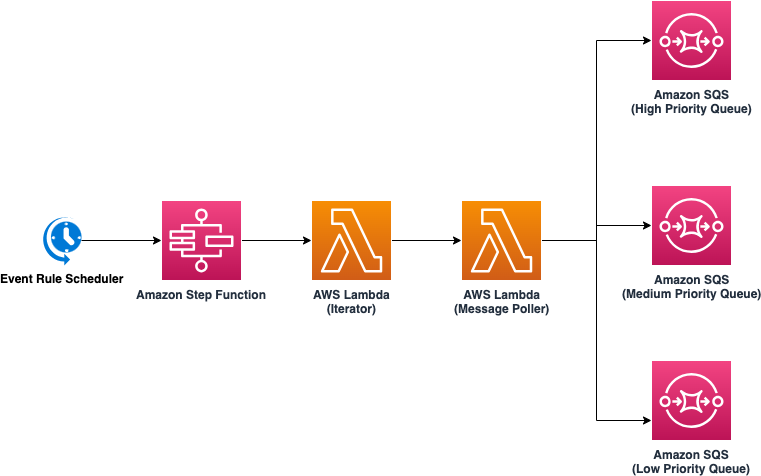
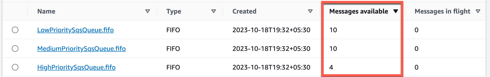

# Priority Queue Pattern using Amazon SQS

This sample project showcases Priority Queue Pattern using AWS Serverless services. There are three priorities - High, Medium and Low. The project demonstrates the behavior using both standard and FIFO SQS Queues. Lambda is used as consumer of the messages from SQS queues. The objective is to first process the messages from High priority queue and only if there is no messages in High priority queue, process from Medium and subsequently from Low priority queue if no more messages left on High and Medium priority queues. As it is observed in the results, FIFO queue performs much better in maintaining the priority however Standard queue might not be able to maintain the priority in some instances as the ordering of the messages is on best effort basis.

Learn more about this pattern at Serverless Land Patterns: https://serverlessland.com/patterns/eventbridge-scheduled-lambda

Important: this application uses various AWS services and there are costs associated with these services after the Free Tier usage - please see the [AWS Pricing page](https://aws.amazon.com/pricing/) for details. You are responsible for any AWS costs incurred. No warranty is implied in this example.

## Requirements

* [Create an AWS account](https://portal.aws.amazon.com/gp/aws/developer/registration/index.html) if you do not already have one and log in. The IAM user that you use must have sufficient permissions to make necessary AWS service calls and manage AWS resources.
* [AWS CLI](https://docs.aws.amazon.com/cli/latest/userguide/install-cliv2.html) installed and configured
* [Git Installed](https://git-scm.com/book/en/v2/Getting-Started-Installing-Git)
* [AWS Serverless Application Model](https://docs.aws.amazon.com/serverless-application-model/latest/developerguide/serverless-sam-cli-install.html) (AWS SAM) installed

## IMPORTANT
The deployed Lambda function is called every 10 seconds. So, **please delete the resources or stop the scheduler** once the testing is done to avoid charges. 

## Deployment Instructions

1. Create a new directory, navigate to that directory in a terminal and clone the GitHub repository:
    ``` 
    git clone https://github.com/aws-samples/serverless-patterns
    ```
2. Change directory to the pattern directory:
    ```
    cd priority-queue-sam
    ```
3. From the command line, use AWS SAM to deploy the AWS resources for the pattern as specified in the template.yml file:
    ```
    sam deploy --guided
    ```
4. During the prompts:
    * Enter a stack name
    * Enter the desired AWS Region
    * Allow SAM CLI to create IAM roles with the required permissions.

    Once you have run `sam deploy -guided` mode once and saved arguments to a configuration file (samconfig.toml), you can use `sam deploy` in future to use these defaults.

5. Note the outputs from the SAM deployment process. These contain the SQS queue URLs which are used for testing.

## How it works

The Step Function invokes the iterator Lambda Function once every 1 minute. The iterator Lambda function invokes the Poller Lambda function every 10 seconds. The Poller Lambda function has logic to first read from the high priority queue. If there is no more messages on high priority queue, then read from the medium priority queue. Subsequently, if there is no more messages in the medium priority queue (as well as in the high priority queue), then read from Low priority queue. The same architecture can be extended to any number of priorities. 


## Testing

The template deploys the pattern using both Standard and FIFO queue. 
1. After running `sam deploy --guided`, make a note of the SQS URLs. You will need to provide them in the next steps. 
2. Update the `push-messages-to-fifo-queues.sh` and `push-messages-to-standard-queues.sh` files with FIFO and Standard queue URLs respectively. You can also optionally change the number of messages to be published.
3. Run the `push-messages-to-fifo-queues.sh` and/ or `push-messages-to-standard-queues.sh`
     ```
    bash push-messages-to-fifo-queues.sh
    ```
    ```
    bash push-messages-to-standard-queues.sh
    ```
4. If you have pushed messages using `push-messages-to-fifo-queues.sh` in the above step, then go to the [AWS SQS Console](https://console.aws.amazon.com/sqs/v2/home) page and search for the queue with name `HighPrioritySqsQueue.fifo`, `MediumPrioritySqsQueue.fifo` and `LowPrioritySqsQueue.fifo`. Keep refreshing this page in every 10 seconds and validate the number of messages are first read from the High priority queue, then medium priority queue and then low priority queue. 


5. Similarly, if you have pushed messages using `push-messages-to-standard-queues.sh` in the above step, then go to the [AWS SQS Console](https://console.aws.amazon.com/sqs/v2/home) page and search for the queue with name `HighPrioritySqsQueue`, `MediumPrioritySqsQueue` and `LowPrioritySqsQueue`. Keep refreshing this page in every 10 seconds and validate the number of messages. Unlike the FIFO queues, you may find some of the lower priority messages are read before high priority messages as the messages ordering is not gauranteed in standard queues. 

6. Optionally, you can also go to the Lambda console. Find your Lambda function, and open the CloudWatch logs. You will see the processed messages are logged. 

## Cleanup
 
1. Delete the stack
    ```bash
    sam delete
    ```
----
Copyright 2023 Amazon.com, Inc. or its affiliates. All Rights Reserved.

SPDX-License-Identifier: MIT-0
