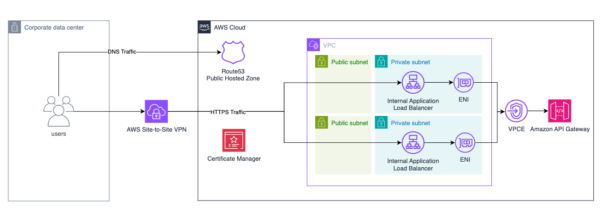

# Amazon Private API Gateway with VPC Endpoints and Public Domain

This pattern creates an Amazon Private API Gateway that is only accessible through VPC endpoints, with public custom domain name resolution for internal only access through an Amazon internal Application Load Balancer.

This architecture is intended for use cases which require private APIs, which are only accessible from on-premises via VPN or Direct Connect, while the DNS can be resolved publicly.

Learn more about this pattern at Serverless Land Patterns: [https://serverlessland.com/patterns/private-apigw-custom-domain](https://serverlessland.com/patterns/private-apigw-custom-domain)

Important: this application uses various AWS services and there are costs associated with these services after the Free Tier usage - please see the [AWS Pricing page](https://aws.amazon.com/pricing/) for details. You are responsible for any AWS costs incurred. No warranty is implied in this example.

## Project Structure

```
├── app.py                          # CDK app entry point
├── cdk.json                        # CDK configuration
├── requirements.txt                # Python dependencies
├── private_api_gateway/
│   ├── __init__.py
│   └── private_api_gateway_stack.py # Main stack definition
└── README.md                       # This file
```
## Architecture

- **VPC**: 10.0.0.0/16 with DNS support
- **Subnets**: 2 public + 2 private subnets across 2 AZs
- **NAT Gateway**: Managed by CDK in public subnets
- **Private API Gateway**: PetStore sample API with VPC endpoint restriction
- **Application Load Balancer**: Internal ALB for SSL termination
- **Lambda Automation**: Custom resource for VPC endpoint target registration



## Requirements
Create an AWS account if you do not already have one and log in. The IAM user that you use must have sufficient permissions to make necessary AWS service calls and manage AWS resources.

* [Create an AWS account](https://portal.aws.amazon.com/gp/aws/developer/registration/index.html) if you do not already have one and log in. The IAM user that you use must have sufficient permissions to make necessary AWS service calls and manage AWS resources.
* [AWS CLI](https://docs.aws.amazon.com/cli/latest/userguide/install-cliv2.html) installed and configured
* [Git Installed](https://git-scm.com/book/en/v2/Getting-Started-Installing-Git)
* [AWS Cloud Development Kit](https://docs.aws.amazon.com/cdk/v2/guide/getting-started.html) (AWS CDK) installed
* [Amazon Route 53](https://docs.aws.amazon.com/Route53/latest/DeveloperGuide/dns-configuring.html) configured as DNS service and public hosted zone created 
* [Public Certificate](https://docs.aws.amazon.com/acm/latest/userguide/acm-public-certificates.html) requested in Amazon Certificate Manager (ACM)
* [Python 3.12+](https://www.python.org/downloads/) installed


## Deployment Instructions

### 1. Install Dependencies
```bash
# Create virtual environment
python3 -m venv .venv

# Activate virtual environment
source .venv/bin/activate  # or your venv activation command

# Install CDK dependencies
pip install -r requirements.txt
```

### 2. Get Parameters

You must provide both context parameters:

1. **domain_name**: Your custom domain name (e.g., api.example.com)
2. **certificate_arn**: ARN of your ACM certificate that covers the domain

### 3. CDK Deployment

```bash
# Deploy with both required parameters
cdk deploy \
  -c domain_name=api.example.com \
  -c certificate_arn=arn:aws:acm:region:account:certificate/certificate-id

# Example with subdomain
cdk deploy \
  -c domain_name=privateapi.mycompany.com \
  -c certificate_arn=arn:aws:acm:region:account:certificate/<certificate-id>
```

#### CDK Output

The stack provides this output:
- **ALBDNSName**: ALB DNS name for CNAME record


### 4. DNS Configuration

After deployment, you must create a DNS record in your domain's hosted zone:

1. **Get ALB DNS name** from CDK output
2. **Create CNAME record**:
   ```
   api.example.com -> internal-alb-xxx.region.elb.amazonaws.com
   ```

## Testing

Test from within the VPC (EC2 instance or Client VPN):
```bash
curl https://api.example.com/pets
curl https://api.example.com/pets/2
```

### Expected Responses
```json
# GET /pets
[
  {"id": 1, "type": "dog", "price": 249.99},
  {"id": 2, "type": "cat", "price": 124.99},
  {"id": 3, "type": "fish", "price": 0.99}
]

# GET /pets/2
{
  "id": 2,
  "type": "cat", 
  "price": 124.99
}
```

## Security Features

- API only accessible through VPC endpoint
- Security groups restrict access to VPC and Client VPN ranges
- ALB provides SSL termination with your certificate
- Resource policies enforce VPC endpoint access only

## Troubleshooting

### Certificate Issues
- Ensure certificate is in the same region
- Verify certificate covers your domain name
- Check certificate validation status

### DNS Issues
- Verify CNAME or ALIAS record points to ALB DNS name
- Check DNS propagation with `nslookup your-domain.com`
- Ensure you have DNS management access for your domain

### Target Registration
- Manually check target group health in AWS Console
- Verify VPC endpoint has network interfaces created

## Cleanup

# Destroy

```bash
cdk destroy -c domain_name=api.example.com -c certificate_arn=YOUR-CERT-ARN
```
----
Copyright 2024 Amazon.com, Inc. or its affiliates. All Rights Reserved.

SPDX-License-Identifier: MIT-0

