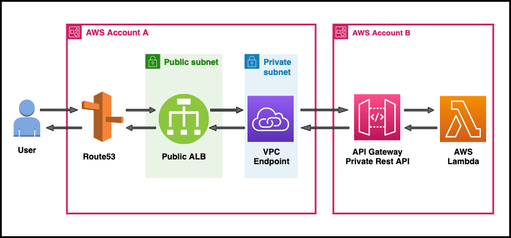

# Serverless cross account ALB->PrivateAPI use-case using AWS Lambda, API Gateway, Application Load Balancer, VPC Endpoint


This serverless pattern allows users from one account to access their Private REST APIs present in another account over the internet. This facilitates abstraction of network resources (like load balancers, virtual private clouds, endpoints) & application resources (like lambda, api gateway) into separate  individual management accounts.

## Working:

* Here we will add the VPC endpoint IP address as a Target behind an ALB.
* The ALB will pass the incoming HTTPS traffic to the Target Group attached to the HTTPS 443 listener.
* The customd domain ACM certificate will be added to the ALB's HTTPS 443 listener.
* VPC endpoint will be added to the resource policy of the Private API to allow access.
* Finally the private API will be invoked using the custom domain name along with the Host header consisting the API's default endpoint.

Learn more about this pattern at Serverless Land Patterns: https://serverlessland.com/patterns/public-alb-private-api-terraform

Important: this ready-to-use application uses various AWS services and there are costs associated with these services after the Free Tier usage - please see the [AWS Pricing page](https://aws.amazon.com/pricing/) for details. You are responsible for any AWS costs incurred. No warranty is implied in this example.

## Requirements:

* [Create two AWS accounts](https://portal.aws.amazon.com/gp/aws/developer/registration/index.html) if you do not already have, create them and log in. The IAM user that you use must have sufficient permissions to make necessary AWS service calls and manage AWS resources.
* [AWS CLI](https://docs.aws.amazon.com/cli/latest/userguide/install-cliv2.html) installed and configure two profiles with credentials for the individual accounts as below :
```
[default]
[crossaccount]
```
* [Git Installed](https://git-scm.com/book/en/v2/Getting-Started-Installing-Git)
* [Terraform](https://learn.hashicorp.com/tutorials/terraform/install-cli?in=terraform/aws-get-started) installed

## Deployment Instructions

1. Create a new directory, navigate to that directory in a terminal and clone the GitHub repository:
    ``` 
    git clone https://github.com/aws-samples/serverless-pattern
    ```
1. Change directory to the pattern directory:
    ```
    cd public-alb-private-api-terraform
    ```
1. From the command line, initialize terraform to  to downloads and installs the providers defined in the configuration:
    ```
    terraform init
    ```
1. From the command line, apply the configuration in the main.tf file:
    ```
    terraform apply
    ```
1. During the prompts:

   var.custom_domain_name_prefix
    - Enter a value: *{enter only your domain name prefix}*

   var.domain_name
    -  Enter a value: *{enter your domain name}*

   var.region
    - Enter a value: *{enter the region for deployment}*


1. Note the outputs from the deployment process. It contain the full url link which can be used for testing.

## Testing

1. Run the following curl command to invoke the cross account Private Rest API:
```
curl https://<custom_domain>/<stage-name> -H 'Host:<execute-api-invoke-url>'
```

2. Observe the output of the Private API response from the integrated backend Lambda function:
```
Hello from Lambda!
```

## Cleanup
 
1. Change directory to the pattern directory:
    ```
    cd serverless-patterns/public-alb-private-api-terraform
    ```
1. Delete all created resources
    ```bash
    terraform destroy
    ```
1. During the prompts:
    * Enter all details same as entered during creation.

1. Confirm all created resources has been deleted
    ```bash
    terraform show
    ```
----
Copyright 2022 Amazon.com, Inc. or its affiliates. All Rights Reserved.

SPDX-License-Identifier: MIT-0
