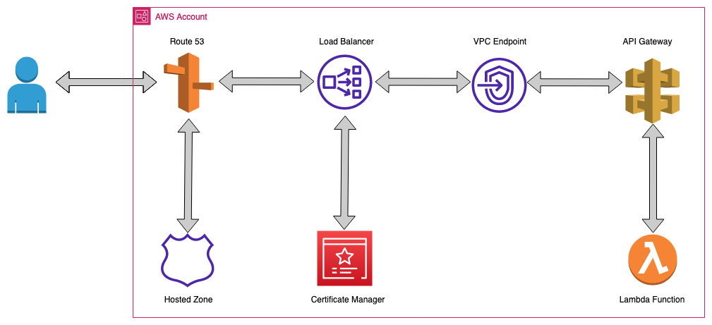
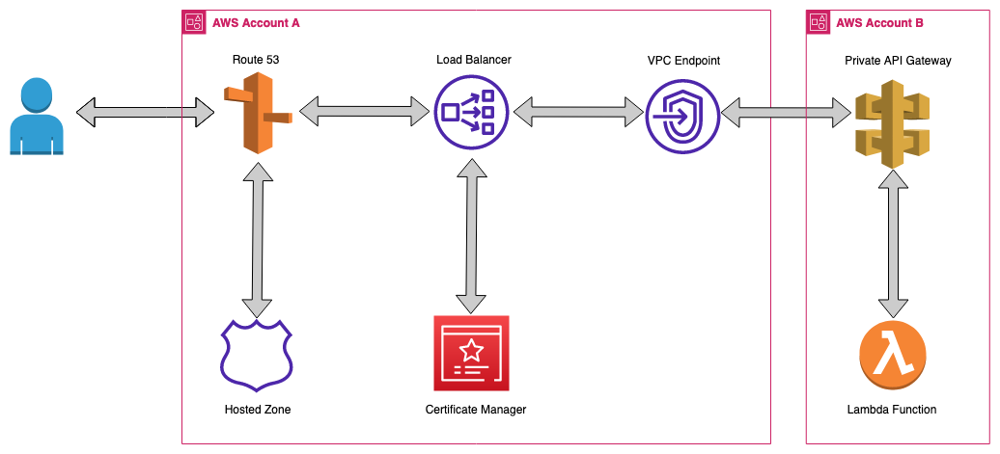

# Serverless same/cross account NLB/ALB->PrivateAPI use-case using VPC Endpoint, API Gateway, Network/Application Load Balancer, AWS Lambda
## Architecture
* Same Account Setup
    

* Cross Account Setup
    

This serverless pattern allows users to access their Private REST APIs present in same or cross account over the internet. This facilitates abstraction of network resources (like load balancers, virtual private clouds, endpoints) & application resources (like lambda, api gateway) into same/separate individual management accounts.

Learn more about this pattern at Serverless Land Patterns: https://serverlessland.com/patterns/public-nlb-or-alb-private-api-cfn

Important: this application uses various AWS services and there are costs associated with these services after the Free Tier usage - please see the [AWS Pricing page](https://aws.amazon.com/pricing/) for details. You are responsible for any AWS costs incurred. No warranty is implied in this example.

## Requirements
* [Create one/two AWS accounts for same/cross account setup](https://portal.aws.amazon.com/gp/aws/developer/registration/index.html) if you do not already have, create them and log in. The IAM user that you use must have sufficient permissions to make necessary AWS service calls and manage AWS resources via access key and secret access key.
* [AWS CLI](https://docs.aws.amazon.com/cli/latest/userguide/install-cliv2.html) installed and configure two profiles if you want to deploy API gateway in cross account otherwise you can simply configure CLI with just default profile to deploy all resources in same account:
    ```
    [default]
    [crossaccount]
    ```
* [Git Installed](https://git-scm.com/book/en/v2/Getting-Started-Installing-Git)
* [SAM](https://docs.aws.amazon.com/serverless-application-model/latest/developerguide/serverless-sam-cli-install.html) installed

## Deployment Instructions

1. Create a new directory, navigate to that directory in a terminal and clone the GitHub repository:
    ``` 
    git clone https://github.com/aws-samples/serverless-pattern
    ```
1. Change directory to the pattern directory:
    ```
    cd public-nlb-or-alb-private-api-cfn
    ```
1. From the command line, use AWS SAM to deploy the AWS resources for the pattern as specified in the template.yml file:
    ```
    sam deploy --guided
    ```
1. During the prompts:

    #Stack name of your choice
    - Enter a stack name
	
    #Enter region to which you want to deploy stack. For example: us-east-1
    - Enter a AWS Region: 
	
    #Prefix that will be added to the resources name
    - Enter a prefix

    #Name of the Load Balancer
	- Enter a ELB Name

    #Name of the target group
	- Enter a TargetGroup Name

    #VPC where Load balancer and VPC endpoint will be deployed
	- Enter a VPC

    #Enter two Public subnets that have IGW for NLB. For example: subnet-0123abc,subnet-0456def
	- Enter PublicSubnetIDs

    #Enter two Private subnets for VPC endpoint. For example: subnet-0567abc,subnet-0890def
	- Enter PrivateSubnetIDs 

    #Enter a security group for VPC endpoint. Same security group will be used in case Application load balancer is selected. Only one security is required. 
	- Enter a SecurityGroupID
	
    #Enter a custom domain name to which you want to send request to. For example: abc.example.com
    - Enter a DomainName
	
    #Enter hosted zone id. 
    - Enter a HostedZoneId

    #Enter NLB if you want to deploy the setup with Network Load Balancer or ALB if you want to deploy this setup with Application Load Balancer.
	- Enter value for NlbOrAlb
	
    #Enter Yes or yes if you want to deploy all resources in same account. To deploy API and backend lambda resource in different account, enter No or no and then deploy the crossAccResources.yaml in different account.
    - Enter value for SameAccount

1. For cross account deployment of API and backend resource
    - Once the above stack is deployed in first account, copy the VPC Endpoint Id and custom domain name from the output section and then use AWS SAM to deploy the AWS resources for the pattern as specified in the crossAccResources.yaml file:
    ```
    sam deploy -t crossAccResources.yaml --guided --profile crossaccount
    ```

    - For SAM configuration environment, enter "cross". This will create a different configuration enviroment section in samconfig.toml file. 

1. Note that the Output from the deployment process will contain the full curl url which can be used for testing. If resources are deployed in cross account then you will receive the curl URL after the deployment of crossAccResources.yaml 

## Testing

1. Run the following curl command that you got from the output section to invoke the same/cross account Private Rest API. In case if you want to use your own private API then use the below sample curl command:
    ```
    curl https://<custom_domain>/<stage-name>/<resource-path> -H 'Host:<api-id>.execute-api.<region>.amazonaws.com'
    ```

2. Observe the output of the Private API response from the integrated backend Lambda function

## Cleanup
 
1. Change directory to the pattern directory:
    ```
    cd serverless-patterns/public-nlb-or-alb-private-api-cfn
    ```
1. Delete all created resources in same account.
    ```
    sam delete --stack-name <stackname>
    ```
    
1. If API is deployed in cross account then run the same command again with the stackname that is deployed in different account along with --profile crossaccount
    ```
    sam delete --stack-name <stackname> --profile crossaccount --config-env cross

1. During the prompts:
    * Enter all details as per requirement.

----
Copyright 2022 Amazon.com, Inc. or its affiliates. All Rights Reserved.

SPDX-License-Identifier: MIT-0
