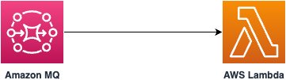

# Event driven Amazon MQ for RabbitMQ message processing using AWS Lambda (Java) 

This sample project demonstrates event driven message processing from an Amazon MQ for RabbitMQ queue using an AWS Lambda function written in Java. 

Learn more about this pattern at Serverless Land Patterns: https://serverlessland.com/patterns/rabbitmq-lambda-sam-java

Important: this application uses various AWS services and there are costs associated with these services after the Free Tier usage - please see the [AWS Pricing page](https://aws.amazon.com/pricing/) for details. You are responsible for any AWS costs incurred. No warranty is implied in this example.

## Requirements

- [Create an AWS account](https://portal.aws.amazon.com/gp/aws/developer/registration/index.html) if you do not already have one and log in. The IAM user that you use must have sufficient permissions to make necessary AWS service calls and manage AWS resources.
- [AWS CLI](https://docs.aws.amazon.com/cli/latest/userguide/install-cliv2.html) installed and configured
- [Git Installed](https://git-scm.com/book/en/v2/Getting-Started-Installing-Git)
- [AWS Serverless Application Model](https://docs.aws.amazon.com/serverless-application-model/latest/developerguide/serverless-sam-cli-install.html) (AWS SAM) installed
- [Java 21 or above](https://docs.aws.amazon.com/corretto/latest/corretto-21-ug/downloads-list.html) installed
- [Maven 3.9.6 or above](https://maven.apache.org/download.cgi) installed


## Deployment Instructions

1. Create a new directory, navigate to that directory in a terminal and clone the GitHub repository:
   ```bash
   git clone https://github.com/aws-samples/serverless-patterns
   ```

2. Change directory to the pattern directory:
   ```bash
   cd serverless-patterns/rabbitmq-lambda-sam-java
   ```

3. From the command line, execute the below command to build the Java based AWS Lambda function.
   ```bash
   sam build
   ```

4. From the command line, use AWS SAM to deploy the AWS resources for the pattern as specified in the template.yml file:
   ```bash
   sam deploy --guided
   ```
4. During the prompts:

   - Enter a stack name
   - Enter the desired AWS Region (e.g. us-east-1).
   - Enter a username. User Name can't contain commas (,), colons (:), equals signs (=), or spaces.
   - Enter a password. Password must be minimum 12 characters, at least 4 unique characters. Can't contain commas (,), colons (:), equals signs (=), spaces or non-printable ASCII characters.
   - Allow SAM CLI to create IAM roles with the required permissions.
   - Keep default values to the rest of the parameters.

   Once you have run `sam deploy --guided` mode once and saved arguments to a configuration file (samconfig.toml), you can use `sam deploy` in future to use these defaults.

5. Note the outputs from the SAM deployment process. These contain the resource names and/or ARNs which are used for next step as well as testing.

## How it works

Please refer to the architecture diagram below:



Here's a breakdown of the steps:

1. **Amazon MQ**: A RabbitMQ single-instance broker is provisioned. A test queue with name `MyTestQueue` is created. A message is pushed to the queue.

2. **AWS Lambda**: An AWS Lambda function with an event source mapping (ESM) configured for `MyTestQueue` queue is created. The Lambda function is triggered when a new message is added to the queue. The Lambda function processes the message and logs the decoded the message content. 


## Testing

1. Log into the RabbitMQ Web Console using the `username` and `password` provided at the time of deployment. The console URL is available in the`RabbitMQWebConsole` key of `sam deploy` output.

2. Go to the `Queues and Streams` tab and click on `Add a new queue` link.

3. Set the `Name` field to `MyTestQueue` and click on the `Add queue` button. The new queue should be added and shortly show in a table. Click on the `MyTestQueue`. This will take you to the `Queue MyTestQueue` details page.

4. Click on the `Publish message` link. 

5. Enter a `Payload` and click `Publish message` button.

6. Execute the below command to tail logs of the AWS Lambda function. Replace `MyMQMessageHandlerFunction` with the function name from output of the `sam deploy -g` command. Replace `your-region` with the region where you are deploying this pattern. 
   ```bash
   aws logs tail --follow /aws/lambda/{MyMQMessageHandlerFunction} --region {your-region}
   ```

7. Check the AWS Lambda console log. It should print the message from the Amazon MQ queue.

8. Press `Ctrl + c` to stop tailing the logs.


## Cleanup

1. To delete the resources deployed to your AWS account via AWS SAM, run the following command:

```bash
sam delete
```


---

Copyright 2024 Amazon.com, Inc. or its affiliates. All Rights Reserved.

SPDX-License-Identifier: MIT-0
