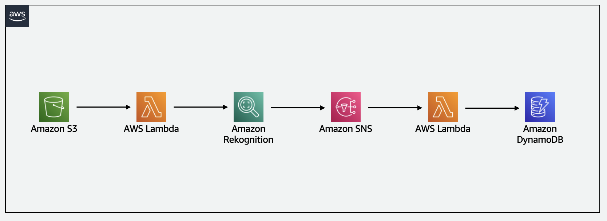

# Amazon Rekognition to Automatically Label Stored Video.

This pattern explains how to deploy a SAM application with Amazon S3, AWS Lambda, Amazon SNS, and DynamoDB. When a video file is created in Amazon S3, the event-driven workflow begins, sending an event to AWS Lambda. This Lambda function, written in Python, invokes the Amazon Rekognition StartLabelDetection function using boto3. An Amazon SNS topic is passed to the Rekognition function, allowing it to publish a completion message to the topic. Once the topic has received a message, it triggers a second Lambda function, which stores the video metadata and detected labels in a DynamoDB table.

Learn more about this pattern at Serverless Land Patterns: [https://serverlessland.com/patterns/rekognition-video-tagging](https://serverlessland.com/patterns/rekognition-video-tagging) 

Important: this application uses various AWS services and there are costs associated with these services after the Free Tier usage - please see the [AWS Pricing page](https://aws.amazon.com/pricing/) for details. You are responsible for any AWS costs incurred. No warranty is implied in this example.

## Requirements

* [Create an AWS account](https://portal.aws.amazon.com/gp/aws/developer/registration/index.html) if you do not already have one and log in. The IAM user that you use must have sufficient permissions to make necessary AWS service calls and manage AWS resources.
* [AWS CLI](https://docs.aws.amazon.com/cli/latest/userguide/install-cliv2.html) installed and configured
* [Git Installed](https://git-scm.com/book/en/v2/Getting-Started-Installing-Git)
* [AWS Serverless Application Model](https://docs.aws.amazon.com/serverless-application-model/latest/developerguide/serverless-sam-cli-install.html) (AWS SAM) installed

## Deployment Instructions

1. Create a new directory, navigate to that directory in a terminal and clone the GitHub repository:
    ``` 
    git clone https://github.com/aws-samples/serverless-patterns
    ```
1. Change directory to the pattern directory:
    ```
    cd rekognition-video-tagging
    ```
1. From the command line, use AWS SAM to deploy the AWS resources for the pattern as specified in the template.yml file:
    ```
    sam deploy --guided
    ```
1. During the prompts:
    * Enter a stack name
    * Enter the desired AWS Region
    * Allow SAM CLI to create IAM roles with the required permissions.

    Once you have run `sam deploy --guided` mode once and saved arguments to a configuration file (samconfig.toml), you can use `sam deploy` in future to use these defaults.

1. Note the outputs from the SAM deployment process. These contain the resource names and/or ARNs which are used for testing.

## How it works



- This pattern is designed to create all services required to run this workflow.
- The workflow begins with an Amazon S3 bucket. 
- When an object is created within the S3 bucket, it sends an event to a AWS Lambda function.
- This Lambda function invokes Amazon Rekognition's StartLabelDetection function, which asynchronously analyses the stored video.
- Once this task is complete, Rekognition publishes a completion status to the Amazon Simple Notification Service (SNS) topic.
- An Amazon Simple Queue Service (SQS) queue is subscribed to this SNS topic, which triggers a secondary Lambda function.
- This Lambda function calls Rekognition's GetLabelDetection function, retrieving the results and storing in an Amazon DynamoDB table.

## Testing
1. Have a video that can be used to detect the labels and metadata for.
2. Run the following command to upload the video to your newly generated S3 bucket. Replace `<your_video.mp4>` with your video file name. Replace `<S3BucketName>` with the name of the S3 bucket generated from the SAM deployment.
    ```
    aws s3 cp <your_video.mp4> s3://<S3BucketName>
    ```
3. Wait for the lambda-get-processing-video-rekognition Lambda to complete, then retrieve the Rekognition label output from the DynamoDB table. Replace `<DDBTableName>` with the name of the DynamoDB table generated by the SAM deployment, in this case, it will be `VideoTags`. You can use the following command:
    ```
    aws dynamodb scan --table-name <DDBTableName>
    ```
    For example: aws dynamodb scan --table-name VideoTags
4. You should see the Rekognition label output from DynamoDB displayed.

## Cleanup
 
1. Delete the stack
    ```
    sam delete
    ```

⚠️ **IMPORTANT** - The above command `sam delete` does not delete the **Amazon S3 bucket** if there are still objects stored within it. Please [empty the bucket](https://docs.aws.amazon.com/AmazonS3/latest/userguide/empty-bucket.html) before running the above command.
----
Copyright 2023 Amazon.com, Inc. or its affiliates. All Rights Reserved.

SPDX-License-Identifier: MIT-0
