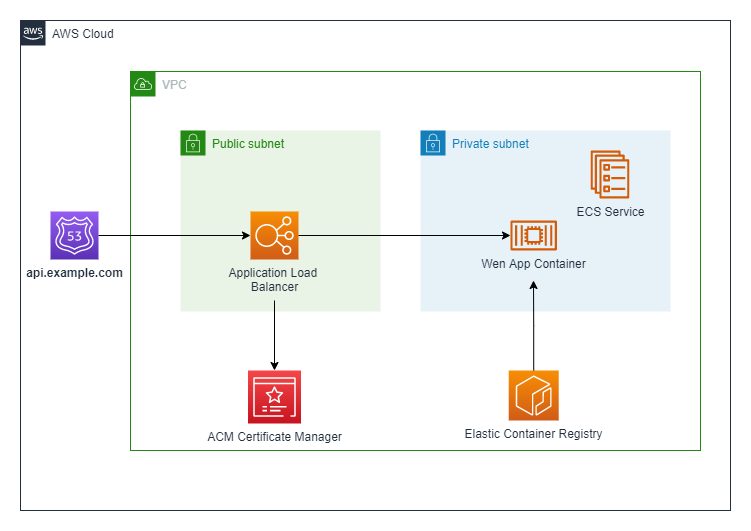
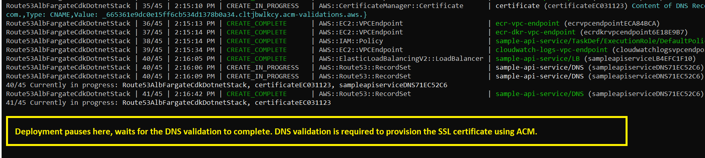
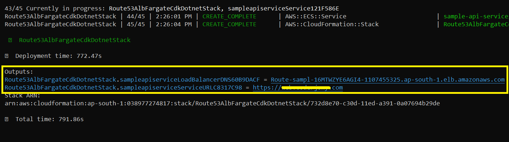

# Running Web API on ECS Fargate with custom domain backed with ALB, fronted by Route53, and secured with ACM Certificate

This pattern shows how to deploy a containerized Web API to the Amazon ECS fargate service, and expose it with a custom domain using Amazon Route53.

This pattern uses .NET as a programming language to create the entire CDK stack.

## Architecture 


Learn more about this pattern at Serverless Land Patterns: https://serverlessland.com/patterns/route53-alb-fargate-cdk-dotnet

**Important**: this application uses various AWS services and there are costs associated with these services after the Free Tier usage - please see the [AWS Pricing page](https://aws.amazon.com/pricing/) for details. You are responsible for any AWS costs incurred. No warranty is implied in this example.

## Requirements

* [Create an AWS account](https://portal.aws.amazon.com/gp/aws/developer/registration/index.html) if you do not already have one and log in. The IAM user that you use must have sufficient permissions to make necessary AWS service calls and manage AWS resources.
* [AWS CLI](https://docs.aws.amazon.com/cli/latest/userguide/install-cliv2.html) installed and configured
* [Git Installed](https://git-scm.com/book/en/v2/Getting-Started-Installing-Git)
* [.NET 7](https://dotnet.microsoft.com/en-us/download/dotnet/7.0) installed
* [AWS Cloud Development Kit](https://docs.aws.amazon.com/cdk/latest/guide/cli.html) (AWS CDK) installed
* [**Domain name**](https://en.wikipedia.org/wiki/Domain_name) - This is required to expose the API with a custom domain name

## Deployment Instructions

1. Clone the project to your local working directory.
    ```
    git clone https://github.com/aws-samples/serverless-patterns
    ```
2. Go to this file [Route53AlbFargateCdkDotnetStack.cs](src/Route53AlbFargateCdkDotnet/Route53AlbFargateCdkDotnetStack.cs), and replace the `apiDomainName` variable value with your domain name.
    ```
    string apiDomainName = "api.YOUR-DOMAIN.com";
    ```
2. Change the working directory to this pattern's directory.
    ```
    cd route53-alb-fargate-cdk-dotnet/src
    ```
3. Build the application.
    ```
    dotnet build
    ```
4. Return one level back to the path `route53-alb-fargate-cdk-dotnet`
    ```
    cd..
    ```
5. Deploy the stack to your default AWS account and region.
    ```
    cdk deploy
    ```
6. ⚠️ **Important** - The deployment is paused while validating the certificate.

   

    Follow the instructions below to complete the certificate validation by proving domain ownership:
    - Navigate to the **Route53 console** and select the recently created **Hosted Zone**.
    - Copy all four servers listed for **name servers**, and save it somewhere.
    - Go to your domain registrar and do the following:
      - Create a new DNS record with **NS** type for your domain.
      - Update the name servers for the domain to use the four Route 53 name servers.

7.  When the DNS validation is finished, the certificate is created in ACM, and the CDK resumes the deployment.
8.  When the deployment is complete, CDK prints two URLs, the first of which points to the ALB and the second to the domain you own.

    

## Testing

1. After deployment, the output displays the following values.
   - Load Balancer URL: `Route53AlbFargateCdkDotnetStack.sampleapiserviceLoadBalancerDNS60B9DACF = Route-sampl-16MTWZYE6AGI4-1107455325.ap-south-1.elb.amazonaws.com`
   - API Custom Domain URL: `Route53AlbFargateCdkDotnetStack.sampleapiserviceServiceURLC8317C98 = https://api.YOUR-DOMAIN.com`
2. Copy the URL with custom domain and append `WeatherForecast`, the URL will look like this - https://api.YOUR-DOMAIN.com/WeatherForecast.
3. Enter this URL into your browser, you should receive a JSON response with weather information.

## Cleanup

Run the given command to delete the resources that were created. It might take some time for the CloudFormation stack to get deleted.
```
cdk destroy
```

⚠️ **IMPORTANT** - The above command `cdk destory` does not delete the **Route53 Hosted Zone** because it contains new records created during the certificate validation process, and deleting it with `cdk destroy` results in error. As a result, the record's removal policy has been set to **RETAIN**. You must manually delete this hosted zone by accessing the Route53 console.

----
Copyright 2023 Amazon.com, Inc. or its affiliates. All Rights Reserved.

SPDX-License-Identifier: MIT-0