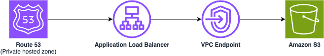

# Internal static website hosting using Amazon Route53, Application Load Balancer and Amazon S3

This pattern deploys a framework to host an internal static website on Amazon S3 bucket that can only be accessed from private network. 

Learn more about this pattern at Serverless Land Patterns: [https://serverlessland.com/patterns/route53-alb-s3](https://serverlessland.com/patterns/route53-alb-s3)

**Important:** this application uses various AWS services and there are costs associated with these services after the Free Tier usage - please see the [AWS Pricing page](https://aws.amazon.com/pricing/) for details. You are responsible for any AWS costs incurred. No warranty is implied in this example.

## Requirements

* [Create an AWS account](https://portal.aws.amazon.com/gp/aws/developer/registration/index.html) if you do not already have one and log in. The IAM user that you use must have sufficient permissions to make necessary AWS service calls and manage AWS resources.
* [AWS CLI](https://docs.aws.amazon.com/cli/latest/userguide/install-cliv2.html) installed and configured
* [Git Installed](https://git-scm.com/book/en/v2/Getting-Started-Installing-Git)
* [AWS Serverless Application Model](https://docs.aws.amazon.com/serverless-application-model/latest/developerguide/serverless-sam-cli-install.html) (AWS SAM) installed

## Deployment Instructions

1. From the command line, use AWS SAM to deploy the AWS resources for the pattern as specified in the template.yml file:
    ```
    sam deploy --guided
    ```
2. During the prompts:
    * Enter a stack name
    * Enter the desired AWS Region e.g. us-east-1 
    * Enter PrivateWebsiteDomainName e.g. hello-world.example.com
    * Allow SAM CLI to create IAM roles with the required permissions
    * Leave all other options to default values

    Once you have run `sam deploy --guided` mode once and saved arguments to a configuration file (samconfig.toml), you can use `sam deploy` in future to use these defaults.

3. Note the outputs from the SAM deployment process. These contain the resource names and/or ARNs which are used for testing.

4. From the command line, run the below command to upload the `index.html` to the S3 bucket. Replace `{WebsiteBucket}` with the corresponding output value of the `sam deploy` command.
    ```
    aws s3 cp index.html s3://{WebsiteBucket}
    ```

## How it works

Please refer to the architecture diagram below:



This template deploys a Route53 hosted zone, an Application Load Balancer (ALB), a VPC Endpoint and a S3 bucket. The private website URL will be exposed via the Route 53 private hosted zone. This URL is accessible from within the VPC.

## Testing

1. [Create a CloudShell VPC environment](https://docs.aws.amazon.com/cloudshell/latest/userguide/creating-vpc-environment.html). Enter the following values:
    * Name - enter your preferred environment name.
    * VPC - `VPCId` from the `sam deploy` output.
    * Subnet - Select any of the two available subnets under the above VPC.
    * Security - `ALBSecurityGroup` from the `sam deploy` output.

2. From the CloudShell command prompt run the following command to access your private website. Replace `{PrivateWebsiteUrl}` with the corresponding output value of the `sam deploy` command:
    ```
    curl -k -L {PrivateWebsiteUrl}   
    ```
   - The `curl` command makes an HTTP GET request to the deployed private website.
     - `-k` option allows curl to ignore that the certificate is issued by a private certificate authority and proceed with making the invocation. 
     - `-L` option tells curl to follow any HTTP redirects that the server sends. If the server responds with a 3xx HTTP status code and provides a new URL, curl will automatically issue a new request to the new URL.

3. You can also test by spinning up an EC2 instance within the same VPC or from another location that has private connectivity to the VPC. However, if you try to access the URL from outside network, it will not be reachable.

## Cleanup
 
1. Delete the contents of the S3 bucket. Make sure to use the correct bucket name.
    ```bash
    aws s3 rm s3://{WebsiteBucket} --recursive
    ```
2. Delete the CloudShell environment created in the VPC.   
3. Delete the stack
    ```bash
    sam delete
    ```

----
Copyright 2024 Amazon.com, Inc. or its affiliates. All Rights Reserved.

SPDX-License-Identifier: MIT-0
