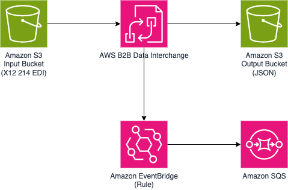

# Event-Driven EDI to JSON Transformation using AWS B2B Data Interchange Status Updates

This sample project demonstrates how AWS B2B Data Interchange can transform EDI Files into JSON as per the transformation logic. The transformation completion event is further processed using Amazon EventBridge Rule and Amazon SQS integration.


Learn more about this pattern at Serverless Land Patterns: https://serverlessland.com/patterns/s3-b2bi-eventbridge-sqs

Important: this application uses various AWS services and there are costs associated with these services after the Free Tier usage - please see the [AWS Pricing page](https://aws.amazon.com/pricing/) for details. You are responsible for any AWS costs incurred. No warranty is implied in this example.

## Requirements

- [Create an AWS account](https://portal.aws.amazon.com/gp/aws/developer/registration/index.html) if you do not already have one and log in. The IAM user that you use must have sufficient permissions to make necessary AWS service calls and manage AWS resources.
- [AWS CLI](https://docs.aws.amazon.com/cli/latest/userguide/install-cliv2.html) installed and configured
- [Git Installed](https://git-scm.com/book/en/v2/Getting-Started-Installing-Git)
- [AWS Serverless Application Model](https://docs.aws.amazon.com/serverless-application-model/latest/developerguide/serverless-sam-cli-install.html) (AWS SAM) installed


## Deployment Instructions

1. Create a new directory, navigate to that directory in a terminal and clone the GitHub repository:
   ```bash
      git clone https://github.com/aws-samples/serverless-patterns
   ```

2. Change directory to the pattern directory:
   ```bash
      cd s3-b2bi-eventbridge-sqs
   ```

3. From the command line, use AWS SAM to deploy the AWS resources for the pattern as specified in the template.yml file:
   ```bash
      sam deploy -g
   ```

4. During the prompts:
   - Enter a stack name.
   - Enter the desired AWS Region. Please refer to the documentation for the list of supported regions.
   - Enter `BusinessName`, `Email` and `Phone`.
   - Keep default values for rest of the parameters.

5. Note the outputs from the SAM deployment process. These contain the resource names and/or Ids which are used for the next step as well as testing.

For subsequent run instead of running `sam deploy -g` you can also use `sam deploy`.


## How it works

Please refer to the architecture diagram below:



* An X12 EDI file is uploaded into the input Amazon S3 bucket.
* File upload action triggers AWS B2B Data Interchange Transformers to transform the X12 EDI file into JSON format.
* The transformed JSON file is uploaded into the output Amazon S3 bucket.
* AWS B2B Data Interchange send the transformation completion event to Amazon EventBridge default bus.
* Amazon EventBridge Rule selects the desired events and forward that to Amazon SQS.

## Testing


1. Log into the [Amazon S3 console](https://s3.console.aws.amazon.com/s3/buckets) open `edi-214-input-{your-account}-{your-region}` bucket. Navigate to folder `input/tp-xxxxxxxxxxxx`. Upload the `sample-edi-214.edi` file into this folder.

2. Now, after a few seconds, open `edi-214-output-{your-account}-{your-region}` bucket. Navigate to folder `output/tp-xxxxxxxxxxxx`.  Download the transformed JSON output file. The content of the downloaded JSON file should look like: 
   ```json
      {
      "ReferenceID": "MSKU0123456",
      "ShipmentID": "90800706",
      "BillOfLandingNumber": "MAEU112233444",
      "ShipmentStatusCode": "LY"
      }
   ```

3. Run the following command to read message from the target SQS queue. Please replace the value of `MyQueue` from the `sam deploy` output.
   ```bash
      aws sqs receive-message --queue-url {MyQueue} --attribute-names All --message-attribute-names All 
   ```
   You should get an output as below:
   ```json
      {
         "Messages": [
            {
                  "MessageId": "f5a8xx-xxx-xxx-xxxxx-xxxbd55eb",
                  "ReceiptHandle": "AQEBaxxxxxIUiOaft20",
                  "MD5OfBody": "4e98cxxxxxxe5665",
                  "Body": "{\"version\":\"0\",\"id\":\"a69xxxx-xxxx-xxxx-xxxx-xxxxx902\",\"detail-type\":\"Transformation Completed\",\"source\":\"aws.b2bi\",
                      ,...,
                  \"object-size-bytes\":134}}}",
                  ....
            }
         ]
      }
   ```   

## Cleanup

1. Delete the content in the Amazon S3 bucket using the following command. Please *ensure* that the correct bucket name is provided to avoid accidental data loss:
   ```bash
      aws s3 rm s3://{EDI214InputBucketName} --recursive --region {my-region}
   ```

2. Delete the content in the Amazon S3 bucket using the following command. Please *ensure* that the correct bucket name is provided to avoid accidental data loss:
   ```bash
      aws s3 rm s3://{EDI214OutputBucketName} --recursive --region {my-region}
   ```

3. To delete the resources deployed to your AWS account via AWS SAM, run the following command:
   ```bash
      sam delete
   ```

---

Copyright 2024 Amazon.com, Inc. or its affiliates. All Rights Reserved.

SPDX-License-Identifier: MIT-0
