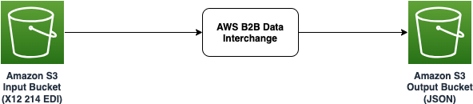

# Transform EDI to JSON using AWS B2B Data Interchange

This sample project demonstrates how AWS B2B Data Interchange can transform EDI Files into JSON as per the transformation logic.

Learn more about this pattern at Serverless Land Patterns: https://serverlessland.com/patterns/s3-b2bi-s3

Important: this application uses various AWS services and there are costs associated with these services after the Free Tier usage - please see the [AWS Pricing page](https://aws.amazon.com/pricing/) for details. You are responsible for any AWS costs incurred. No warranty is implied in this example.

## Requirements

- [Create an AWS account](https://portal.aws.amazon.com/gp/aws/developer/registration/index.html) if you do not already have one and log in. The IAM user that you use must have sufficient permissions to make necessary AWS service calls and manage AWS resources.
- [AWS CLI](https://docs.aws.amazon.com/cli/latest/userguide/install-cliv2.html) installed and configured
- [Git Installed](https://git-scm.com/book/en/v2/Getting-Started-Installing-Git)
- [AWS Serverless Application Model](https://docs.aws.amazon.com/serverless-application-model/latest/developerguide/serverless-sam-cli-install.html) (AWS SAM) installed


## Deployment Instructions

1. Create a new directory, navigate to that directory in a terminal and clone the GitHub repository:
   ```bash
   git clone https://github.com/aws-samples/serverless-patterns
   ```
2. Change directory to the pattern directory:
   ```bash
   cd s3-b2bi-s3
   ```
3. From the command line, use AWS SAM to deploy the AWS resources for the pattern as specified in the template.yml file:
   ```bash
   sam deploy -g -t template-part1.yaml
   ```
4. During the prompts:

   - Enter a stack name. I am assuming the stack name to be `b2bi-stack1`.
   - Enter the desired AWS Region. Please refer to the documentation for the list of supported regions.
   - Enter `BusinessName`, `Email` and `Phone`.

5. Note the outputs from the SAM deployment process. These contain the resource names and/or Ids which are used for the next step as well as testing.

6. Log into [AWS B2B Data Interchange](https://us-east-1.console.aws.amazon.com/b2bi/home). Click on the Transformers tab on the left hand navigation menu. Click on the `MyTransformer`. Click on the `Set Status` button and select `Active`. Please ensure that the `MyTransformer` status is set to `Active`. 

7. From the command line, use AWS SAM to deploy the AWS resources for the pattern as specified in the template.yml file:
   ```bash
   sam deploy -g -t template-part2.yaml
   ```
8. During the prompts:

   - Enter a stack name. I am assuming the stack name to be `b2bi-stack2`.
   - Enter the desired AWS Region. Please refer to the documentation for the list of supported regions.
   - Enter `BusinessName`, `Email`, `Phone`, `EDI214InputBucketName`, `EDI214OutputBucketName`, `MyProfileId` and `MyTransformerId`. Please note the last four parameter values should be given as per the output from the `b2bi-stack1` output. 


## How it works


Please refer to the architecture diagram below:



* An X12 EDI file is uploaded into the input Amazon S3 bucket.
* File upload action triggers AWS B2B Data Interchange Transformers to transform the X12 EDI file into JSON format.
* The transformed JSON file is uploaded into the output Amazon S3 bucket.

## Testing


1. Log into the [Amazon S3 console](https://s3.console.aws.amazon.com/s3/buckets) open `edi-214-input-{your-account}-{your-region}` bucket. Navigate to folder `input/tp-xxxxxxxxxxxx`. Upload the `sample-edi-214.edi` file into this folder.

2. Now, after a few seconds, open `edi-214-output-{your-account}-{your-region}` bucket. Navigate to folder `input/tp-xxxxxxxxxxxx`.  Download the transformed JSON output file. The content of the downloaded JSON file should look like: 
   ```json
      {
      "ReferenceID": "MSKU0123456",
      "ShipmentID": "90800706",
      "BillOfLandingNumber": "MAEU112233444",
      "ShipmentStatusCode": "LY"
      }
   ```


## Cleanup

1. Delete the content in the Amazon S3 bucket using the following command. Please *ensure* that the correct bucket name is provided to avoid accidental data loss:
   ```bash
   aws s3 rm s3://{EDI214InputBucketName} --recursive --region {my-region}
   ```

2. Delete the content in the Amazon S3 bucket using the following command. Please *ensure* that the correct bucket name is provided to avoid accidental data loss:
   ```bash
   aws s3 rm s3://{EDI214OutputBucketName} --recursive --region {my-region}
   ```

3. To delete the resources deployed to your AWS account via AWS SAM, run the following command:
   ```bash
   sam delete --stack-name {b2bi-stack2}
   sam delete --stack-name {b2bi-stack1}
   ```

---

Copyright 2024 Amazon.com, Inc. or its affiliates. All Rights Reserved.

SPDX-License-Identifier: MIT-0
