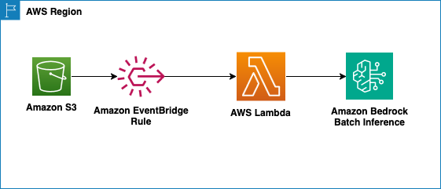

# Amazon S3 to Amazon Bedrock Batch Inference using an Amazon EventBridge Rule

This pattern demonstrates how to trigger a Bedrock batch inference job when an object, that is the input to the batch inference job, is uploaded to S3. The pattern is implemented using AWS CDK.

Learn more about this pattern at [Serverless Land Patterns](https://serverlessland.com/patterns/s3-eventbridge-bedrock-batch-cdk)

Important: this application uses various AWS services and there are costs associated with these services after the Free Tier usage - please see the AWS Pricing page for details. You are responsible for any AWS costs incurred. No warranty is implied in this example.

## Pre-requisites

- [Create an AWS account](https://portal.aws.amazon.com/gp/aws/developer/registration/index.html) if you do not already have one and log in. The IAM user that you use must have sufficient permissions to make necessary AWS service calls and manage AWS resources.
- **[ IMPORTANT]** This pattern uses an example input that is [based on Messages API](https://docs.aws.amazon.com/bedrock/latest/userguide/batch-inference-data.html#batch-inference-data-ex-text) format of Anthropic Claude. Only specific models support batch inference in specific regions. Check the [supported regions and models](https://docs.aws.amazon.com/bedrock/latest/userguide/batch-inference-supported.html) section of the batch inference documentation and make sure you have access to [the correct Claude model](https://docs.aws.amazon.com/bedrock/latest/userguide/model-access-modify.html) that you want to use.
- [AWS CLI](https://docs.aws.amazon.com/cli/latest/userguide/install-cliv2.html) installed and configured
- [Git Installed](https://git-scm.com/book/en/v2/Getting-Started-Installing-Git)
- [AWS CDK](https://docs.aws.amazon.com/cdk/latest/guide/cli.html) installed and configured
- [Python 3.13](https://www.python.org/downloads/) installed

## Deployment Instructions

1. Create a new directory, navigate to that directory in a terminal and clone the GitHub repository:

    ```shell
    git clone https://github.com/aws-samples/serverless-patterns
    ```
2. Change directory to the pattern directory:

    ```shell
    cd s3-bedrock-batch-inference-cdk
    ```

3. Create and activate a Python virtual environment:

    ```shell
    python3 -m venv .venv
    source .venv/bin/activate
    ```

4. Install the required dependencies:

    ```shell
    pip3 install -r requirements.txt
    ```

5. Set your AWS region (replace `us-west-2` with your desired region):

    ```shell
    export AWS_REGION=us-west-2
    ```

6. Deploy the stack by running the command below. Replace `ModelARN` with the ARN of the model you want to use. For example, if you want to use **Claude 3.5 Sonnet** in **us-west-2** the ARN would be `arn:aws:bedrock:us-west-2::foundation-model/anthropic.claude-3-5-sonnet-20240620-v1:0`. 

   **Note:** You can find the complete list of foundation model that support batch inference in the [AWS Bedrock documentation](https://docs.aws.amazon.com/bedrock/latest/userguide/batch-inference-supported.html). The ARN format is: `arn:aws:bedrock:<region>::foundation-model/<model-id>`

   ```shell
   cdk deploy --parameters ModelARN=<ARN of the model>
   ```

   **Note:** You will be prompted to confirm the deployment. Type `y` and press Enter to proceed.

## How it works


This pattern creates an S3 bucket to store the input and output of the batch inference job. It also creates an EventBridge rule that is triggered when a batch inference input file is uploaded. 

When the EventBridge rule is triggered, it uses an AWS-managed Lambda function (created automatically by the `AwsApi` target) to call the Bedrock `createModelInvocationJob` API. This Lambda function creates a new Bedrock batch inference job with the specified model and the uploaded input file. The output of the batch inference job is stored in the same S3 bucket.

**Architecture Flow:**
1. Input file (`input.jsonl`) is uploaded to S3 bucket under `/input/` prefix
2. S3 sends an event to EventBridge when the object is created
3. EventBridge rule matches the event and triggers an AWS-managed Lambda function
4. The Lambda function calls the Bedrock `createModelInvocationJob` API
5. Bedrock processes the batch inference job and stores results in S3 under `/output/` prefix

## Testing
 - Once the pattern is deployed successfully you should see the name of the S3 bucket in the CDK output.
 - Upload the sample `input.jsonl` to this bucket by running this command
   ```shell
   aws s3 cp model_input/input.jsonl  s3://<S3 bucket name>/input/
   ```
 - The upload will trigger the batch inference job. You can check the status of the job on the [AWS Console](https://console.aws.amazon.com/bedrock/home?#/batch-inference) or alternatively, you can use this command:
   ```shell
     aws bedrock list-model-invocation-jobs  | jq '.invocationJobSummaries[] | {jobArn, status, submitTime}'
   ```
 - Once the batch inference job's status is "Completed" (this may take 30+ minutes), you can check the results by navigating to the [S3 bucket](https://console.aws.amazon.com/s3/buckets?&bucketType=general) and checking the `output` prefix


## Cleanup

1. Empty the S3 bucket before deleting the stack:
   ```bash
   aws s3 rm s3://<S3 bucket name> --recursive
   ```

2. Delete the stack by running the command below:
   ```bash
   cdk destroy
   ```

---

Copyright 2025 Amazon.com, Inc. or its affiliates. All Rights Reserved.

SPDX-License-Identifier: MIT-0
