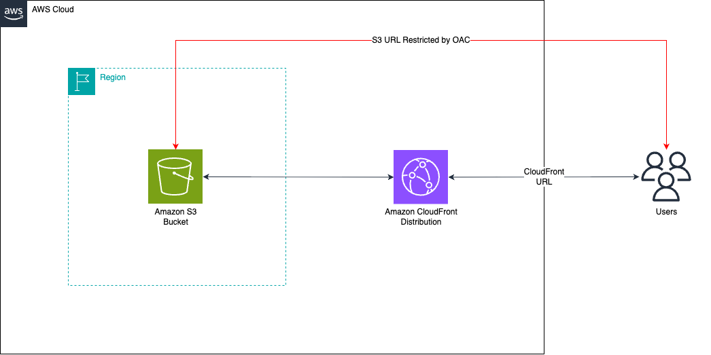

# S3 Hosted Website Served by a CloudFront Distribution restricted by CloudFront Origin Access Control (OAC)

This repo contains serverless patterns showing how to setup a S3 website hosting bucket that is served by a CloudFront distribution that also obfuscates the CloudFront Distribution domain via CloudFront Origin Access Control (OAC).



- Learn more about these patterns at https://serverlessland.com/patterns.
- To learn more about submitting a pattern, read the [publishing guidelines page](https://github.com/aws-samples/serverless-patterns/blob/main/PUBLISHING.md).

Important: this application uses various AWS services and there are costs associated with these services after the Free Tier usage - please see the [AWS Pricing page](https://aws.amazon.com/pricing/) for details. You are responsible for any AWS costs incurred. No warranty is implied in this example.

## Requirements

* [Create an AWS account](https://portal.aws.amazon.com/gp/aws/developer/registration/index.html) if you do not already have one and log in. The IAM user that you use must have sufficient permissions to make necessary AWS service calls and manage AWS resources.
* [AWS CLI](https://docs.aws.amazon.com/cli/latest/userguide/install-cliv2.html) installed and configured
* [Git Installed](https://git-scm.com/book/en/v2/Getting-Started-Installing-Git)
* [AWS Cloud Development Kit](https://docs.aws.amazon.com/cdk/latest/guide/getting_started.html) (AWS CDK) Installed and account bootstrapped

## Deployment Instructions

1. Create a new directory, navigate to that directory in a terminal and clone the GitHub repository:
    ```bash
    git clone https://github.com/aws-samples/serverless-patterns
    ```
2. Change directory to the pattern directory:
    ```bash
    cd s3-cloudfront-oac-cdk-python
    ```
3. Create a virtual environment for python:
    ```bash
    python3 -m venv .venv
    ```
4. Activate the virtual environment:
    ```bash
    source .venv/bin/activate
    ```
5. Install python modules:
    ```bash
    python3 -m pip install -r requirements.txt
    ```
6. From the command line, use CDK to synthesize the CloudFormation template and check for errors:
    ```bash
    cdk synth
    ```
7. From the command line, use CDK to deploy the stack:
    ```bash
    cdk deploy
    ```

## How it works

This CDK app creates a private S3 bucket, uploads a sample `index.html` to it, and creates a CloudFront distribution in front of the bucket. CloudFront reads the bucket content through Origin Access Control (OAC), so the bucket stays private and is only accessible via CloudFront.

## Testing

1. Note the `DistributionId` and `DistributionDomainName` values from the outputs of the CDK deployment process.
2. Open `https://<DistributionDomainName>` in your browser. You should see the sample `index.html` page saying `Hello from S3 + CloudFront!`.
3. Confirm that the distribution accesses the S3 origin via Origin Access Control (OAC).
    ```bash
    aws cloudfront get-distribution-config --id <DistributionId> --query 'DistributionConfig.Origins.Items[0].OriginAccessControlId'
    ```

## Cleanup

1. Delete the stack
    ```bash
    cdk destroy
    ```
1. Confirm the stack has been deleted
    ```bash
    aws cloudformation list-stacks --query "StackSummaries[?contains(StackName,'S3CloudFrontOACStack')].StackStatus"
    ```

----
Copyright 2026 Amazon.com, Inc. or its affiliates. All Rights Reserved.

SPDX-License-Identifier: MIT-0
