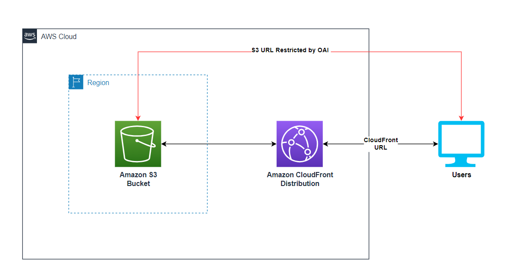

# S3 Hosted Website Served by a CloudFront Distribution restricted by Cloudfront Origin Access Identity (OAI)

This repo contains serverless patterns showing how to setup a S3 website hosting bucket that is served by a CloudFront distribution that also obfuscates the CloudFront Distribution domain via Cloudfront Origin Access Identity (OAI).



- Learn more about these patterns at https://serverlessland.com/patterns.
- To learn more about submitting a pattern, read the [publishing guidelines page](https://github.com/aws-samples/serverless-patterns/blob/main/PUBLISHING.md).

Important: this application uses various AWS services and there are costs associated with these services after the Free Tier usage - please see the [AWS Pricing page](https://aws.amazon.com/pricing/) for details. You are responsible for any AWS costs incurred. No warranty is implied in this example.

## Requirements

* AWS Account
* AWS CLI already configured with Administrator permission
* [NodeJS 14.x installed](https://nodejs.org/en/download/)
* CDK v2 installed: See Getting Started With the AWS CDK
* Python CDK required libraries: (install with pip install -r requirements.txt)
* Clone this repo!

## Deployment Instructions

1. Within your CDK Python module directory(where all your cdk stacks are located) create a constructs folder
2. Place the `s3_cloudfront_oai_cdk.py` file in the constructs folder you created 
3. Import the construct into the desired stack you would like to use this construct (ex.`from .constructs.s3_website import S3CloudFrontOAI`)
4. Use this construct in your stack by defining it in your stack (ex. `myS3HostedWebsite = S3CloudFrontOAI(self, 's3-hosted-website')`)
5. In your terminal run `CDK Deploy` for the specified stack that uses this construct

### Removing the resources

1. run `CDK Destroy <stack id>` for the specified stack that used this construct

```
git clone https://github.com/aws-samples/serverless-patterns/s3-cloudfront-oai-cdk-python
```

Each subdirectory contains additional installation and usage instructions. 

----
Copyright 2021 Amazon.com, Inc. or its affiliates. All Rights Reserved.
----

