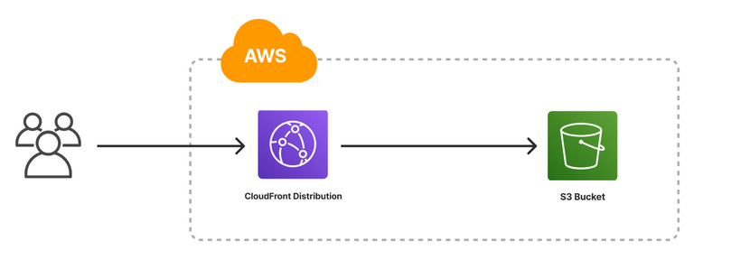

# Amazon S3 hosted website served by a CloudFront distribution restricted by CloudFront Origin Access Control (OAC)
This project serves as a demonstration of how to leverage Amazon CloudFront and Amazon Simple Storage Service (S3) to host and deliver a static website efficiently and securely.

Amazon S3 is an object storage service that provides a highly scalable, durable, and cost-effective way to store and retrieve data, including website files such as HTML, CSS, JavaScript, and other static assets. In this project, S3 is utilized as the origin, which means it hosts the static website content.

Amazon CloudFront, on the other hand, is a content delivery network (CDN) service that caches and distributes the website content from multiple edge locations around the world. By integrating CloudFront with the S3-hosted website, the project showcases how to leverage CloudFront's caching and content distribution capabilities to improve website performance, reduce latency, and enhance the end-user experience.



- Learn more about these patterns at https://serverlessland.com/patterns.
- To learn more about submitting a pattern, read the [publishing guidelines page](https://github.com/aws-samples/serverless-patterns/blob/main/PUBLISHING.md).

Important: this application uses various AWS services and there are costs associated with these services after the Free Tier usage - please see the [AWS Pricing page](https://aws.amazon.com/pricing/) for details. You are responsible for any AWS costs incurred. No warranty is implied in this example.

## Requirements

* [Create an AWS account](https://portal.aws.amazon.com/gp/aws/developer/registration/index.html) if you do not already have one and log in. The IAM user that you use must have sufficient permissions to make necessary AWS service calls and manage AWS resources.
* [AWS CLI](https://docs.aws.amazon.com/cli/latest/userguide/install-cliv2.html) installed and configured
* [Git Installed](https://git-scm.com/book/en/v2/Getting-Started-Installing-Git)
* [Terraform Installed](https://www.terraform.io/)

## Deployment Instructions
1. Create a new directory, navigate to that directory in a terminal and clone the GitHub repository:
    ``` 
    git clone https://github.com/aws-samples/serverless-patterns
    ```
2. Change directory to the pattern directory:
    ```
    cd s3-cloudfront-spa
    ```
3. Initilize terraform
    ```
    Run terraform init
    ```
4. Create terrform plan
    ```
    Run terraform plan
    ```
5. Create AWS resources
    ```
    Run terraform apply
    ```
    During the prompts:
    * Enter yes

6. Copy your front end assests

## Testing
1.  Go to AWS Console.
2.  Go to your hosting Amazon S3 bucket.
3.  Upload your front end content or Copy index.html from "s3-cloudfront-spa" pattern "test" folder for testing.
4.  Go to AWS Cloudfront.
5.  Go to Distributions.
5.  Select your distribution domain and browse it. e.g ***********.cloudfront.net/index.html.
    
### Removing the resources

1. To destory deployed resources
    ```
    Run terraform destroy
    ```

----
Copyright 2024 Amazon.com, Inc. or its affiliates. All Rights Reserved.
----

