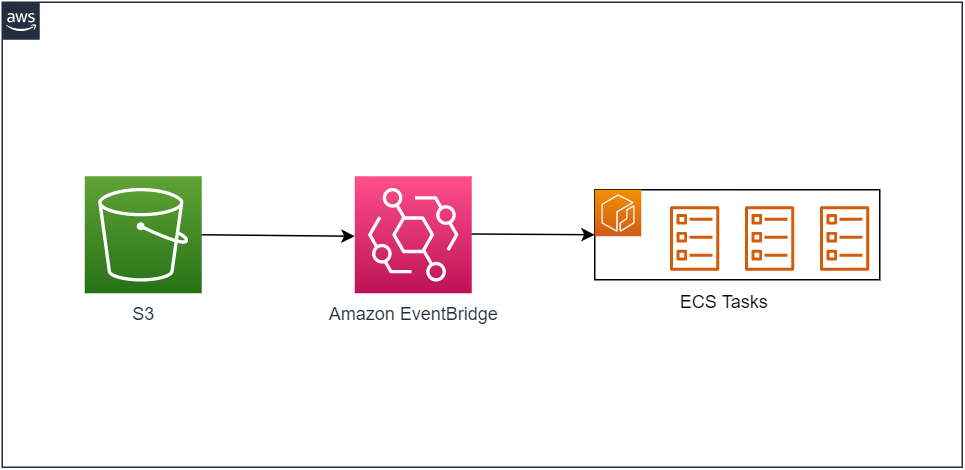
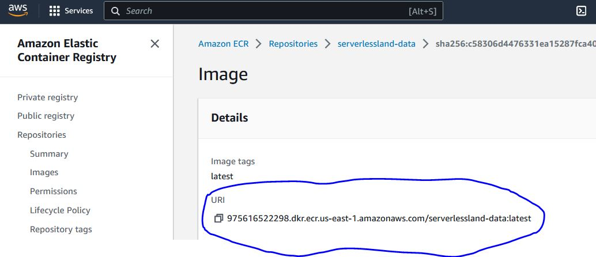

# Serverless pattern to integrate EventBridge and ECS-Fargate tasks



This serverless pattern uses EventBridge to trigger multiple ECS tasks on Fargate. The ECS task queries the S3 bucket for files and reads them. These ECS tasks can be extended to insert the data to a database, thus speeding up the process of loading data from S3 to a database.

This application pattern can be extended to

    1. Process a file from a single bucket in parallel
    2. Perform long running tasks not suited for Lambda processing in parallel

Important: this application uses various AWS services and there are costs associated with these services after the Free Tier usage - please see the [AWS Pricing page](https://aws.amazon.com/pricing) for details. You are responsible for any AWS costs incurred. No warranty is implied in this example.

# Requirements

- [Create an AWS account](https://aws.amazon.com) if you do not already have, create them and log in. The IAM user that you use must have sufficient permissions to make necessary AWS service calls and manage AWS resources.
- [AWS CLI](https://docs.aws.amazon.com/cli/latest/userguide/getting-started-install.html) installed and configured
- [Git Installed](https://git-scm.com/book/en/v2/Getting-Started-Installing-Git)
- [Docker Installed](https://docs.docker.com/get-docker/)
- [Terramform installed](https://www.terraform.io/)

# Deployment Instructions

1. Configure AWS CLI to the account and region you want to deploy the application to

2. Create a new directory then navigate to that directory in a terminal and clone the GitHub repository:
    ``` 
    git clone https://github.com/aws-samples/serverless-patterns
    ``` 
3. Change directory to the pattern directory:
    ``` 
    cd serverless-patterns/s3-eventbridge-ecs
    ``` 

4. Go to the [Docker directory](src/docker/README.md) and execute the docker command as per the Readme file.
    
    * Build the Docker image first in local
    ``` 
    docker build -t `<image name>`:latest .
    ``` 

    * In the Linux and Mac environments, you may need to execute the following command to make the build script executable:
    ``` 
    chmod 755 build.sh
    ``` 

    * Publish the image to ECR and provide the image name, AWS region and AWS Account Number
    ``` 
    ./build.sh -i `<image name>` -r `<region>` -a `<account>` 
    ``` 


    The docker commands in the file will perform the following:
    - It will create an ECR Repository in your AWS account in the preferred AWS region
    - It will create the task docker image and push it to the ECR repository
    - Once done, login to the AWS console and search for ECR. Note the ARNs of the image name for the task. The ARN and image name will be needed in terraform script

    

5. Make the following changes in the [terraform script](pattern_s3_eb_ecs.tf):
    - Line 2 - Replace the placeholder "REPLACE_ME_WITH_S3_BUCKET" with an unique S3 bucket name. The terraform will create the S3 bucket
    - Line 4 - Replace the placeholder "REPLACE_ME_WITH_ECR_IMAGE_ARN" with the image URI, from step 4 above
    - Line 5 - Replace the placeholder "REPLACE_ME_WITH_SUBNET_ID" with a VPC subnet block from your AWS account. The subnets can come from the default or any existing VPCs in the AWS account
    - Line 6 - Replace the placeholder "REPLACE_ME_WITH_AWS_REGION" with the AWS region where the script will deploy resources

    ``` 
    #Sample Configuration
    locals {
        bucket_name     = "mybucketname"
        event_bus_name  = "default"
        container_image = "123456789000.dkr.ecr.us-east-2.amazonaws.com/myimagename:latest"
        ecs_subnet_id   = "subnet-00000000000000000"
        region          = "us-east-1"

    }
    ``` 

6. Execute the following terraform command to deploy the stack

    ``` 
    terraform init
    terraform plan
    terraform apply -auto-approve
    ``` 

7. The terraform will create a ECS cluster and deploy the image (created in step 4) in ECS. The script will use the default EventBridge event bus and create S3 notification rule to the default event bus.The rule will listen to the S3 upload events in the incoming folder. The script will provision all the necessary IAM roles and policies to execute the pattern

# Testing

1. Once the terraform script executed successfully, upload a sample csv file in the S3 folder called 'incoming'.
   You can follow the below AWS CLI command to upload the file directly inside incoming folder :
   ``` 
   aws s3api put-object --bucket your-bucket-name --key incoming/file-name  --body file-name
   ``` 

   Sample CLI command:
   ``` 
   aws s3api put-object --bucket test-serverlessland --key incoming/HistoricalData_1669400287621.csv  --body HistoricalData_1669400287621.csv
   ``` 
2. The S3 file upload will trigger an EventBridge Rule which will call the ECS task. The ECS task will execute and print the csv data in the cloudwatch log

3. Check the CloudWatch log group to see the ECS task execution details. the logs can be found in /ecs/serverlessland-dump-env-vars
   You can use following cli command to get all streams of the cloudwatch logs
   ``` 
   aws logs describe-log-streams --log-group-name /ecs/serverlessland-dump-env-vars --log-stream-name-prefix ecs/serverlessland-dump-env-vars/
   ``` 
   You can select a particular stream to see the details
   ``` 
   aws logs get-log-events --log-group-name /ecs/serverlessland-dump-env-vars --log-stream-name replace-stream-name-from-above-command
   ``` 
# Cleanup

1. For deleting the EventBridge, S3, ECS task and associated IAM roles and policies, execute the following command:

    ``` 
    terramform destroy
    ``` 
2. For deleting the ECS image, go to the Amazon Elastic Container Registry from AWS Console. Search for the repository that contains the image to delete. 
   On the Repositories: repository_name page, select the box to the left of the image to delete and choose Delete.
   In the Delete image(s) dialog box, verify that the selected images should be deleted and choose Delete.

    Alternatively you can execute the following command from cli to delete the image:

    * List the images in your repository. Tagged images will have both an image digest as well as a list of associated tags. Untagged images will only have an image digest.
    ``` 
    aws ecr list-images --repository-name my-repo
    ``` 
    * Delete any unwanted tags for the image by specifying the tag associated with the image you want to delete. When the last tag is deleted from an image, the image is also deleted.
    ``` 
    aws ecr batch-delete-image --repository-name my-repo --image-ids imageTag=tag1 imageTag=tag2
    ``` 
Copyright 2023 Amazon.com, Inc. or its affiliates. All Rights Reserved.

SPDX-License-Identifier: MIT-0
