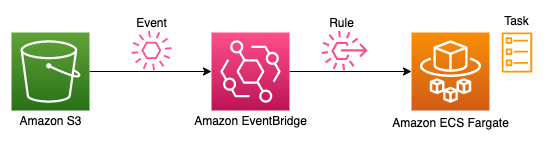

# Amazon S3 to AWS Fargate

This pattern demonstrates how to invoke an AWS Fargate task when an object is uploaded to Amazon S3.
This pattern is commonly implemented with an AWS Lambda function, but this is not always possible:
- Processing > 15 min
- Docker image > 10G
- GPU required

When you need more (more time, more memory, more power), but still want to use serverless service, you can look at Fargate.

Important: this application uses various AWS services and there are costs associated with these services after the Free Tier usage - please see the [AWS Pricing page](https://aws.amazon.com/pricing/) for details. You are responsible for any AWS costs incurred. No warranty is implied in this example.

## Requirements

* [Create an AWS account](https://portal.aws.amazon.com/gp/aws/developer/registration/index.html) if you do not already have one and log in. The IAM user that you use must have sufficient permissions to make necessary AWS service calls and manage AWS resources.
* [AWS CLI](https://docs.aws.amazon.com/cli/latest/userguide/install-cliv2.html) installed and configured
* [Git Installed](https://git-scm.com/book/en/v2/Getting-Started-Installing-Git)
* [AWS Cloud Development Kit](https://docs.aws.amazon.com/cdk/v2/guide/getting_started.html) (AWS CDK) installed

## Deployment Instructions

1. Create a new directory, navigate to that directory in a terminal and clone the GitHub repository:
    ``` 
    git clone https://github.com/aws-samples/serverless-patterns
    ```
2. Change directory to the pattern directory:
    ```
    cd serverless-patterns/s3-eventbridge-fargate-cdk
    ```
3. From the command line, use AWS SAM to deploy the AWS resources for the pattern as specified in the template.yml file:
    ```
    npm install && npx cdk deploy
    ```
4. During the prompts:
    * Allow CDK to create resources and IAM roles with the required permissions.

5. Note the outputs from the CDK deployment process. These contain the resource names and/or ARNs which are used for testing.

## How it works



1. When a file is uploaded to S3, in the specified bucket (eventually with a specific prefix), an event is triggered
2. EventBridge catch this event and triggers the ECS Fargate task
3. Fargate bootstrap a container to run the task

## Testing

1. Once CDK / CloudFormation deployed the stack, upload a file to S3 using the following command.
   (replace `your-bucket-name` with the CDK output `S3TriggerFargateTaskStack.IngestionBucket`) :

```shell
   aws s3api put-object --bucket your-bucket-name --key file-name --body file-name
``` 

2. The S3 file upload will trigger the EventBridge Rule which will run the ECS task. The ECS task will execute and print the content of the document in CloudWatch.

3. Check the CloudWatch log group to see the ECS task execution details. Logs can be found in `/ecs/doc-ingestion` log stream. 
Use the following commands to get the logs:

```shell
# get log streams
aws logs describe-log-streams --log-group-name /ecs/doc-ingestion
# use the latest log stream name in the next command to get logs
aws logs get-log-events --log-group-name /ecs/doc-ingestion --log-stream-name doc-ingestion-logs/DocIngestion/...
```

4. The file contents are displayed in the log.

## Cleanup

1. Delete the stack
    ```bash
    npx cdk destroy
    ```
2. Confirm the stack has been deleted
    ```bash
    aws cloudformation list-stacks --query "StackSummaries[?contains(StackName,'S3TriggerFargateTaskStack')].StackStatus"
    ```
----
Copyright 2023 Amazon.com, Inc. or its affiliates. All Rights Reserved.

SPDX-License-Identifier: MIT-0
