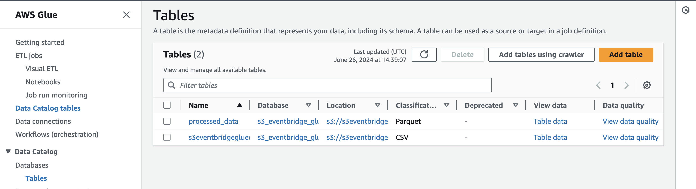

# Automatic Data Transformation and Catalog with Amazon S3 notifications and AWS Step functions

This pattern creates a State Machine triggered by an S3 notification. The state machine triggers a glue crawler and a glue ETL job to transform and catalog csv data. It creates all the necessary permissions and roles, following the principle of least privilege. 

Note, this pattern does not integrate with environments where the Glue Data Catalog is **managed by AWS Lake Formation**. To make it work, you will need to give the right [permissions](https://repost.aws/knowledge-center/glue-insufficient-lakeformation-permissions) to the Glue Crawler and Glue Job roles.

Learn more about this pattern at Serverless Land Patterns: << Add the live URL here >>

Important: this application uses various AWS services and there are costs associated with these services after the Free Tier usage - please see the [AWS Pricing page](https://aws.amazon.com/pricing/) for details. You are responsible for any AWS costs incurred. No warranty is implied in this example.

## Requirements

* [Create an AWS account](https://portal.aws.amazon.com/gp/aws/developer/registration/index.html) if you do not already have one and log in. The IAM user that you use must have sufficient permissions to make necessary AWS service calls and manage AWS resources.
* [AWS CLI](https://docs.aws.amazon.com/cli/latest/userguide/install-cliv2.html) installed and configured
* [Git Installed](https://git-scm.com/book/en/v2/Getting-Started-Installing-Git)
* [AWS Cloud Development Kit](https://docs.aws.amazon.com/cdk/v2/guide/home.html) (AWS CDK) installed
* [Python, pip, virtualenv](https://docs.aws.amazon.com/cdk/latest/guide/work-with-cdk-python.html) installed

## Deployment Instructions

1. Create a new directory, navigate to that directory in a terminal and clone the GitHub repository:
    ``` 
    git clone https://github.com/aws-samples/serverless-patterns
    ```
1. Change directory to the pattern directory:
    ```
    cd s3-eventbridge-glue
    ```
1. Create a virtual environment:
    ```
    python3 -m venv .venv
    ```
1. Activate the virtual environment
   ```
   source .venv/bin/activate
   ```
   For a Windows platform, activate the virtualenv like this:
   ```
   .venv\Scripts\activate.bat
1. Install the Python required dependencies:
   ```
   pip install -r requirements.txt
   ```
6. Review the CloudFormation template the cdk generates for you stack using the following AWS CDK CLI command:
   ```
   cdk synth
   ```
7. Run the command below to bootstrap your account CDK needs it to deploy
    ```
    cdk bootstrap
    ```
8. From the command line, use CDK to deploy the AWS resources for the pattern. You'll be prompted to approve security related changes during the deployment.
    ```
    cdk deploy
    ```

## How it works

When you upload a .csv file to the Input S3 bucket, it matches with an Amazon EventBridge rule that triggers a State Machine. The State Machine is composed of two steps:

1. Starts a AWS Glue Crawler to crawl the input bucket. This allows you to have the raw data (before transformation) inside the Data Catalog
2. Start a AWS Glue ETL Job, that runs a simple transformation job and drops empty columns in the dataset

The processed/transformed data is then added to the Data Catalog and to an S3 bucket to allow for further processing.

## Testing

1. Navigate to the S3 bucket containing 'input-bucket' in the name
2. Upload a .csv file to the bucket. A [sample file](./sample_data/sample_dataset.csv) can be found in this pattern.
3. Wait for the AWS Step Functions State Machine to complete and you should be able to see 2 tables under the Glue Data Catalog, one containing the raw and the other the processed data, as shown below:



## Cleanup
 
1. Delete the stack
    ```
    cdk destroy
    ```

2. Confirm the stack has been deleted. Login to the AWS console and navigate to the AWS Cloudformation service page "CdkServerlessInfraStack" is deleted or run the below 
    ```bash
    aws cloudformation list-stacks --query "StackSummaries[?contains(StackName,'S3EventbridgeGluecrawlerStack')].StackStatus"
    ```

You should expect to see a message confirming `DELETE_COMPLETE`.

----
Copyright 2024 Amazon.com, Inc. or its affiliates. All Rights Reserved.

SPDX-License-Identifier: MIT-0