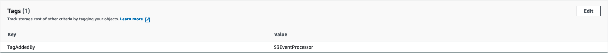

# AWS S3 to AWS EventBridge to AWS Lambda

This pattern contains a sample AWS Cloud Development Kit (AWS CDK) template for creating an AWS S3 bucket with AWS EventBridge notifications turned on. All S3 events in this bucket is sent to AWS EventBridge. This CDK template also deploys a AWS Lambda function which will process the event sent to AWS EventBridge and create a tag for the S3 object that was created. An AWS EventBridge rule is also created to send only the `Object Created` event of the bucket to the Lambda function.

Learn more about this pattern at Serverless Land Patterns:: https://serverlessland.com/patterns/s3-eventbridge-lambda

Important: This template uses various AWS services and there are costs associated with these services after the Free Tier usage - please see the [AWS Pricing page](https://aws.amazon.com/pricing/) for details. You are responsible for any AWS costs incurred. No warranty is implied in this example.

## Requirements

- [Create an AWS account](https://portal.aws.amazon.com/gp/aws/developer/registration/index.html) if you do not already have one and log in. The IAM user that you use must have sufficient permissions to make necessary AWS service calls and manage AWS resources.
- [AWS CLI](https://docs.aws.amazon.com/cli/latest/userguide/install-cliv2.html) installed and configured
- [Git Installed](https://git-scm.com/book/en/v2/Getting-Started-Installing-Git)
- [AWS CDK](https://docs.aws.amazon.com/cdk/latest/guide/cli.html) installed and configured

## Deployment Instructions

1. Create a new directory, navigate to that directory in a terminal and clone the GitHub repository:
   ```bash
   git clone https://github.com/aws-samples/serverless-patterns
   ```
2. Change directory to the pattern directory:
   ```bash
   cd serverless-patterns/s3-eventbridge-lambda-cdk/cdk
   ```
3. Install dependencies:
   ```bash
   npm install
   ```
4. From the command line, configure AWS CDK:
   ```bash
   cdk bootstrap ACCOUNT-NUMBER/REGION # e.g.
   cdk bootstrap 1111111111/us-east-1
   cdk bootstrap --profile test 1111111111/us-east-1
   ```
5. From the command line, use AWS CDK to deploy the AWS resources for the pattern as specified in the `stack/s3-eventbridge-lambda-stack.ts`
   ```bash
   cdk deploy
   ```
6. The CDK template successfully creates a new S3 bucket, a lambda function `s3-event-processor` and an EventBridge rule targeting the lambda function for the `Object Created` event.

7. Note the outputs from the CDK deployment process. This contains the S3 bucket name. 

## How it works

- Upload a file to the newly created S3 bucket
- This will send an `Object Created` event to EventBridge
- Based on the EventBridge rule, the lambda funtion is executed by passing the `Object Created` event
- The lambda function processes that event and tags the object that was created in the bucket

## Testing

1. Navidate to AWS console and go to the S3 bucket that was created by this CDK template

2. Upload a file to the S3 bucket

3. Immediately after the upload is completed successfully, navigate to the object in the S3 bucket and check the tags. You will see a tag as shown in the image below

    

## Cleanup

1. Delete the stack
   ```bash
   cdk destroy
   ```

2. Navigate to CloudWatch and deleted any log groups created by the `s3-event-processor` lambda function

## Documentation and useful references
- [AWS S3 Event Notifications with EventBridge](https://aws.amazon.com/blogs/aws/new-use-amazon-s3-event-notifications-with-amazon-eventbridge/)
- [Using EventBridge with S3](https://docs.aws.amazon.com/AmazonS3/latest/userguide/EventBridge.html)

----
Copyright 2022 Amazon.com, Inc. or its affiliates. All Rights Reserved.

SPDX-License-Identifier: MIT-0