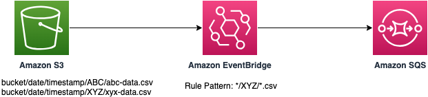

# S3 to EventBridge to SQS with wildcard pattern match

The wildcard filter in Amazon EventBridge rule provides more flexible event matching patterns to reduce rule management and optimize consumers. The SAM template deploys an Amazon S3 bucket, an Amazon EventBridge rule with wildcard pattern match having target as an Amazon SQS queue.

Learn more about this pattern at Serverless Land Patterns:https://serverlessland.com/patterns/s3-eventbridge-wildcard-sam

Important: this application uses various AWS services and there are costs associated with these services after the Free Tier usage - please see the [AWS Pricing page](https://aws.amazon.com/pricing/) for details. You are responsible for any AWS costs incurred. No warranty is implied in this example.

## Requirements

- [Create an AWS account](https://portal.aws.amazon.com/gp/aws/developer/registration/index.html) if you do not already have one and log in. The IAM user that you use must have sufficient permissions to make necessary AWS service calls and manage AWS resources.
- [AWS CLI](https://docs.aws.amazon.com/cli/latest/userguide/install-cliv2.html) installed and configured
- [Git Installed](https://git-scm.com/book/en/v2/Getting-Started-Installing-Git)
- [AWS Serverless Application Model](https://docs.aws.amazon.com/serverless-application-model/latest/developerguide/serverless-sam-cli-install.html) (AWS SAM) installed

## Deployment Instructions

1. Create a new directory, navigate to that directory in a terminal and clone the GitHub repository:
   ```
   git clone https://github.com/aws-samples/serverless-patterns
   ```
2. Change directory to the pattern directory:
   ```
   cd s3-eventbridge-wildcard-sam
   ```
3. From the command line, use AWS SAM to deploy the AWS resources for the pattern as specified in the template.yml file:
   ```
   sam deploy --guided
   ```
4. During the prompts:
    * Enter a stack name
    * Enter `us-east-1` or any other AWS Region. 
    * Allow SAM CLI to create IAM roles with the required permissions. Please keep all other options to default.
5. Make a note of the output, which will be used during testing.

## How it works

* This template creates an S3 bucket that publishes events to Amazon EventBridge, an EventBridge rule with wildcard filter to select only the desired events from dynamic subfolders in Amazon S3 bucket and also an Amazon SQS queue as the target.
* Once the stack is deployed, we will use `upload-to-s3.sh` to create dynamic subfolders based on current date and timestamp within the S3 bucket and upload new files. 
* This will trigger multiple events, however, only the events that will match the wildcard pattern as per the EventBridge rule, will be selected and a message will be sent to the SQS queue.
* We will inspect the messages from the SQS queue to validate the same.

Please refer to the architecture diagram below:



## Testing

1. Run the script `upload-to-s3.sh` to create dynamic subfolders based on current date and timestamp within the S3 bucket and upload new files. Please provide the name of the bucket when asked. You will find the bucket name in the output of the deployment command.
    ```bash
    bash upload-to-s3.sh
    ```

   Sample output:
   ```bash
      Enter S3 bucket name: {your-bucket-name}
      {
         "ETag": "\"d41d8cd98f00b204e9800998ecf8427e\"",
         "ServerSideEncryption": "AES256"
      }
      upload: ./abc-data.csv to s3://{your-bucket-name}/2024-01-17/1705479398/ABC/abc-data.csv
      {
         "ETag": "\"d41d8cd98f00b204e9800998ecf8427e\"",
         "ServerSideEncryption": "AES256"
      }
      upload: ./xyz-data.csv to s3://{your-bucket-name}/2024-01-17/1705479398/XYZ/xyz-data.csv
      ABC and XYZ data uploaded to S3 bucket {your-bucket-name}
      2024-01-17 13:46:42          0 2024-01-17/1705479398/ABC/
      2024-01-17 13:46:45          7 2024-01-17/1705479398/ABC/abc-data.csv
      2024-01-17 13:46:48          0 2024-01-17/1705479398/XYZ/
      2024-01-17 13:46:51          7 2024-01-17/1705479398/XYZ/xyz-data.csv
   ```
2. Please use the below aws cli command to read message from the SQS queue. Please replace the {SQSQueueURL} with the URL from the deployent output and also replace the {your-region} with the region that you selected during deployment:
    ```bash
    aws sqs receive-message --queue-url {SQSQueueURL} --attribute-names All  --message-attribute-names All --region {your-region}
    ```
   
   Sample output:
    ```bash
         {
            "MessageId": "9b441910-c70b-4ac0-90b7-7eb7372a8418",
            "ReceiptHandle": "AQEBHRT2rKwvVD4HkdFXSUZ55T9ofuQChbD1N52VZMwzdOrHq6fgHodHlfeIsiLGKRHqc87VQxTkfylUHmhwnMgpbqsW7GNjPiIuYZrwMMdlqZb1A0249J/WMa8gVe2oMde6xAUdSAN0zLP9biJLjLFFtmBDnI4HhvUvs42B1ApQ998+TMwD3Rbc9SmFFDXtUcafwESGTLpR9rNEa6IbegT4ubu31pP0jtw2dw9REIhq8LU0VPwxLvBMgFMVZczyi3RnVyQYN79afSALrx/zYRINu0COTVWEw53tnqPle/8pl/uJg+PE2fyPiWXHVaemClQXRHDNX1X6iP392lGzc6pU/mL8ZCtWTYkfYbBv0wdMIs0BcVVjuFmsB0mrm5By/DiAcLDUtZ8GhlRhlZli7V0ycg==",
            "MD5OfBody": "63a538841fd7c7e8c4f4551a18391fa8",
            "Body": "{\"version\":\"0\",\"id\":\"a2b89aa3-d845-e241-e0ed-f5a14b646d4f\",\"detail-type\":\"Object Created\",\"source\":\"aws.s3\",\"account\":\"796495736600\",\"time\":\"2024-01-17T07:01:40Z\",\"region\":\"us-west-2\",\"resources\":[\"arn:aws:s3:::{your-bucket-name}\"],\"detail\":{\"version\":\"0\",\"bucket\":{\"name\":\"{your-bucket-name}\"},\"object\":{\"key\":\"2024-01-17/1705474885/XYZ/xyz-data.csv\",\"size\":7,\"etag\":\"4f8d938c2f3606be69d0d2c42384cab8\",\"sequencer\":\"0065A77B54899B2CC1\"},\"request-id\":\"N1BFC1PRNEYWJAP7\",\"requester\":\"796495736600\",\"source-ip-address\":\"15.248.4.199\",\"reason\":\"PutObject\"}}",
            "Attributes": {
                "SenderId": "AIDAIE6VAXUQU2DKHA7DK",
                "ApproximateFirstReceiveTimestamp": "1705477859273",
                "ApproximateReceiveCount": "1",
                "SentTimestamp": "1705474902151"
            }
        }
    ```

   As you see from the message, even though in step 1, we uploaded files into `<current-date>/<timestamp>/ABC/` and `<current-date>/<timestamp>/XYZ/` folders, the EventBridge rule pattern `*/XYZ/*.csv` matched the event corresponding to the csv file uploaded into `<current-date>/<timestamp>/XYZ/` folder. 


## Cleanup

1. Delete all files from the S3 bucket using the command. Please provide the S3 bucket name from the deployment output. Please confirm the warning message.

    ```bash
    bash empty-s3-bucket.sh
    ```

2. Delete the stack
   ```bash
   sam delete
   ```

----
Copyright 2024 Amazon.com, Inc. or its affiliates. All Rights Reserved.

SPDX-License-Identifier: MIT-0
