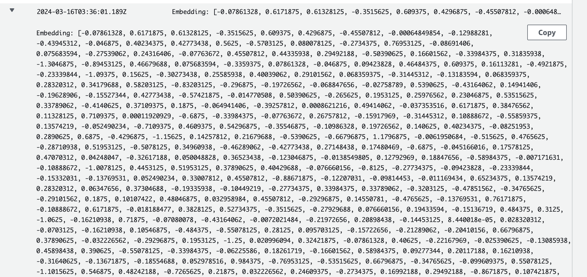

# S3 to Lambda to Bedrock Embeddings

This pattern creates a Amazon S3 bucket, a Lambda function, which will be used to get vector embeddings for the document uploaded into Amazon S3 using Amazon Bedrock.
The Lambda function is triggered by S3 'OBJECT_CREATED' events. The Lambda function can optionally apply business logic to the S3 object. After processing, the Lambda function invokes the embedding model form Amazon Bedrock to get the vector embeddings, which is useful for LLM RAG use cases.

Important: this application uses various AWS services and there are costs associated with these services after the Free Tier usage - please see the [AWS Pricing page](https://aws.amazon.com/pricing/) for details. You are responsible for any AWS costs incurred. No warranty is implied in this example.

## Requirements

* [Create an AWS account](https://portal.aws.amazon.com/gp/aws/developer/registration/index.html) if you do not already have one and log in. The IAM user that you use must have sufficient permissions to make necessary AWS service calls and manage AWS resources.
* [AWS CLI](https://docs.aws.amazon.com/cli/latest/userguide/install-cliv2.html) installed and configured
* [Git Installed](https://git-scm.com/book/en/v2/Getting-Started-Installing-Git)
* [AWS CDK](https://docs.aws.amazon.com/cdk/v2/guide/cli.html)
* [Python, pip, virtualenv](https://docs.aws.amazon.com/cdk/latest/guide/work-with-cdk-python.html) installed

## Prerequisite
Amazon Bedrock users need to request access to models before they are available for use. If you want to add additional models for text, chat, and image generation, you need to request access to models in Amazon Bedrock. Please refer to the link below for instruction:
[Model access](https://docs.aws.amazon.com/bedrock/latest/userguide/model-access.html).

## Deployment Instructions

1. Create a new directory, navigate to that directory in a terminal and clone the GitHub repository:
    ``` 
    git clone https://github.com/aws-samples/serverless-patterns
    ```
2. Change directory to the pattern directory:
    ```
    cd s3-lambda-bedrock-cdk-python
    ```
3. Create a virtual environment for Python:
   ```
   python3 -m venv .venv
   ```
4. Activate the virtual environment
   ```
   source .venv/bin/activate
   ```
   For a Windows platform, activate the virtualenv like this:
   ```
   .venv\Scripts\activate.bat
5. Install the Python required dependencies:
   ```
   pip install -r requirements.txt
   ```
6. Review the CloudFormation template the cdk generates for you stack using the following AWS CDK CLI command:
   ```
   cdk synth
   ```
7. Run the command below to bootstrap your account CDK needs it to deploy
    ```
    cdk bootstrap
    ```
8. From the command line, use CDK to deploy the AWS resources for the pattern. You'll be prompted to approve security related changes during the deployment.
    ```
    cdk deploy
    ```

## How it works

* Any object uploaded to the Amazon S3 bucket will trigger the S3 Create Object event and invoke the AWS Lambda function asynchronously, providing an event that includes comprehensive details about the object. Leveraging the object details within the event, Lambda proceeds to extract the content of the object. Subsequently, it initiates a call to the Amazon Bedrock Titan Embedding service to obtain the vector embeddings corresponding to the content of the object.

## Testing

1. Navigate to the S3 bucket containing key 's3-lambda-bedrock-cdk-python-bucket**' along with your stack name and a hash key
2. Upload any text file to the bucket
3. Wait for the AWS Lambda function to invoke the Amazon Bedrock model to get the vector embeddings. The vector embeddings will be printed in the Amazon CloudWatch logs as shown below



### Making changes

You can customize the AWS Lambda Functions by editing the code at `./src/lambda_function.py`. To deploy changes, use the `cdk deploy` command.

## Cleanup
 
1. Delete the stack
    ```
    cdk destroy
    ```

2. Confirm the stack has been deleted. Login to the AWS console and navigate to the AWS Cloudformation service page "CdkServerlessInfraStack" is deleted or run the below 
    ```bash
    aws cloudformation list-stacks --query "StackSummaries[?contains(StackName,'S3LambdaBedrockCdkPythonStack')].StackStatus"
    ```

You should expect to see a message confirming `DELETE_COMPLETE`.

----
Copyright 2024 Amazon.com, Inc. or its affiliates. All Rights Reserved.

SPDX-License-Identifier: MIT-0
