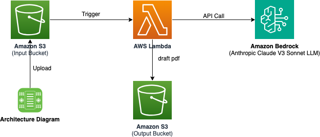

# Generating blog content from image using Amazon Bedrock Claude v3 sonnet LLM

This sample project uses Amazon Bedrock Claude V3 sonnet LLM to create a draft blog from an image uploaded into Amazon S3 bucket

Learn more about this pattern at Serverless Land Patterns: https://serverlessland.com/patterns/s3-lambda-bedrock-sam

Important: this application uses various AWS services and there are costs associated with these services after the Free Tier usage - please see the [AWS Pricing page](https://aws.amazon.com/pricing/) for details. You are responsible for any AWS costs incurred. No warranty is implied in this example.

## Requirements

- [Create an AWS account](https://portal.aws.amazon.com/gp/aws/developer/registration/index.html) if you do not already have one and log in. The IAM user that you use must have sufficient permissions to make necessary AWS service calls and manage AWS resources.
- [AWS CLI](https://docs.aws.amazon.com/cli/latest/userguide/install-cliv2.html) installed and configured
- [Git Installed](https://git-scm.com/book/en/v2/Getting-Started-Installing-Git)
- [AWS Serverless Application Model](https://docs.aws.amazon.com/serverless-application-model/latest/developerguide/serverless-sam-cli-install.html) (AWS SAM) installed

## Prerequisite
Amazon Bedrock users need to request access to models before they are available for use. Please request access for Claude V3 Sonnet LLM from the Amazon Bedrock console. Please refer to the link below for instruction:
[Model access](https://docs.aws.amazon.com/bedrock/latest/userguide/model-access.html).

## Deployment Instructions

1. Create a new directory, navigate to that directory in a terminal and clone the GitHub repository:
   ```bash
   git clone https://github.com/aws-samples/serverless-patterns
   ```

2. Change directory to the pattern directory:
   ```bash
   cd serverless-patterns/s3-lambda-bedrock-sam
   ```

3. From the command line, use AWS SAM to deploy the AWS resources for the pattern as specified in the template.yml file:
   ```bash
   sam deploy -g
   ```

4. During the prompts:

   - Enter a stack name. 
   - Enter the desired AWS Region.
   - Leave rest of the options as default.

   Once you have run `sam deploy --guided` mode once and saved arguments to a configuration file (samconfig.toml), you can use `sam deploy` in future to use these defaults.

5. Note the outputs from the SAM deployment process. This contain the resource names and/or Ids which are used for next step as well as for testing.

6. Run the `create_lambda_layer.sh`. You may have to change the file permission to make it executable.  This will create the lambda layer with necessary boto3 api for bedrock.
   ```bash
   bash create_lambda_layer.sh
   ```

7. Provide a name for the Lambda layer. Such as: 
   ```bash
   Enter the name of the Layer: fpdf2_layer
   ```
   It will show output like below:
   ```bash
   Publishing the layer. Please wait ...
   {
    "Content": {
      .....
      .....
    },
    "LayerArn": "arn:aws:lambda:us-east-1:xxxxxxxxxxxx:layer:fpdf2_layer",
    "LayerVersionArn": "arn:aws:lambda:us-east-1:xxxxxxxxxxxx:layer:fpdf2_layer:1",
    "Description": "",
    "CreatedDate": "YYYY-MM-DDT10:47:36.983+0000",
    "Version": 1
   }
   ``` 

8. You may have to press `q` to come out of the output. Copy the value of `LayerVersionArn` from the above output and provide it into the next step. Such as:
   ```bash
   Enter the LayerVersionArn from the above command: arn:aws:lambda:us-east-1:xxxxxxxxxxxx:layer:fpdf2_layer:1
   ```

9. Please copy the value of `InvokeBedrockClaudeV3Function` from the `sam deploy --guided` output and provide that as response to next question. Such as:
   ```bash
   Enter the Lambda function name from the SAM deploy output: your-stack-name-InvokeBedrockClaudeV3Function-xxxxxxxxxxxx
   ```
   The script will now run aws cli command to add the newly created layer to the Lambda function.
   It will show output like below:
   ```bash
   Adding the new layer to your Lambda function's configuration. Please wait ...
   {
      "FunctionName": "your-stack-name-InvokeBedrockClaudeV3Function-xxxxxxxxxxxx",
      ......
      ......
      "State": "Active",
      "LastUpdateStatus": "InProgress",
      "LastUpdateStatusReason": "The function is being created.",
      "LastUpdateStatusReasonCode": "Creating",
      "PackageType": "Zip",
      "Architectures": [
         "arm64"
      ],
      "EphemeralStorage": {
         "Size": 512
      }
   }      
   ```    

10. You may have to press `q` to come out of the output. The setup is ready for testing.

## How it works


Please refer to the architecture diagram below:



* User uploads an architecture image file into the Amazon S3 input bucket.
* Amazon S3 triggers the AWS Lambda function.
* The AWS Lambda function reads the image file and converts into Base 64 encoded format and calls Amazon Bedrock API for Anthropic Claude V3 Sonnect LLM with the encoded data and prompt to create a blog from it.
* The Amazon Amazon Bedrock API for Anthropic Claude V3 Sonnect LLM generated the blog content and retuns the JSON response.
* THe AWS Lambda function creates a pdf file with the blog content and saves it into an Amazon S3 output bucket.

## Testing


1. From the command line, please execute the below command to upload the `sample-architecture.jpeg` file into the Amazon S3 bucket. Please replace `MyInputBucketName` from the `sam deploy` output and also your region. 
   ```bash
   aws s3 cp sample-architecture.jpeg s3://{MyInputBucketName}/sample-architecture.jpeg --region {your-region}
   ```

2. Run the `create_lambda_layer.sh`. You may have to change the file permission to make it executable.  This will create the lambda layer with necessary boto3 api for bedrock.
   ```bash
   bash delete_lambda_layer.sh
   ```

3. Log into [Amazon S3 Console](https://s3.console.aws.amazon.com/s3/buckets), within a few seconds, you should see a `draft-blog.pdf` file uploaded into the the `MyOutputBucketName` S3 bucket. Download the file from the bucket using the below command and validate the content.
   ```bash
   aws s3 cp s3://{MyOutputBucketName}/draft-blog.pdf ./draft-blog.pdf
   ```

## Cleanup

1. Delete the content in the Amazon S3 bucket using the following command. Please update `MyInputBucketName` from the `sam deploy` output. Please *ensure* that the correct bucket name is provided to avoid accidental data loss:
   ```bash
   aws s3 rm s3://{MyInputBucketName} --recursive --region {your-region}
   aws s3 rm s3://{MyOutputBucketName} --recursive --region {your-region}
   ```

2. Delete the AWS Lambda layer using the following command:
   ```bash
   bash delete_lambda_layer.sh
   ```

3. To delete the resources deployed to your AWS account via AWS SAM, run the following command:
   ```bash
   sam delete
   ```

---

Copyright 2024 Amazon.com, Inc. or its affiliates. All Rights Reserved.

SPDX-License-Identifier: MIT-0
