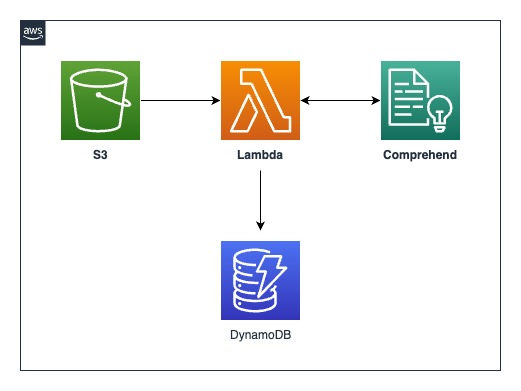

# S3 -> Lambda -> Comprehend
This patterns shows CDK deployment on how to leverage Amazon S3, AWS Lambda, Amazon Comprehend and Amazon DynamoDB to perform Batch Sentiment Analysis in a serverless fashion.

## Architecture


### What resources will be created?
This CDK code will create the following:
   - One S3 bucket (to hold the text for which sentiment analysis has to be done)
   - One Lambda function (to invoke the Comprehend API)
   - One DynamoDB (to store the result of Sentiment Analysis)
   - One IAM role (for the Lambda function to invoke Comprehend and DynamoDB)

## Requirements

### Development Environment
**Cloud 9**

This demonstration for this pattern is executed in an AWS Cloud9 environment. The EC2 instance used is m5.large (8 GiB RAM + 2 vCPU). However, users have an option to deploy the application using CDK from local environment as well.

### AWS setup
**Region**

If you have not yet run `aws configure` and set a default region, you must do so, or you can also run `export AWS_DEFAULT_REGION=<your-region>`. The region used in the demonstration is us-east-1 as Amazon Bedrock is currently not available in every region.

**Authorization**

You must use a role that has sufficient permissions to create IAM roles, as well as CloudFormation resources

#### Python >=3.8
Make sure you have [python3](https://www.python.org/downloads/) installed at a version >=3.8.x in the CDK environment. The demonstration uses python 3.10.

#### AWS CDK
Make sure you have the [AWS CDK](https://docs.aws.amazon.com/cdk/v2/guide/getting_started.html#getting_started_install) installed in the Cloud9 environment.


## Setup

### Set up environment and gather packages

```
cd s3-lambda-comprehend-cdk-python
```

Install the required dependencies (aws-cdk-lib and constructs) into your Python environment 
```
pip install -r requirements.txt
```

### Gather and deploy resources with the CDK

First synthesize, which executes the application, defines which resources will be created, and translates this into a CloudFormation template
```
cdk synth
```
All AWS CDK v2 deployments use dedicated AWS resources to hold data during deployment. Therefore, your AWS account and Region must be bootstrapped to create these resources before you can deploy. If you haven't already bootstrapped execute the below command
```
cdk bootstrap
```
and deploy with
```
cdk deploy
```

The deployment will create a S3 bucket, a Lambda function and a DynamoDB table.

## How it works
The S3 bucket acts as a placeholder to upload the text, required for performing Sentiment Analysis. In the demonstration, we use the contents inside `src\user_input_text.txt`. 
The file is uploaded to S3 bucket, which triggers the Lambda function. The Lambda function processes the contents within the uploaded file and invokes the Comprehend's `BatchDetectSentiment` API and the analyzed response from Comprehend service is stored in DynamoDB.

## Testing
Upon successful deployment of the stack, the Output section would provide the `S3 Bucket` in the CDK environment. 
Upload the sample file `src\user_input_text.txt` into the `S3 bucket`. The upload action triggers the Lambda function and the input text is analyzed.
A response as below is returned from Amazon Comprehend service and stored in a DynamoDB table with file name as the partition key. 
As per specific use-cases, the responses can be converted into a flat file to be stored in S3.

Response from Comprehend Service:
```
[{
	'Index': 0, 
	'Sentiment': 'NEGATIVE', 
	'SentimentScore': 
	{
		'Positive': 0.0004151896573603153, 
		'Negative': 0.9991872906684875, 
		'Neutral': 0.00035902965464629233, 
		'Mixed': 3.8464131648652256e-05
	}
}, 
{
	'Index': 1, 
	'Sentiment': 'POSITIVE', 
	'SentimentScore': 
	{
		'Positive': 0.9949328303337097, 
		'Negative': 0.00017402479716110975, 
		'Neutral': 0.004860139451920986, 
		'Mixed': 3.302405457361601e-05
	}
}, 
{
	'Index': 2, 'Sentiment': 
	'POSITIVE', 
	'SentimentScore': 
	{
		'Positive': 0.9485660791397095, 
		'Negative': 0.003914174623787403, 
		'Neutral': 0.0472978875041008, 
		'Mixed': 0.00022181126405484974
	}
}, 
{
	'Index': 3, 'Sentiment': 'POSITIVE', 
	'SentimentScore': 
	{
		'Positive': 0.5873997211456299, 
		'Negative': 0.0012677968479692936, 
		'Neutral': 0.41117972135543823, 
		'Mixed': 0.00015274948964361101
	}
}]

```

## Cleanup

To clean up the resources created as part of this demonstration, run the command `cdk destroy` in the directory `s3-lambda-comprehend-cdk-python`. In addition, users are advised to terminate the Cloud9 EC2 instance to avoid any unexpected charges.
