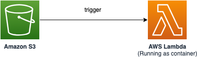

# Deploy AWS Lambda functions with container image

   This sample project demonstrates how to deploy an AWS Lambda function with container image that gets triggered by Amazon S3 bucket create object event.

Learn more about this pattern at Serverless Land Patterns: https://serverlessland.com/patterns/s3-lambda-container-sam

Important: this application uses various AWS services and there are costs associated with these services after the Free Tier usage - please see the [AWS Pricing page](https://aws.amazon.com/pricing/) for details. You are responsible for any AWS costs incurred. No warranty is implied in this example.

## Requirements

- [Create an AWS account](https://portal.aws.amazon.com/gp/aws/developer/registration/index.html) if you do not already have one and log in. The IAM user that you use must have sufficient permissions to make necessary AWS service calls and manage AWS resources.
- [AWS CLI](https://docs.aws.amazon.com/cli/latest/userguide/install-cliv2.html) installed and configured
- [Git Installed](https://git-scm.com/book/en/v2/Getting-Started-Installing-Git)
- [AWS Serverless Application Model](https://docs.aws.amazon.com/serverless-application-model/latest/developerguide/serverless-sam-cli-install.html) (AWS SAM) installed
- [Docker](https://docs.docker.com/engine/install/) Installed and running


## Deployment Instructions

1. Create a new directory, navigate to that directory in a terminal and clone the GitHub repository:
   ```bash
   git clone https://github.com/aws-samples/serverless-patterns
   ```

2. Change directory to the pattern directory:
   ```bash
   cd serverless-patterns/s3-lambda-container-sam
   ```

3. Execute the below script from the command line. This script build the docker image, creates the ECR repository and push the image to the repository.:
   ```bash
   bash build.sh
   ```

4. Provide the following details. Please change the sample values according to your requirement:
   - Enter image name: sample-image
   - Enter repository name: sample-repo
   - Enter AWS account ID: enter your AWS account Id.
   - Enter AWS Region: us-east-1 

   After successful execution of the script, the script will output the image URI. Please make a note of the image URI which will be used in the next step. Sample output:

   ```bash
   Pushed image URI: <your-aws-account-id>.dkr.ecr.<your-region>.amazonaws.com/<repo-name>:latest
   ```bash

5. From the command line, use AWS SAM to deploy the AWS resources for the pattern as specified in the template.yml file:
   ```bash
   sam deploy -g
   ```

6. During the prompts:
   - Enter a stack name. 
   - Enter the desired AWS Region. Please refer to the [documentation](https://docs.aws.amazon.com/ses/latest/dg/regions.html#region-receive-email) for the list of supported regions.
   - Enter `ContainerImageURI`. Please enter the image URI from the previous step.
   - Leave rest of the options as default.

7. Note the outputs from the SAM deployment process. This contain the resource names and/or Ids which are used for next step as well as for testing.


## How it works


Please refer to the architecture diagram below:



* Upload a file into the Amazon S3 bucket.
* The create object event in the S3 bucket triggers the AWS Lambda function.
* The AWS Lambda function reads the content of the file uploaded into the S3 bucket. 


## Testing


1. Upload the `sample-data.csv` into the Amazon S3 bucket using the below command. Please replace `SampleBucketName` with output from the `sam deploy` output and also your region. 
   ```bash
   aws s3 cp sample-data.csv s3://{SampleBucketName}/sample-data.csv  --region {my-region}
   ```

2. Execute the below command to tail logs of the AWS Lambda function. Please replace `SampleFunction` from the `sam deploy -g` output and also your region. 
   ```bash
   aws logs tail --follow /aws/lambda/{SampleFunction} --region {your-region}
   ```

3. You should see logline similar to following in the Lambda function log. This shows that the AWS Lambda function was triggered by object creation event in Amazon S3 bucket. The Lambda function was able to read the content of the CSV file: 
   ```bash
   2024-03-01T17:36:26.109000+00:00 2024/03/01/[$LATEST]d51xxxxxxxxxxxxxxxxxxxxx08230 START RequestId: c622c100-xxxxx-xxxx-xxxx-eeca1dd7f8b5 Version: $LATEST
   2024-03-01T17:36:26.354000+00:00 2024/03/01/[$LATEST]d51xxxxxxxxxxxxxxxxxxxxx08230 Lines:
   2024-03-01T17:36:26.354000+00:00 2024/03/01/[$LATEST]d51xxxxxxxxxxxxxxxxxxxxx08230 ['John, 35, New York, USA, hiking', 'Mary, 28, London, UK, reading ', 'Bob, 41, Toronto, Canada, cycling', 'Alice, 24, Paris, France, photography', 'David, 30, Berlin, Germany, cooking', 'Emma, 47, Sydney, Australia, gardening', 'Michael, 19, Mumbai, India, video games', 'Olivia, 52, Shanghai, China, yoga', 'James, 61, Sao Paulo, Brazil, golf', 'Sophia, 18, Cairo, Egypt, singing']
   2024-03-01T17:36:26.356000+00:00 2024/03/01/[$LATEST]d51xxxxxxxxxxxxxxxxxxxxx08230 END RequestId: c622c100-xxxxx-xxxx-xxxx-eeca1dd7f8b5
   ```

4. Press `Ctrl + C` to come out of the AWS Lambda log tailing.


## Cleanup


1. Delete the content in the Amazon S3 bucket using the following command. Please update `SampleBucketName` from the `sam deploy -g` output. Please *ensure* that the correct bucket name is provided to avoid accidental data loss:
   ```bash
   aws s3 rm s3://{SampleFunction} --recursive --region {your-region}
   ```

2. To delete the resources deployed to your AWS account via AWS SAM, run the following command:
   ```bash
   sam delete
   ```

---

Copyright 2024 Amazon.com, Inc. or its affiliates. All Rights Reserved.

SPDX-License-Identifier: MIT-0
