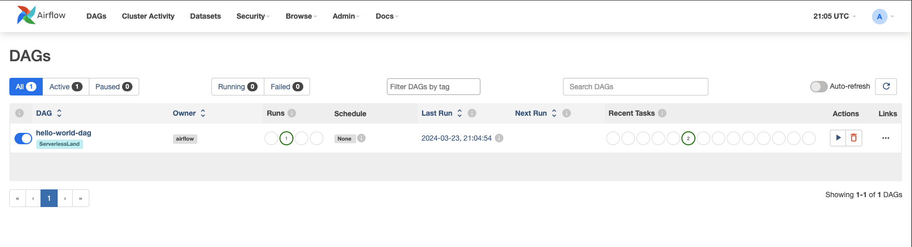

# Triggering DAG (Directed Acyclical Graph) workflow in MWAA (Managed Wokflow for Apache Airflow) using S3 file upload events

This pattern demonstrates how to trigger a DAG workflow hosted in MWAA (Managed Wokflow for Apache Airflow) using input request files uploaded in a source S3 bucket.

Learn more about this pattern at Serverless Land Patterns: http://serverlessland.com/patterns/s3-lambda-mwaa-terraform

Important: this application uses various AWS services and there are costs associated with these services after the Free Tier usage - please see the [AWS Pricing page](https://aws.amazon.com/pricing/) for details. You are responsible for any AWS costs incurred. No warranty is implied in this example.

## Requirements

* [Create an AWS account](https://portal.aws.amazon.com/gp/aws/developer/registration/index.html) if you do not already have one and log in. The IAM user that you use must have sufficient permissions to make necessary AWS service calls and manage AWS resources.
* [AWS CLI](https://docs.aws.amazon.com/cli/latest/userguide/install-cliv2.html) installed and configured
* [Git Installed](https://git-scm.com/book/en/v2/Getting-Started-Installing-Git)
* [Python](https://www.python.org/downloads/) installed
* [PIP](https://pip.pypa.io/en/stable/installation/) installed
* [Terraform](https://developer.hashicorp.com/terraform/tutorials/aws-get-started/install-cli) installed

## Deployment Instructions

1. Create a new directory, navigate to that directory in a terminal and clone the GitHub repository:
    ```bash 
    git clone https://github.com/aws-samples/serverless-patterns
    ```
2. Change directory to the pattern directory:
    ```bash
    cd s3-lambda-mwaa-terraform
    ```
3. Deploy with terraform:
    ```bash
    terraform -chdir=infra init
    terraform -chdir=infra apply
    ```
4. After successful deployment, note the outputs `mwaa_webserver_url` and `input_bucket_id`. You will use them for testing.

## How it works

This Terraform application deploys a MWAA (Managed Wokflow for Apache Airflow) instance with a `hello-world-dag` workflow, an input S3 bucket with event notifications to lambda. Lambda has been configured to trigger `hello-world-dag` workflow in MWAA for `input.json` file uploaded in the input S3 bucket.
***NOTE: Provisioning MWAA Airflow environment takes minimum of 20 mins***

## Testing

1. Retrieve the MWAA WebServer url from the deployment output variable `mwaa_webserver_url` and open MWAA console in a browser using the url `https://<mwaa_webserver_url>`
    ```
    mwaa_webserver_url = "36fd2436-eb06-4a24-b9aa-49cd07264010.c14.us-east-1.airflow.amazonaws.com"
    ```
2. Retrieve the input S3 bucket name from deployment output variable `input_bucket_id`. 
    ```
    input_bucket_id = "input-us-east-1-847104828221"
    ```
3. Upload the provided `input.json` file in the input S3 bucket.
    ```bash
    aws s3 cp test/input.json s3://<input_bucket_id>/input.json --sse "AES256"
    # example 
    aws s3 cp test/input.json s3://input-us-east-1-847104828221/input.json --sse "AES256"
    ```
4. You should now see the `hello-world-dag` workflow triggered in MWAA console




## Cleanup
 
1. Delete the application
    ```bash
    terraform -chdir=infra destroy
    ```
2. Confirm the application has been deleted
    ```bash
    terraform -chdir=infra show
    ```
----
Copyright 2024 Amazon.com, Inc. or its affiliates. All Rights Reserved.

SPDX-License-Identifier: MIT-0
