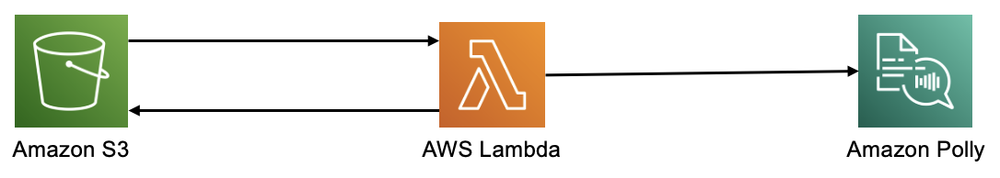

# S3 - Lambda - Polly

This pattern demonstrates the use of Polly, lambda and S3 event notifications to convert a text to speech on uploading the file to S3.

Learn more about this pattern at Serverless Land Patterns: << Add the live URL here >>

Important: this application uses various AWS services and there are costs associated with these services after the Free Tier usage - please see the [AWS Pricing page](https://aws.amazon.com/pricing/) for details. You are responsible for any AWS costs incurred. No warranty is implied in this example.

## Services

The AWS services used in this pattern are

- Amazon S3
- AWS Lambda
- Amazon Polly



## Requirements

* [Create an AWS account](https://portal.aws.amazon.com/gp/aws/developer/registration/index.html) if you do not already have one and log in. The IAM user that you use must have sufficient permissions to make necessary AWS service calls and manage AWS resources.
* [AWS CLI](https://docs.aws.amazon.com/cli/latest/userguide/install-cliv2.html) installed and configured
* [Git Installed](https://git-scm.com/book/en/v2/Getting-Started-Installing-Git)
* [AWS Serverless Application Model](https://docs.aws.amazon.com/serverless-application-model/latest/developerguide/serverless-sam-cli-install.html) (AWS SAM) installed

## Deployment Instructions

1. Create a new directory, navigate to that directory in a terminal and clone the GitHub repository:
    ``` 
    git clone https://github.com/aws-samples/serverless-patterns
    ```
1. Change directory to the pattern directory:
    ```
    cd s3-lambda-polly-sam
    ```
1. From the command line, use AWS SAM to build the application:
    ```
    sam build --use-container
    ```
1. Use AWS SAM to deploy the AWS resources for the pattern as specified in the template.yml file:
    ```
    sam deploy --guided
    ```
1. During the prompts:
    * Enter a stack name
    * Enter the desired AWS Region
    * Allow SAM CLI to create IAM roles with the required permissions.

    Once you have run `sam deploy --guided` mode once and saved arguments to a configuration file (samconfig.toml), you can use `sam deploy` in future to use these defaults.

1. Note the outputs from the SAM deployment process. These contain the resource names and/or ARNs which are used for testing.

## How it works

The S3 bucket is configured with event notification. On uploading the text file to S3 bucket, it triggers an event notification to lambda. The lambda reads the file contents from the S3 bucket and sends it to polly for speech conversion. The polly returns an audio file which is stored backed into the same bucket.

## Testing

Provide steps to trigger the integration and show what should be observed if successful.

1. Upload the test.txt to the S3 bucket
    ```bash
    aws s3 cp test.txt s3://texttospeechinputbucket
    ```
1. The audio file will be written back to the same bucket after 2-3 mins.

## Cleanup
 
1. Delete the stack
    ```bash
    sam delete
    ```
----
Copyright 2023 Amazon.com, Inc. or its affiliates. All Rights Reserved.

SPDX-License-Identifier: MIT-0