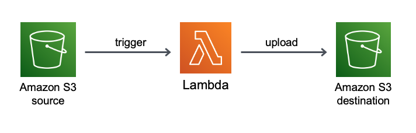

## Description
## S3 - Lambda - S3

This pattern creates two S3 buckets and a Lambda function using SAM and Java 11.

Important: this application uses various AWS services and there are costs associated with these services after the Free Tier usage - please see the AWS Pricing page for details. You are responsible for any AWS costs incurred.


## Language:
###This is a Maven project which uses Java 11 and AWS SDK

## Framework

The framework used to deploy the infrastructure is SAM

## Services used

The AWS services used in this pattern are
#### AWS Lambda - Amazon S3

Topology




## Description
The SAM template contains all the information to deploy AWS resources(the Lambda function and two S3 buckets)
and also the permission required by these service to communicate.

You will be able to create and delete the CloudFormation stack using the CLI commands.

The source S3 bucket will trigger the Lambda function whenever a new object .txt is uploaded, 
and the Lambda function will download the object from the source bucket, will transform all the characters to
uppercase and finally will upload the newly updated object into the second S3 bucket.

This is fully functional example developed in Java 11.


## Deployment commands

````
mvn clean package

# create an S3 bucket where the source code will be stored:
aws s3 mb s3://RANDOM_CHARACTERS

# copy the source code located in the target folder:
aws s3 cp target/sourceCode.zip s3://RANDOM_CHARACTERS

# SAM will deploy the CloudFormation stack described in the template.yml file:
sam deploy --s3-bucket RANDOM_CHARACTERS --stack-name transformer --capabilities CAPABILITY_IAM

````

## Testing

To test the endpoint first send data using the following command. Be sure to update the endpoint with endpoint of your stack.

```
#create a text file and write a text paragraph

#upload the text file to the source S3 bucket sourceconfigbckt
aws s3 cp input.txt s3://sourceconfigbckt

#list all bucket
aws s3 ls

#list the new file in the second bucket destinationconfigbckt
aws s3 ls s3://destinationconfigbckt

#download the output.txt file
aws s3api get-object --bucket destinationconfigbckt --key output.txt download

#display the content
cat download

```

## Cleanup

Run the given command to delete the resources that were created. It might take some time for the CloudFormation stack to get deleted.
```
aws s3 rm s3://sourceconfigbckt --recursive

aws s3 rm s3://destinationconfigbckt --recursive

aws cloudformation delete-stack --stack-name transformer

aws s3 rm s3://RANDOM_CHARACTERS --recursive

aws s3 rb s3://RANDOM_CHARACTERS
```

## Requirements

* [Create an AWS account](https://portal.aws.amazon.com/gp/aws/developer/registration/index.html) if you do not already have one and log in. The IAM user that you use must have sufficient permissions to make necessary AWS service calls and manage AWS resources.
* [AWS CLI](https://docs.aws.amazon.com/cli/latest/userguide/install-cliv2.html) installed and configured
* [Git Installed](https://git-scm.com/book/en/v2/Getting-Started-Installing-Git)
* [AWS Serverless Application Model](https://docs.aws.amazon.com/serverless-application-model/latest/developerguide/serverless-sam-cli-install.html) (AWS SAM) installed


## Author bio
Name: Razvan Minciuna
Linkedin: https://www.linkedin.com/in/razvanminciuna/
Description: Software Architect
