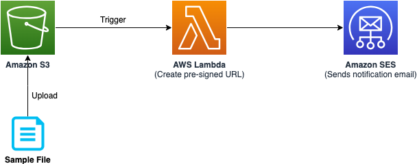

# Send email with pre-signed S3 bucket URL whenever a file is uploaded into the bucket

This sample project demonstrates how to send an email with pre-signed S3 bucket URL whenever a file is uploaded into the bucket.

Learn more about this pattern at Serverless Land Patterns: https://serverlessland.com/patterns/s3-lambda-ses-sam

Important: this application uses various AWS services and there are costs associated with these services after the Free Tier usage - please see the [AWS Pricing page](https://aws.amazon.com/pricing/) for details. You are responsible for any AWS costs incurred. No warranty is implied in this example.

## Requirements

- [Create an AWS account](https://portal.aws.amazon.com/gp/aws/developer/registration/index.html) if you do not already have one and log in. The IAM user that you use must have sufficient permissions to make necessary AWS service calls and manage AWS resources.
- [AWS CLI](https://docs.aws.amazon.com/cli/latest/userguide/install-cliv2.html) installed and configured
- [Git Installed](https://git-scm.com/book/en/v2/Getting-Started-Installing-Git)
- [AWS Serverless Application Model](https://docs.aws.amazon.com/serverless-application-model/latest/developerguide/serverless-sam-cli-install.html) (AWS SAM) installed


## Deployment Instructions

1. Create a new directory, navigate to that directory in a terminal and clone the GitHub repository:
   ```bash
   git clone https://github.com/aws-samples/serverless-patterns
   ```
2. Change directory to the pattern directory:
   ```bash
   cd s3-lambda-ses-sam
   ```
3. From the command line, use AWS SAM to deploy the AWS resources for the pattern as specified in the template.yml file:
   ```bash
   sam deploy -g
   ```
4. During the prompts:

   - Enter a stack name. 
   - Enter the desired AWS Region. Please refer to the [documentation](https://docs.aws.amazon.com/ses/latest/dg/regions.html#region-endpoints) for the list of supported regions.
   - Enter `SenderEmailId`. Email will be sent from this email id. You need to have access to this email id for one time verification. 
   - Enter `RecipientEmailId`. Email will be sent to this email id.
   - Leave rest of the options as default.

5. You should receive an email in `SenderEmailId` with subject line `Amazon Web Services – Email Address Verification Request in region {your-region}`. Click on the verification link to verify the ownership of the email id.


5. Note the outputs from the SAM deployment process. This contain the resource names and/or Ids which are used for next step as well as for testing.


## How it works


Please refer to the architecture diagram below:



* User uploads a file into the Amazon S3 bucket.
* Amazon S3 triggers the AWS Lambda function.
* The AWS Lambda function creates a pre-signed URL with validity of one hour for the uploaded file and calls Amazon SES API.
* The Amazon SES sends the notification email.

## Testing


1. From the command line, please execute the below command to upload the `sample.json` file into the Amazon S3 bucket. Please replace `MyBucketName` from the `sam deploy` output and also your region. 
   ```bash
   aws s3 cp sample.json s3://{MyBucketName}/sample.json --region us-west-2--region {your-region}
   ```


2. Within a few seconds, you should receive an email with subject line `New Amazon S3 object uploaded`. The email contains the pre-signed URL to access the file from the Amazon S3 bucket. The URL is valid for one hour. Please click the link to view the content of the file on the browser.

## Cleanup

1. Delete the content in the Amazon S3 bucket using the following command. Please update `MyBucketName` from the `sam deploy` output. Please *ensure* that the correct bucket name is provided to avoid accidental data loss:
   ```bash
   aws s3 rm s3://{MyBucketName} --recursive --region {my-region}
   ```

3. To delete the resources deployed to your AWS account via AWS SAM, run the following command:
   ```bash
   sam delete
   ```

---

Copyright 2024 Amazon.com, Inc. or its affiliates. All Rights Reserved.

SPDX-License-Identifier: MIT-0
