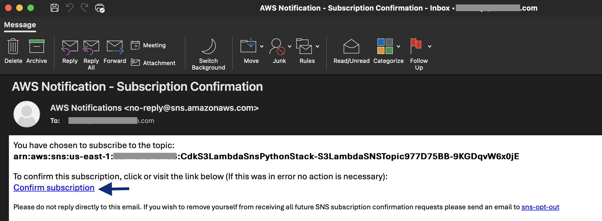
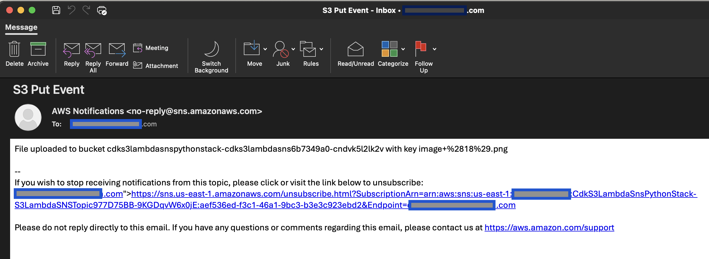

# Amazon S3 to AWS Lambda to publish Amazon SNS notification

This pattern creates a Amazon S3 bucket, a Lambda function, and an Amazon SNS topic.
The Lambda function is triggered by S3 'OBJECT_CREATED' events. The Lambda function can optionally apply business logic to the S3 object. After processing, the Lambda function publishes an SNS notification of the new object.

Important: this application uses various AWS services and there are costs associated with these services after the Free Tier usage - please see the [AWS Pricing page](https://aws.amazon.com/pricing/) for details. You are responsible for any AWS costs incurred. No warranty is implied in this example.

## Requirements

* [Create an AWS account](https://portal.aws.amazon.com/gp/aws/developer/registration/index.html) if you do not already have one and log in. The IAM user that you use must have sufficient permissions to make necessary AWS service calls and manage AWS resources.
* [AWS CLI](https://docs.aws.amazon.com/cli/latest/userguide/install-cliv2.html) installed and configured
* [Git Installed](https://git-scm.com/book/en/v2/Getting-Started-Installing-Git)
* [AWS CDK](https://docs.aws.amazon.com/cdk/v2/guide/cli.html)
* [Python, pip, virtualenv](https://docs.aws.amazon.com/cdk/latest/guide/work-with-cdk-python.html) installed

## Deployment Instructions

1. Create a new directory, navigate to that directory in a terminal and clone the GitHub repository:
    ``` 
    git clone https://github.com/aws-samples/serverless-patterns
    ```
2. Change directory to the pattern directory:
    ```
    cd s3-lambda-sns-python-cdk
    ```
3. Create a virtual environment for Python:
   ```
   python3 -m venv .venv
   ```
4. Activate the virtual environment
   ```
   source .venv/bin/activate
   ```
   For a Windows platform, activate the virtualenv like this:
   ```
   .venv\Scripts\activate.bat
5. Install the Python required dependencies:
   ```
   pip install -r requirements.txt
   ```
6. Review the CloudFormation template the cdk generates for you stack using the following AWS CDK CLI command:
   ```
   cdk synth
   ```
7. Run the command below to bootstrap your account CDK needs it to deploy
    ```
    cdk bootstrap
    ```
8. From the command line, use CDK to deploy the AWS resources for the pattern. You'll be prompted to approve security related changes during the deployment.
    ```
    cdk deploy --parameters Email=<EMAIL_ID_THAT_YOU_WANT_TO_SUSCRIBE_TO_SNS_TOPIC>
    ```
9. Once the deployment is complete, you should receive a email to the email id that was used in the previous step to confirm the Amazon SNS subscription as shown below. Follow the link in the email to confirm the subscription.
    

## How it works

* Any object uploaded to the Amazon S3 bucket will trigger the S3 Create Object event and invoke the AWS Lambda associated with the event.
The AWS Lambdaambda function will get the Amazon S3 bucket name and object key from the event. This informatation is used to read the object and apply business logic if any before triggering the Amazon SNS topic with the required message.

## Testing

1. Navigate to the S3 bucket containing key 'cdks3lambdasnspythonstack-cdks3lambdasns**' along with your stack name and a hash key
2. Upload any object to the bucket
3. Wait for the AWS Lambda function to process the S3 event notification and send message to the email subscribed to the SNS topic. It should look like below sample



### Making changes

You can customize the AWS Lambda Functions by editing the code at `./src/lambda_function.py`. To deploy changes, use the `cdk deploy` command.

## Cleanup
 
1. Delete the stack
    ```
    cdk destroy
    ```

2. Confirm the stack has been deleted. Login to the AWS console and navigate to the AWS Cloudformation service page "CdkServerlessInfraStack" is deleted or run the below 
    ```bash
    aws cloudformation list-stacks --query "StackSummaries[?contains(StackName,'CdkS3LambdaSnsPythonStack')].StackStatus"
    ```

You should expect to see a message confirming `DELETE_COMPLETE`.

----
Copyright 2024 Amazon.com, Inc. or its affiliates. All Rights Reserved.

SPDX-License-Identifier: MIT-0
