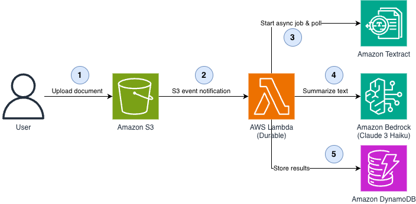

# Durable Document Processing with Amazon S3, AWS Lambda, Amazon Textract, and Amazon Bedrock

This pattern demonstrates a durable document processing pipeline. When a document is uploaded to Amazon S3, a durable AWS Lambda function extracts text using Amazon Textract's asynchronous API, summarizes the content with Amazon Bedrock (Amazon Nova Lite), and stores the results in Amazon DynamoDB. The durable function uses checkpointing and `waitForCondition` to reliably poll for the Textract job completion without wasting compute, and automatically resumes from the last checkpoint if interrupted.

Learn more about this pattern at Serverless Land Patterns: [https://serverlessland.com/patterns/s3-lambda-textract-bedrock-durable-cdk-ts](https://serverlessland.com/patterns/s3-lambda-textract-bedrock-durable-cdk-ts)

Important: this application uses various AWS services and there are costs associated with these services after the Free Tier usage - please see the [AWS Pricing page](https://aws.amazon.com/pricing/) for details. You are responsible for any AWS costs incurred. No warranty is implied in this example.

## Requirements

* [Create an AWS account](https://portal.aws.amazon.com/gp/aws/developer/registration/index.html) if you do not already have one and log in. The IAM user that you use must have sufficient permissions to make necessary AWS service calls and manage AWS resources.
* [AWS CLI](https://docs.aws.amazon.com/cli/latest/userguide/install-cliv2.html) installed and configured
* [Git Installed](https://git-scm.com/book/en/v2/Getting-Started-Installing-Git)
* [Node.js and npm](https://nodejs.org/) installed
* [AWS CDK](https://docs.aws.amazon.com/cdk/latest/guide/getting_started.html) installed
* [Amazon Bedrock model access](https://docs.aws.amazon.com/bedrock/latest/userguide/model-access.html) enabled for Amazon Nova Lite in your AWS region

## Important: Bedrock Inference Profile Region Prefix

The Lambda handler uses a cross-region inference profile ID to invoke Amazon Nova Lite. The profile ID is region-specific:

| Region | Inference Profile ID |
|--------|---------------------|
| US regions (us-east-1, us-west-2, etc.) | `us.amazon.nova-lite-v1:0` |
| EU regions (eu-central-1, eu-west-1, etc.) | `eu.amazon.nova-lite-v1:0` |
| AP regions (ap-southeast-1, ap-northeast-1, etc.) | `ap.amazon.nova-lite-v1:0` |

The default in this pattern is `eu.amazon.nova-lite-v1:0`. If deploying to a different region, update the `modelId` in `lambda/processor.js` and the inference profile ARN in `lib/pattern-stack.ts`.

## Deployment Instructions

1. Create a new directory, navigate to that directory in a terminal and clone the GitHub repository:

    ```bash
    git clone https://github.com/aws-samples/serverless-patterns
    ```

2. Change directory to the pattern directory:

    ```bash
    cd s3-lambda-textract-bedrock-durable-cdk-ts
    ```

3. Install dependencies:

    ```bash
    npm install
    ```

4. Deploy the CDK stack to your default AWS account and region:

    ```bash
    cdk deploy
    ```

5. Note the outputs from the CDK deployment process. These contain the resource names which are used for testing.

## Deployment Outputs

After deployment, CDK will display the following outputs. Save these values for testing:

| Output Key | Description | Usage |
|------------|-------------|-------|
| `DocumentBucketName` | Amazon S3 bucket for document uploads | Upload documents here to trigger processing |
| `ResultsTableName` | Amazon DynamoDB table for processing results | Query this table to see extracted text and summaries |
| `ProcessorFunctionName` | Durable AWS Lambda function name | Use for monitoring and log inspection |
| `ProcessorFunctionArn` | Durable AWS Lambda function ARN | Reference for invocation and permissions |

## How it works



This pattern creates a durable AWS Lambda function that implements a multi-step document processing pipeline with automatic checkpointing and resilient polling.

Architecture flow:
1. A document (PDF, PNG, or JPG) is uploaded to the Amazon S3 document bucket
2. Amazon S3 sends an event notification that triggers the durable AWS Lambda function
3. The function starts an asynchronous Amazon Textract text detection job (Step 1: `start-textract`)
4. The function polls for Textract job completion using `waitForCondition` with exponential backoff (Step 2: `wait-textract-complete`) — the function suspends between polls without consuming compute
5. Once Textract completes, the function extracts text from the response blocks (Step 3: `extract-text`)
6. The extracted text is sent to Amazon Bedrock (Amazon Nova Lite) for summarization (Step 4: `bedrock-summarize`)
7. The summary and metadata are stored in Amazon DynamoDB (Step 5: `store-results`)

Each step is checkpointed by the durable execution runtime. If the function is interrupted at any point (timeout, transient error), it resumes from the last completed step rather than starting over.

Example use cases:
- **Invoices**: Extract line items, amounts, and vendor details automatically
- **Contracts**: Identify key clauses, obligations, and renewal dates
- **Insurance documents**: Digitize forms and extract policy information
- **Compliance reports**: Flag non-compliant sections or missing fields

## Testing

### Upload a Test Document

1. Get the S3 bucket name from the stack outputs:

    ```bash
    BUCKET_NAME=$(aws cloudformation describe-stacks \
      --stack-name S3LambdaTextractBedrockDurableStack \
      --query 'Stacks[0].Outputs[?OutputKey==`DocumentBucketName`].OutputValue' \
      --output text)
    ```

2. Upload a PDF, PNG, or JPG document:

    ```bash
    aws s3 cp your-document.pdf s3://$BUCKET_NAME/
    ```

3. The durable Lambda function is triggered automatically. You can monitor progress in CloudWatch Logs:

    ```bash
    FUNCTION_NAME=$(aws cloudformation describe-stacks \
      --stack-name S3LambdaTextractBedrockDurableStack \
      --query 'Stacks[0].Outputs[?OutputKey==`ProcessorFunctionName`].OutputValue' \
      --output text)

    aws logs tail /aws/lambda/$FUNCTION_NAME --follow
    ```

### Check Processing Results

1. Get the DynamoDB table name:

    ```bash
    TABLE_NAME=$(aws cloudformation describe-stacks \
      --stack-name S3LambdaTextractBedrockDurableStack \
      --query 'Stacks[0].Outputs[?OutputKey==`ResultsTableName`].OutputValue' \
      --output text)
    ```

2. Scan the table for results (allow 1-2 minutes for processing to complete):

    ```bash
    aws dynamodb scan --table-name $TABLE_NAME
    ```

3. Query a specific document result:

    ```bash
    aws dynamodb get-item \
      --table-name $TABLE_NAME \
      --key '{"documentKey": {"S": "your-document.pdf"}}'
    ```

The result includes the Textract job ID, extracted text length, Bedrock-generated summary, and processing timestamp.

## Cleanup

1. Empty the S3 bucket and delete the stack:

    ```bash
    cdk destroy
    ```

2. Confirm the deletion when prompted.

---

Copyright 2026 Amazon.com, Inc. or its affiliates. All Rights Reserved.

SPDX-License-Identifier: MIT-0
