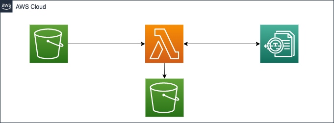
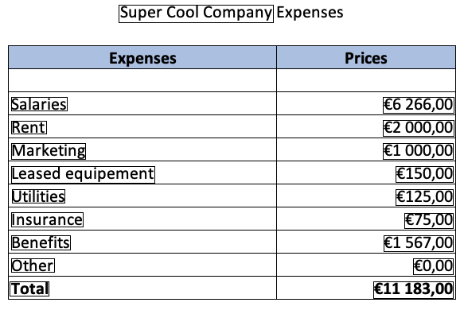

# Amazon S3 to AWS Lambda to Amazon Textract to Amazon S3

The Terraform template in this pattern allows you to use Amazon Textract (a machine learning service) to automatically extracts text, handwriting, and data from scanned expense documents

## Topology



### Deployed resources:
* S3 Buckets with blocked public access
* Lambda function in python
* Lambda Layer for Pillow python library
* Cloudwatch log group for Lambda function
* Required roles and policies

Learn more about this pattern at Serverless Land Patterns: [serverlessland.com/patterns/s3-lambda-textract-cdktf](https://serverlessland.com/patterns/s3-lambda-textract-cdktf)

Important: this application uses various AWS services and there are costs associated with these services after the Free Tier usage - please see the [AWS Pricing page](https://aws.amazon.com/pricing/) for details. You are responsible for any AWS costs incurred. No warranty is implied in this example.

## Requirements

* [Create an AWS account](https://portal.aws.amazon.com/gp/aws/developer/registration/index.html) if you do not already have one and log in. The IAM user that you use must have sufficient permissions to make necessary AWS service calls and manage AWS resources.
* [AWS CLI](https://docs.aws.amazon.com/cli/latest/userguide/install-cliv2.html) installed and configured
* [Git](https://git-scm.com/book/en/v2/Getting-Started-Installing-Git) installed and configured
* [Terraform](https://learn.hashicorp.com/tutorials/terraform/install-cli)  installed
* [Python v3](https://www.python.org/) installed
* [CDK For Terraform](https://learn.hashicorp.com/tutorials/terraform/cdktf-install) installed

## Customization

You can customize the deployment according to your needs by editing the `config.json` file.

```json
{
  "region": "us-east-1",
  "tags": {
    "pattern": "s3-lambda-textract",
    "deployed_by": "cdktf",
    "repository": "https://github.com/aws-samples/serverless-patterns/tree/main/s3-lambda-textract-cdktf"
  },
  "layers": {
    "pillow": {
      "always_refresh": true,
      "url":"https://files.pythonhosted.org/packages/15/37/45ad6041473ebb803d0bb265cf7e749c4838dc48c3335a03e63d6aad07d8/Pillow-9.1.0-cp39-cp39-manylinux_2_17_x86_64.manylinux2014_x86_64.whl",
      "hash": "82283af99c1c3a5ba1da44c67296d5aad19f11c535b551a5ae55328a317ce331"
    }
  }
}
```

|Parameter|type|Description| Required |
|---|---|---|---|
|region|string|The region to deploy the stack to| Yes     |
|tags|map(string)|The tags to use for each deployed resource of the stack| Yes     |
|always_refresh|boolean|Always download Pillow module and reconstruct the zip file| Yes     |
|url|string|The pillow module url| Yes     |
|hash|string|The pillow module file hash| Yes     |


You can change the provider and module version if needed by modifying the `requirement.txt` file

## Deployment Instructions

> Before starting, you may want to use a virtual environment for your deployment, if yes please create one and activate it before going through deployment instructions.

1. Create a new directory, navigate to that directory in a terminal and clone the GitHub repository:
```bash
git clone https://github.com/aws-samples/s3-lambda-textract-cdktf
```
2. Change directory to the pattern directory:
```bash
cd serverless-patterns/s3-lambda-textract-cdktf
```

3. activate your python venv

4. Run the below command to install needed python modules and libraries requirements
```bash
pip install -r requirements.txt
```

5. Synthesize Terraform resources to cdktf.out/
- Using default values
```bash
cdktf synth
```


6. Perform a diff (terraform plan) for the stack
```bash
cdktf diff
```

7. Deploy the stack

- Using default values
```bash
cdktf deploy
```

8. Select `Approve` hen prompted.

> Note the output from the CDKTF deployment process. This contains the resource names and/or ARNs which are used for testing.

## Testing

You can test the deployed pattern by uploading an expense image to the brand new created input bucket `s3-lambda-textract-input-bucket-<YOUR-DEPLOYMENT-ID>`, you can find an expense example named `expense_example.png` in the `assets/expense` directory. 

> please replace resource name by those provided by the cdktf outputs

1. List created directories
```bash
aws s3 ls  --recursive
2022-04-20 08:54:35 s3-lambda-textract-input-bucket-<YOUR-DEPLOYMENT-ID>
2022-04-20 08:54:15 s3-lambda-textract-output-bucket-<YOUR-DEPLOYMENT-ID>
```

2. validate that there is no record file in the target bucket
```bash
aws s3 ls "s3://s3-lambda-textract-input-bucket-<YOUR-DEPLOYMENT-ID>" --recursive
```

```bash
aws s3 ls "s3://s3-lambda-textract-output-bucket-<YOUR-DEPLOYMENT-ID>" --recursive
```

3. validate that you do not have any record in cloudwatch log
```bash
aws logs describe-log-streams --log-group-name '/aws/lambda/s3-lambda-textract-lambda-<YOUR-DEPLOYMENT-ID>'
{
    "logStreams": []
}
```

4. Upload an expense image to the input bucket to trigger the process
```bash
aws s3 cp assets/expense/expense_example.png  "s3://s3-lambda-textract-input-bucket-<YOUR-DEPLOYMENT-ID>"
upload: assets/expense/expense_example.png to s3://s3-lambda-textract-input-bucket-<YOUR-DEPLOYMENT-ID>/expense_example.png
```

5. validate that you now have some log record in Cloudwatch log
```bash
aws logs describe-log-streams --log-group-name '/aws/lambda/s3-lambda-textract-lambda-<YOUR-DEPLOYMENT-ID>'
{
    "logStreams": [
        {
            "logStreamName": "2022/04/20/[$LATEST]4116c35a0da348c385a075f1e7a4fa75",
            "creationTime": 1650464339517,
            "firstEventTimestamp": 1650464338144,
            "lastEventTimestamp": 1650464338145,
            "lastIngestionTime": 1650464349794,
            "uploadSequenceToken": "49624539330656186667084271654701253412478608432034742978",
            "arn": "arn:aws:logs:<YOUR-REGION-NAME>:xxxxxxxxxxx:log-group:/aws/lambda/s3-lambda-textract-lambda-<YOUR-DEPLOYMENT-ID>:log-stream:2022/04/20/[$LATEST]4116c35a0da348c385a075f1e7a4fa75",
            "storedBytes": 0
        }
    ]
}
```

6. Explore the logs
```bash
aws logs get-log-events --log-group-name '/aws/lambda/s3-lambda-textract-lambda-<YOUR-DEPLOYMENT-ID>' --log-stream-name '2022/04/20/[$LATEST]4116c35a0da348c385a075f1e7a4fa75'
{
    "events": [
        {
            "timestamp": 1650464338144,
            "message": "START RequestId: 66bf9590-0741-44ae-97e6-3eff4f32838d Version: $LATEST\n",
            "ingestionTime": 1650464339524
        },
        {
            "timestamp": 1650464338145,
            "message": "{\"level\":\"INFO\",\"location\":\"lambdaTextract:29\",\"message\":{\"Records\":[{\"eventVersion\":\"2.1\",\"eventSource\":\"aws:s3\",\"awsRegion\":\"<YOUR-REGION-NAME>\",\"eventTime\":\"2022-04-20T14:18:56.079Z\",\"eventName\":\"ObjectCreated:Put\",\"userIdentity\":{\"principalId\":\"AWS:AROARQMAZNNFYPW5GZCBN:hterkiba-Isengard\"},\"requestParameters\":{\"sourceIPAddress\":\"54.240.197.238\"},\"responseElements\":{\"x-amz-request-id\":\"93ET1TNKXSD6B63S\",\"x-amz-id-2\":\"krMnIqZlkJdrmY1s1O2FLI5W+KRDDwmFM0oYWEUQb/0TxWX+xzRJCCOvz7SomLClTSZS4bLVRL9J+ZP6IdAeQ2ol3eJKQ9JW\"},\"s3\":{\"s3SchemaVersion\":\"1.0\",\"configurationId\":\"tf-s3-lambda-20220420065434185400000003\",\"bucket\":{\"name\":\"s3-lambda-textract-input-bucket-<YOUR-DEPLOYMENT-ID>\",\"ownerIdentity\":{\"principalId\":\"ANV925YU7A2UY\"},\"arn\":\"arn:aws:s3:::s3-lambda-textract-input-bucket-<YOUR-DEPLOYMENT-ID>\"},\"object\":{\"key\":\"expense_example.png\",\"size\":40063,\"eTag\":\"63f3d92ebc21e9014381b80209a53f20\",\"sequencer\":\"006260164FB94A5732\"}}}]},\"timestamp\":\"2022-04-20 14:18:58,145+0000\",\"service\":\"service_undefined\",\"xray_trace_id\":\"1-62601651-54ae14f42716ac3b38f3b563\"}\n",
            "ingestionTime": 1650464339524
        },
        {
            "timestamp": 1650464340784,
            "message": "{\"level\":\"INFO\",\"location\":\"lambdaTextract:53\",\"message\":{\"DocumentMetadata\":{\"Pages\":1},\"ExpenseDocuments\":[{\"ExpenseIndex\":1,\"SummaryFields\":[{\"Type\":{\"Text\":\"VENDOR_NAME\",\"Confidence\":98.90094757080078},\"ValueDetection\":{\"Text\":\"Super Cool Company\",\"Geometry\":{\"BoundingBox\":{\"Width\":0.3327615559101105,\"Height\":0.056410256773233414,\"Left\":0.25643226504325867,\"Top\":0.015384615398943424},\"Polygon\":[{\"X\":0.25643226504325867,\"Y\":0.015384615398943424},{\"X\":0.5891938209533691,\"Y\":0.015384615398943424},{\"X\":0.5891938209533691,\"Y\":0.07179487496614456},{\"X\":0.25643226504325867,\"Y\":0.07179487496614456}]},\"Confidence\":98.89884948730469},\"PageNumber\":1},{\"Type\":{\"Text\":\"OTHER\",\"Confidence\":92.0},\"LabelDetection\":{\"Text\":\"Benefits\",\"Geometry\":{\"BoundingBox\":{\"Width\":0.12618665397167206,\"Height\":0.046074189245700836,\"Left\":0.025720829144120216,\"Top\":0.7590957283973694},\"Polygon\":[{\"X\":0.025720829144120216,\"Y\":0.7590957283973694},{\"X\":0.15190748870372772,\"Y\":0.7590957283973694},{\"X\":0.15190748870372772,\"Y\":0.805169939994812},{\"X\":0.025720829144120216,\"Y\":0.805169939994812}]},\"Confidence\":91.970703125},\"ValueDetection\":{\"Text\":\"\\u20ac1 567,00\",\"Geometry\":{\"BoundingBox\":{\"Width\":0.15028278529644012,\"Height\":0.0505826510488987,\"Left\":0.8270717859268188,\"Top\":0.7604801058769226},\"Polygon\":[{\"X\":0.8270717859268188,\"Y\":0.7604801058769226},{\"X\":0.9773545861244202,\"Y\":0.7604801058769226},{\"X\":0.9773545861244202,\"Y\":0.811062753200531},{\"X\":0.8270717859268188,\"Y\":0.811062753200531}]},\"Confidence\":91.899169921875},\"PageNumber\":1},{\"Type\":{\"Text\":\"OTHER\",\"Confidence\":87.5},\"LabelDetection\":{\"Text\":\"Other\",\"Geometry\":{\"BoundingBox\":{\"Width\":0.092717744410038,\"Height\":0.04492077976465225,\"Left\":0.024860793724656105,\"Top\":0.8342896103858948},\"Polygon\":[{\"X\":0.024860793724656105,\"Y\":0.8342896103858948},{\"X\":0.11757853627204895,\"Y\":0.8342896103858948},{\"X\":0.11757853627204895,\"Y\":0.8792104125022888},{\"X\":0.024860793724656105,\"Y\":0.8792104125022888}]},\"Confidence\":87.4920425415039},\"ValueDetection\":{\"Text\":\"\\u20ac0,00\",\"Geometry\":{\"BoundingBox\":{\"Width\":0.08629637956619263,\"Height\":0.049193475395441055,\"Left\":0.8908959627151489,\"Top\":0.835852861404419},\"Polygon\":[{\"X\":0.8908959627151489,\"Y\":0.835852861404419},{\"X\":0.9771923422813416,\"Y\":0.835852861404419},{\"X\":0.9771923422813416,\"Y\":0.8850463032722473},{\"X\":0.8908959627151489,\"Y\":0.8850463032722473}]},\"Confidence\":87.4839096069336},\"PageNumber\":1},{\"Type\":{\"Text\":\"OTHER\",\"Confidence\":83.5},\"LabelDetection\":{\"Text\":\"Utilities\",\"Geometry\":{\"BoundingBox\":{\"Width\":0.1140352115035057,\"Height\":0.044481560587882996,\"Left\":0.026250405237078667,\"Top\":0.6115190386772156},\"Polygon\":[{\"X\":0.026250405237078667,\"Y\":0.6115190386772156},{\"X\":0.14028561115264893,\"Y\":0.6115190386772156},{\"X\":0.14028561115264893,\"Y\":0.656000554561615},{\"X\":0.026250405237078667,\"Y\":0.656000554561615}]},\"Confidence\":83.47708892822266},\"ValueDetection\":{\"Text\":\"\\u20ac125,00\",\"Geometry\":{\"BoundingBox\":{\"Width\":0.1236727237701416,\"Height\":0.04970308020710945,\"Left\":0.8531010746955872,\"Top\":0.611940324306488},\"Polygon\":[{\"X\":0.8531010746955872,\"Y\":0.611940324306488},{\"X\":0.976773738861084,\"Y\":0.611940324306488},{\"X\":0.976773738861084,\"Y\":0.661643385887146},{\"X\":0.8531010746955872,\"Y\":0.661643385887146}]},\"Confidence\":83.46796417236328},\"PageNumber\":1},{\"Type\":{\"Text\":\"OTHER\",\"Confidence\":82.0},\"LabelDetection\":{\"Text\":\"Insurance\",\"Geometry\":{\"BoundingBox\":{\"Width\":0.15486589074134827,\"Height\":0.04552839323878288,\"Left\":0.02437412180006504,\"Top\":0.6854333877563477},\"Polygon\":[{\"X\":0.02437412180006504,\"Y\":0.6854333877563477},{\"X\":0.17924000322818756,\"Y\":0.6854333877563477},{\"X\":0.17924000322818756,\"Y\":0.730961799621582},{\"X\":0.02437412180006504,\"Y\":0.730961799621582}]},\"Confidence\":81.93597412109375},\"ValueDetection\":{\"Text\":\"\\u20ac75,00\",\"Geometry\":{\"BoundingBox\":{\"Width\":0.10381362587213516,\"Height\":0.047827694565057755,\"Left\":0.8726890683174133,\"Top\":0.6881065368652344},\"Polygon\":[{\"X\":0.8726890683174133,\"Y\":0.6881065368652344},{\"X\":0.9765027165412903,\"Y\":0.6881065368652344},{\"X\":0.9765027165412903,\"Y\":0.7359341979026794},{\"X\":0.8726890683174133,\"Y\":0.7359341979026794}]},\"Confidence\":81.9705810546875},\"PageNumber\":1},{\"Type\":{\"Text\":\"OTHER\",\"Confidence\":77.0},\"LabelDetection\":{\"Text\":\"Leased equipement\",\"Geometry\":{\"BoundingBox\":{\"Width\":0.30861130356788635,\"Height\":0.05552837625145912,\"Left\":0.025136269629001617,\"Top\":0.535991370677948},\"Polygon\":[{\"X\":0.025136269629001617,\"Y\":0.535991370677948},{\"X\":0.3337475657463074,\"Y\":0.535991370677948},{\"X\":0.3337475657463074,\"Y\":0.5915197730064392},{\"X\":0.025136269629001617,\"Y\":0.5915197730064392}]},\"Confidence\":76.99299621582031},\"ValueDetection\":{\"Text\":\"\\u20ac150,00\",\"Geometry\":{\"BoundingBox\":{\"Width\":0.12324966490268707,\"Height\":0.05004194378852844,\"Left\":0.8538694977760315,\"Top\":0.5379282832145691},\"Polygon\":[{\"X\":0.8538694977760315,\"Y\":0.5379282832145691},{\"X\":0.9771191477775574,\"Y\":0.5379282832145691},{\"X\":0.9771191477775574,\"Y\":0.5879701972007751},{\"X\":0.8538694977760315,\"Y\":0.5879701972007751}]},\"Confidence\":76.9796371459961},\"PageNumber\":1},{\"Type\":{\"Text\":\"OTHER\",\"Confidence\":68.5},\"LabelDetection\":{\"Text\":\"Marketing\",\"Geometry\":{\"BoundingBox\":{\"Width\":0.15969151258468628,\"Height\":0.05206960067152977,\"Left\":0.0247403085231781,\"Top\":0.4629954695701599},\"Polygon\":[{\"X\":0.0247403085231781,\"Y\":0.4629954695701599},{\"X\":0.18443182110786438,\"Y\":0.4629954695701599},{\"X\":0.18443182110786438,\"Y\":0.51506507396698},{\"X\":0.0247403085231781,\"Y\":0.51506507396698}]},\"Confidence\":68.46507263183594},\"ValueDetection\":{\"Text\":\"\\u20ac1 000,00\",\"Geometry\":{\"BoundingBox\":{\"Width\":0.15109536051750183,\"Height\":0.050760045647621155,\"Left\":0.8264157772064209,\"Top\":0.4627320170402527},\"Polygon\":[{\"X\":0.8264157772064209,\"Y\":0.4627320170402527},{\"X\":0.9775111079216003,\"Y\":0.4627320170402527},{\"X\":0.9775111079216003,\"Y\":0.5134920477867126},{\"X\":0.8264157772064209,\"Y\":0.5134920477867126}]},\"Confidence\":63.139705657958984},\"PageNumber\":1},{\"Type\":{\"Text\":\"OTHER\",\"Confidence\":67.5},\"LabelDetection\":{\"Text\":\"Rent\",\"Geometry\":{\"BoundingBox\":{\"Width\":0.07432162761688232,\"Height\":0.04319101944565773,\"Left\":0.025294316932559013,\"Top\":0.38976359367370605},\"Polygon\":[{\"X\":0.025294316932559013,\"Y\":0.38976359367370605},{\"X\":0.09961594641208649,\"Y\":0.38976359367370605},{\"X\":0.09961594641208649,\"Y\":0.4329546093940735},{\"X\":0.025294316932559013,\"Y\":0.4329546093940735}]},\"Confidence\":67.48968505859375},\"ValueDetection\":{\"Text\":\"\\u20ac2 000,00\",\"Geometry\":{\"BoundingBox\":{\"Width\":0.15176056325435638,\"Height\":0.050438474863767624,\"Left\":0.8260876536369324,\"Top\":0.38886040449142456},\"Polygon\":[{\"X\":0.8260876536369324,\"Y\":0.38886040449142456},{\"X\":0.97784823179245,\"Y\":0.38886040449142456},{\"X\":0.97784823179245,\"Y\":0.4392988979816437},{\"X\":0.8260876536369324,\"Y\":0.4392988979816437}]},\"Confidence\":65.94291687011719},\"PageNumber\":1},{\"Type\":{\"Text\":\"OTHER\",\"Confidence\":64.0},\"LabelDetection\":{\"Text\":\"Salaries\",\"Geometry\":{\"BoundingBox\":{\"Width\":0.12005946040153503,\"Height\":0.04456194490194321,\"Left\":0.02473490685224533,\"Top\":0.31389859318733215},\"Polygon\":[{\"X\":0.02473490685224533,\"Y\":0.31389859318733215},{\"X\":0.14479435980319977,\"Y\":0.31389859318733215},{\"X\":0.14479435980319977,\"Y\":0.35846051573753357},{\"X\":0.02473490685224533,\"Y\":0.35846051573753357}]},\"Confidence\":63.98881530761719},\"ValueDetection\":{\"Text\":\"\\u20ac6 266,00\",\"Geometry\":{\"BoundingBox\":{\"Width\":0.15195566415786743,\"Height\":0.05023369565606117,\"Left\":0.825847327709198,\"Top\":0.3147476315498352},\"Polygon\":[{\"X\":0.825847327709198,\"Y\":0.3147476315498352},{\"X\":0.9778029918670654,\"Y\":0.3147476315498352},{\"X\":0.9778029918670654,\"Y\":0.3649813234806061},{\"X\":0.825847327709198,\"Y\":0.3649813234806061}]},\"Confidence\":60.857086181640625},\"PageNumber\":1},{\"Type\":{\"Text\":\"TOTAL\",\"Confidence\":99.94390106201172},\"LabelDetection\":{\"Text\":\"Total\",\"Geometry\":{\"BoundingBox\":{\"Width\":0.08404802531003952,\"Height\":0.04615384712815285,\"Left\":0.021440822631120682,\"Top\":0.9076923131942749},\"Polygon\":[{\"X\":0.021440822631120682,\"Y\":0.9076923131942749},{\"X\":0.1054888516664505,\"Y\":0.9076923131942749},{\"X\":0.1054888516664505,\"Y\":0.9538461565971375},{\"X\":0.021440822631120682,\"Y\":0.9538461565971375}]},\"Confidence\":99.9348373413086},\"ValueDetection\":{\"Text\":\"\\u20ac11 183,00\",\"Geometry\":{\"BoundingBox\":{\"Width\":0.17152658104896545,\"Height\":0.05384615436196327,\"Left\":0.8053172826766968,\"Top\":0.9076923131942749},\"Polygon\":[{\"X\":0.8053172826766968,\"Y\":0.9076923131942749},{\"X\":0.9768438935279846,\"Y\":0.9076923131942749},{\"X\":0.9768438935279846,\"Y\":0.9615384340286255},{\"X\":0.8053172826766968,\"Y\":0.9615384340286255}]},\"Confidence\":94.75177764892578},\"PageNumber\":1}],\"LineItemGroups\":[{\"LineItemGroupIndex\":1,\"LineItems\":[{\"LineItemExpenseFields\":[{\"Type\":{\"Text\":\"ITEM\",\"Confidence\":94.25447082519531},\"ValueDetection\":{\"Text\":\"Salaries\",\"Geometry\":{\"BoundingBox\":{\"Width\":0.13201840221881866,\"Height\":0.04179059714078903,\"Left\":0.00799666065722704,\"Top\":0.3146207630634308},\"Polygon\":[{\"X\":0.00799666065722704,\"Y\":0.3146207630634308},{\"X\":0.14001506567001343,\"Y\":0.3146207630634308},{\"X\":0.14001506567001343,\"Y\":0.356411337852478},{\"X\":0.00799666065722704,\"Y\":0.356411337852478}]},\"Confidence\":94.23799896240234},\"PageNumber\":1},{\"Type\":{\"Text\":\"PRICE\",\"Confidence\":94.25447082519531},\"ValueDetection\":{\"Text\":\"\\u20ac6 266,00\",\"Geometry\":{\"BoundingBox\":{\"Width\":0.13504169881343842,\"Height\":0.047760654240846634,\"Left\":0.8263091444969177,\"Top\":0.3146207630634308},\"Polygon\":[{\"X\":0.8263091444969177,\"Y\":0.3146207630634308},{\"X\":0.9613507986068726,\"Y\":0.3146207630634308},{\"X\":0.9613507986068726,\"Y\":0.3623813986778259},{\"X\":0.8263091444969177,\"Y\":0.3623813986778259}]},\"Confidence\":89.62582397460938},\"PageNumber\":1},{\"Type\":{\"Text\":\"EXPENSE_ROW\",\"Confidence\":94.25447082519531},\"ValueDetection\":{\"Text\":\"Salaries \\u20ac6 266,00\",\"Geometry\":{\"BoundingBox\":{\"Width\":0.9991423487663269,\"Height\":0.07164103537797928,\"Left\":0.0,\"Top\":0.30044180154800415},\"Polygon\":[{\"X\":0.0,\"Y\":0.30044180154800415},{\"X\":0.9991423487663269,\"Y\":0.30044180154800415},{\"X\":0.9991423487663269,\"Y\":0.37208282947540283},{\"X\":0.0,\"Y\":0.37208282947540283}]},\"Confidence\":91.1375732421875},\"PageNumber\":1}]},{\"LineItemExpenseFields\":[{\"Type\":{\"Text\":\"ITEM\",\"Confidence\":98.67459869384766},\"ValueDetection\":{\"Text\":\"Marketing\",\"Geometry\":{\"BoundingBox\":{\"Width\":0.14919355511665344,\"Height\":0.05054035782814026,\"Left\":0.036944787949323654,\"Top\":0.4635656774044037},\"Polygon\":[{\"X\":0.036944787949323654,\"Y\":0.4635656774044037},{\"X\":0.1861383467912674,\"Y\":0.4635656774044037},{\"X\":0.1861383467912674,\"Y\":0.514106035232544},{\"X\":0.036944787949323654,\"Y\":0.514106035232544}]},\"Confidence\":98.6242904663086},\"PageNumber\":1},{\"Type\":{\"Text\":\"PRICE\",\"Confidence\":98.67459869384766},\"ValueDetection\":{\"Text\":\"\\u20ac1 000,00\",\"Geometry\":{\"BoundingBox\":{\"Width\":0.13306449353694916,\"Height\":0.04756735637784004,\"Left\":0.8282754421234131,\"Top\":0.4635656774044037},\"Polygon\":[{\"X\":0.8282754421234131,\"Y\":0.4635656774044037},{\"X\":0.9613399505615234,\"Y\":0.4635656774044037},{\"X\":0.9613399505615234,\"Y\":0.511133074760437},{\"X\":0.8282754421234131,\"Y\":0.511133074760437}]},\"Confidence\":90.95307159423828},\"PageNumber\":1},{\"Type\":{\"Text\":\"EXPENSE_ROW\",\"Confidence\":98.67459869384766},\"ValueDetection\":{\"Text\":\"Marketing \\u20ac1 000,00\",\"Geometry\":{\"BoundingBox\":{\"Width\":0.9991423487663269,\"Height\":0.06986459344625473,\"Left\":0.0,\"Top\":0.4509305953979492},\"Polygon\":[{\"X\":0.0,\"Y\":0.4509305953979492},{\"X\":0.9991423487663269,\"Y\":0.4509305953979492},{\"X\":0.9991423487663269,\"Y\":0.5207951664924622},{\"X\":0.0,\"Y\":0.5207951664924622}]},\"Confidence\":93.44144439697266},\"PageNumber\":1}]},{\"LineItemExpenseFields\":[{\"Type\":{\"Text\":\"ITEM\",\"Confidence\":93.27278137207031},\"ValueDetection\":{\"Text\":\"Leased equipement\",\"Geometry\":{\"BoundingBox\":{\"Width\":0.2943548262119293,\"Height\":0.0511513352394104,\"Left\":0.03795285150408745,\"Top\":0.5377628803253174},\"Polygon\":[{\"X\":0.03795285150408745,\"Y\":0.5377628803253174},{\"X\":0.33230769634246826,\"Y\":0.5377628803253174},{\"X\":0.33230769634246826,\"Y\":0.5889142155647278},{\"X\":0.03795285150408745,\"Y\":0.5889142155647278}]},\"Confidence\":93.26429748535156},\"PageNumber\":1},{\"Type\":{\"Text\":\"PRICE\",\"Confidence\":93.27278137207031},\"ValueDetection\":{\"Text\":\"\\u20ac150,00\",\"Geometry\":{\"BoundingBox\":{\"Width\":0.10685481131076813,\"Height\":0.04814241826534271,\"Left\":0.8544850945472717,\"Top\":0.5377628803253174},\"Polygon\":[{\"X\":0.8544850945472717,\"Y\":0.5377628803253174},{\"X\":0.9613399505615234,\"Y\":0.5377628803253174},{\"X\":0.9613399505615234,\"Y\":0.5859053134918213},{\"X\":0.8544850945472717,\"Y\":0.5859053134918213}]},\"Confidence\":93.24810791015625},\"PageNumber\":1},{\"Type\":{\"Text\":\"EXPENSE_ROW\",\"Confidence\":93.27278137207031},\"ValueDetection\":{\"Text\":\"Leased equipement \\u20ac150,00\",\"Geometry\":{\"BoundingBox\":{\"Width\":0.9991423487663269,\"Height\":0.07221362739801407,\"Left\":0.0,\"Top\":0.5264795422554016},\"Polygon\":[{\"X\":0.0,\"Y\":0.5264795422554016},{\"X\":0.9991423487663269,\"Y\":0.5264795422554016},{\"X\":0.9991423487663269,\"Y\":0.5986931324005127},{\"X\":0.0,\"Y\":0.5986931324005127}]},\"Confidence\":93.25890350341797},\"PageNumber\":1}]},{\"LineItemExpenseFields\":[{\"Type\":{\"Text\":\"ITEM\",\"Confidence\":96.83724975585938},\"ValueDetection\":{\"Text\":\"Utilities\",\"Geometry\":{\"BoundingBox\":{\"Width\":0.09369879961013794,\"Height\":0.04179085046052933,\"Left\":0.04250793159008026,\"Top\":0.6109602451324463},\"Polygon\":[{\"X\":0.04250793159008026,\"Y\":0.6109602451324463},{\"X\":0.1362067312002182,\"Y\":0.6109602451324463},{\"X\":0.1362067312002182,\"Y\":0.6527511477470398},{\"X\":0.04250793159008026,\"Y\":0.6527511477470398}]},\"Confidence\":96.81068420410156},\"PageNumber\":1},{\"Type\":{\"Text\":\"PRICE\",\"Confidence\":96.83724975585938},\"ValueDetection\":{\"Text\":\"\\u20ac125,00\",\"Geometry\":{\"BoundingBox\":{\"Width\":0.10881154984235764,\"Height\":0.04776106774806976,\"Left\":0.852549135684967,\"Top\":0.6124528050422668},\"Polygon\":[{\"X\":0.852549135684967,\"Y\":0.6124528050422668},{\"X\":0.9613606333732605,\"Y\":0.6124528050422668},{\"X\":0.9613606333732605,\"Y\":0.660213828086853},{\"X\":0.852549135684967,\"Y\":0.660213828086853}]},\"Confidence\":96.80010223388672},\"PageNumber\":1},{\"Type\":{\"Text\":\"EXPENSE_ROW\",\"Confidence\":96.83724975585938},\"ValueDetection\":{\"Text\":\"Utilities \\u20ac125,00\",\"Geometry\":{\"BoundingBox\":{\"Width\":0.9991423487663269,\"Height\":0.06417886167764664,\"Left\":0.0,\"Top\":0.6012588143348694},\"Polygon\":[{\"X\":0.0,\"Y\":0.6012588143348694},{\"X\":0.9991423487663269,\"Y\":0.6012588143348694},{\"X\":0.9991423487663269,\"Y\":0.6654376983642578},{\"X\":0.0,\"Y\":0.6654376983642578}]},\"Confidence\":96.80538940429688},\"PageNumber\":1}]},{\"LineItemExpenseFields\":[{\"Type\":{\"Text\":\"ITEM\",\"Confidence\":96.0080795288086},\"ValueDetection\":{\"Text\":\"Insurance\",\"Geometry\":{\"BoundingBox\":{\"Width\":0.1551038771867752,\"Height\":0.037298426032066345,\"Left\":0.022692957893013954,\"Top\":0.6897765398025513},\"Polygon\":[{\"X\":0.022692957893013954,\"Y\":0.6897765398025513},{\"X\":0.1777968406677246,\"Y\":0.6897765398025513},{\"X\":0.1777968406677246,\"Y\":0.7270749807357788},{\"X\":0.022692957893013954,\"Y\":0.7270749807357788}]},\"Confidence\":95.93311309814453},\"PageNumber\":1},{\"Type\":{\"Text\":\"PRICE\",\"Confidence\":96.0080795288086},\"ValueDetection\":{\"Text\":\"\\u20ac75,00\",\"Geometry\":{\"BoundingBox\":{\"Width\":0.08762361109256744,\"Height\":0.04625017195940018,\"Left\":0.8737499117851257,\"Top\":0.6867926120758057},\"Polygon\":[{\"X\":0.8737499117851257,\"Y\":0.6867926120758057},{\"X\":0.9613735675811768,\"Y\":0.6867926120758057},{\"X\":0.9613735675811768,\"Y\":0.7330427765846252},{\"X\":0.8737499117851257,\"Y\":0.7330427765846252}]},\"Confidence\":95.97364044189453},\"PageNumber\":1},{\"Type\":{\"Text\":\"EXPENSE_ROW\",\"Confidence\":96.0080795288086},\"ValueDetection\":{\"Text\":\"Insurance \\u20ac75,00\",\"Geometry\":{\"BoundingBox\":{\"Width\":0.9991423487663269,\"Height\":0.05669359862804413,\"Left\":0.0,\"Top\":0.6815708875656128},\"Polygon\":[{\"X\":0.0,\"Y\":0.6815708875656128},{\"X\":0.9991423487663269,\"Y\":0.6815708875656128},{\"X\":0.9991423487663269,\"Y\":0.7382645010948181},{\"X\":0.0,\"Y\":0.7382645010948181}]},\"Confidence\":95.95337677001953},\"PageNumber\":1}]}]}]}],\"ResponseMetadata\":{\"RequestId\":\"a7a514fe-81b3-49af-aaba-e64772355a13\",\"HTTPStatusCode\":200,\"HTTPHeaders\":{\"x-amzn-requestid\":\"a7a514fe-81b3-49af-aaba-e64772355a13\",\"content-type\":\"application/x-amz-json-1.1\",\"content-length\":\"15855\",\"date\":\"Wed, 20 Apr 2022 14:19:00 GMT\"},\"RetryAttempts\":0}},\"timestamp\":\"2022-04-20 14:19:00,784+0000\",\"service\":\"service_undefined\",\"xray_trace_id\":\"1-62601651-54ae14f42716ac3b38f3b563\"}\n",
            "ingestionTime": 1650464349794
        },
        {
            "timestamp": 1650464340785,
            "message": "{\"level\":\"INFO\",\"location\":\"lambdaTextract:72\",\"message\":[[{\"label\":\"VENDOR_NAME\",\"value\":\"Super Cool Company\"},{\"label\":\"Benefits\",\"value\":\"\\u20ac1 567,00\"},{\"label\":\"Other\",\"value\":\"\\u20ac0,00\"},{\"label\":\"Utilities\",\"value\":\"\\u20ac125,00\"},{\"label\":\"Insurance\",\"value\":\"\\u20ac75,00\"},{\"label\":\"Leased equipement\",\"value\":\"\\u20ac150,00\"},{\"label\":\"Marketing\",\"value\":\"\\u20ac1 000,00\"},{\"label\":\"Rent\",\"value\":\"\\u20ac2 000,00\"},{\"label\":\"Salaries\",\"value\":\"\\u20ac6 266,00\"},{\"label\":\"Total\",\"value\":\"\\u20ac11 183,00\"}]],\"timestamp\":\"2022-04-20 14:19:00,784+0000\",\"service\":\"service_undefined\",\"xray_trace_id\":\"1-62601651-54ae14f42716ac3b38f3b563\"}\n",
            "ingestionTime": 1650464349794
        },
        {
            "timestamp": 1650464341950,
            "message": "{\"level\":\"INFO\",\"location\":\"lambdaTextract:77\",\"message\":\"Saving json file to s3-lambda-textract-output-bucket-<YOUR-DEPLOYMENT-ID>/2022-04-20-14-19-01/expense_example.json\",\"timestamp\":\"2022-04-20 14:19:01,950+0000\",\"service\":\"service_undefined\",\"xray_trace_id\":\"1-62601651-54ae14f42716ac3b38f3b563\"}\n",
            "ingestionTime": 1650464349794
        },
        {
            "timestamp": 1650464342149,
            "message": "{\"level\":\"INFO\",\"location\":\"lambdaTextract:88\",\"message\":\"Drawing bounding boxes\",\"timestamp\":\"2022-04-20 14:19:02,149+0000\",\"service\":\"service_undefined\",\"xray_trace_id\":\"1-62601651-54ae14f42716ac3b38f3b563\"}\n",
            "ingestionTime": 1650464349794
        },
        {
            "timestamp": 1650464344031,
            "message": "{\"level\":\"INFO\",\"location\":\"lambdaTextract:124\",\"message\":\"Saving png file with bounding boxes to s3-lambda-textract-output-bucket-<YOUR-DEPLOYMENT-ID>/2022-04-20-14-19-01/expense_example.png\",\"timestamp\":\"2022-04-20 14:19:04,031+0000\",\"service\":\"service_undefined\",\"xray_trace_id\":\"1-62601651-54ae14f42716ac3b38f3b563\"}\n",
            "ingestionTime": 1650464349794
        },
        {
            "timestamp": 1650464344108,
            "message": "{\"level\":\"INFO\",\"location\":\"lambdaTextract:135\",\"message\":\"Operation completed successfully\",\"timestamp\":\"2022-04-20 14:19:04,108+0000\",\"service\":\"service_undefined\",\"xray_trace_id\":\"1-62601651-54ae14f42716ac3b38f3b563\"}\n",
            "ingestionTime": 1650464349794
        },
        {
            "timestamp": 1650464344111,
            "message": "END RequestId: 66bf9590-0741-44ae-97e6-3eff4f32838d\n",
            "ingestionTime": 1650464349794
        },
        {
            "timestamp": 1650464344111,
            "message": "REPORT RequestId: 66bf9590-0741-44ae-97e6-3eff4f32838d\tDuration: 5965.21 ms\tBilled Duration: 5966 ms\tMemory Size: 128 MB\tMax Memory Used: 85 MB\tInit Duration: 624.71 ms\t\n",
            "ingestionTime": 1650464349794
        }
    ],
    "nextForwardToken": "f/36806584797279377406238156546965608791704931121641160711/s",
    "nextBackwardToken": "b/36806584664210830806605928249006531508653382422268149760/s"
}
```

7. validate that you have result files in the output bucket
```bash
aws s3 ls "s3://s3-lambda-textract-output-bucket-<YOUR-DEPLOYMENT-ID>" --recursive
2022-04-20 16:19:03        501 2022-04-20-14-19-01/expense_example.json
2022-04-20 16:19:05      37473 2022-04-20-14-19-01/expense_example.png
```

8. Download the result files
```bash
aws s3 cp "s3://s3-lambda-textract-output-bucket-<YOUR-DEPLOYMENT-ID>/2022-04-20-14-19-01/expense_example.json" .
download: s3://s3-lambda-textract-output-bucket-<YOUR-DEPLOYMENT-ID>/2022-04-20-14-19-01/expense_example.json to ./expense_example.json
```

```bash
aws s3 cp "s3://s3-lambda-textract-output-bucket-<YOUR-DEPLOYMENT-ID>/2022-04-20-14-19-01/expense_example.png" .
download: s3://s3-lambda-textract-output-bucket-<YOUR-DEPLOYMENT-ID>/2022-04-20-14-19-01/expense_example.png to ./expense_example.png
```


9. Display the extracted text
```bash
cat expense_example.json| jq  
```
```json
[
  [
    {
      "label": "VENDOR_NAME",
      "value": "Super Cool Company"
    },
    {
      "label": "Benefits",
      "value": "€1 567,00"
    },
    {
      "label": "Other",
      "value": "€0,00"
    },
    {
      "label": "Utilities",
      "value": "€125,00"
    },
    {
      "label": "Insurance",
      "value": "€75,00"
    },
    {
      "label": "Leased equipement",
      "value": "€150,00"
    },
    {
      "label": "Marketing",
      "value": "€1 000,00"
    },
    {
      "label": "Rent",
      "value": "€2 000,00"
    },
    {
      "label": "Salaries",
      "value": "€6 266,00"
    },
    {
      "label": "Total",
      "value": "€11 183,00"
    }
  ]
]
```

9. open the `png` file with your favorite image viewer to see bounding boxes surrounding the discovered text



## Cleanup
 
1. Change directory to the pattern directory:
```bash
cd serverless-patterns/s3-lambda-textract-cdktf
```

2. Delete the stack

- Using default values
```bash
cdktf destroy
```

3. Select `Approve` hen prompted.


----
Copyright Amazon.com, Inc. or its affiliates. All Rights Reserved.
SPDX-License-Identifier: MIT-0


