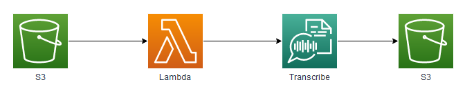

# S3 Triggered Lambda Function that starts an Amazon Transcribe Job and points to another S3 bucket for results

This repo contains serverless patterns showing how to setup a Lambda with an S3 *object created* trigger that starts a basic, one-speaker, Amazon Transcribe job. The resulting transcription is placed into another S3 bucket.



- Learn more about these patterns at https://serverlessland.com/patterns.
- To learn more about submitting a pattern, read the [publishing guidelines page](https://github.com/aws-samples/serverless-patterns/blob/main/PUBLISHING.md).

Important: this application uses various AWS services and there are costs associated with these services after the Free Tier usage - please see the [AWS Pricing page](https://aws.amazon.com/pricing/) for details. You are responsible for any AWS costs incurred. No warranty is implied in this example.

## Requirements

* AWS Account
* AWS CLI already configured with Administrator permission
* [NodeJS 14.x installed](https://nodejs.org/en/download/)
* CDK v2 installed: See Getting Started With the AWS CDK
* Python CDK required libraries: (install with pip install -r requirements.txt)
* Clone this repo!

## Deployment Instructions

1. Within your CDK Python module directory(where all your cdk stacks are located) create a constructs folder and within the constructs folder, create an assets folder.
2. Place the `s3_lambda_transcribe_cdk.py` file in the constructs folder you created and the `file-uploaded-trigger` folder in the assets folder you created.
3. Import the construct into the desired stack you would like to use this construct (ex.`from .constructs.s3_lambda_transcribe_cdk import TriggerTranscribe`)
4. Use this construct in your stack by defining it in your stack (ex. `trigger_transcribe = TriggerTranscribe(self, 'trigger-transcribe')`)
5. In your terminal run `CDK Deploy` for the specified stack that uses this construct

### Removing the resources

1. run `CDK Destroy <stack id>` for the specified stack that used this construct

```
git clone https://github.com/aws-samples/serverless-patterns/s3-lambda-transcribe-cdk
```

Each subdirectory contains additional installation and usage instructions. 

----
Copyright 2021 Amazon.com, Inc. or its affiliates. All Rights Reserved.
----

