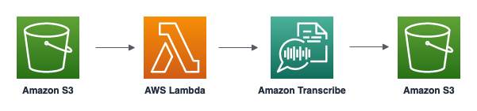

# S3 - Lambda - Transcribe

This pattern contains a sample AWS Serverless Application Model (SAM) template that deploys a Lambda Function with an S3 object created trigger to start an Amazon Transcribe job and place the results in another S3 bucket.

This pattern deploys one Lambda Function and two S3 buckets.

Learn more about this pattern at Serverless Land Patterns: << Add the live URL here >>

Important: this application uses various AWS services and there are costs associated with these services after the Free Tier usage - please see the [AWS Pricing page](https://aws.amazon.com/pricing/) for details. You are responsible for any AWS costs incurred. No warranty is implied in this example.

## Services

The AWS services used in this pattern are

- Amazon S3
- AWS Lambda
- Amazon Transcribe



## Requirements

- [Create an AWS account](https://portal.aws.amazon.com/gp/aws/developer/registration/index.html) if you do not already have one and log in. The IAM user that you use must have sufficient permissions to make necessary AWS service calls and manage AWS resources.
- [AWS CLI](https://docs.aws.amazon.com/cli/latest/userguide/install-cliv2.html) installed and configured
- [Git Installed](https://git-scm.com/book/en/v2/Getting-Started-Installing-Git)
- [AWS Serverless Application Model](https://docs.aws.amazon.com/serverless-application-model/latest/developerguide/serverless-sam-cli-install.html) (AWS SAM) installed

## Deployment Instructions

1. Create a new directory, navigate to that directory in a terminal and clone the GitHub repository:
   ```
   git clone https://github.com/aws-samples/serverless-patterns
   ```
1. Change directory to the pattern directory:
   ```
   cd s3-lambda-transcribe-sam
   ```
1. From the command line, use AWS SAM to build the application:
   ```
   sam build
   ```
1. Use AWS SAM to deploy the AWS resources for the pattern as specified in the template.yml file:
   ```
   sam deploy --guided
   ```
1. During the prompts:

   - Enter a stack name
   - Enter the desired AWS Region
   - Allow SAM CLI to create IAM roles with the required permissions.
     Once you have run `sam deploy --guided` mode once and saved arguments to a configuration file (samconfig.toml), you can use `sam deploy` in future to use these defaults.

1. Note the outputs from the SAM deployment process. These contain the resource names and/or ARNs which are used for testing.

## How it works

The input S3 bucket is configured with an event notification that invokes the Lambda function on upload of the audio file. The lambda reads the file contents from the S3 bucket and sends it to Transcribe for speech-to-text conversion. Transcribe returns an JSON file that contains the speech transcript which is stored in the output S3 bucket.

## Testing

1. Upload the audio.mp3 file to the input S3 bucket
   ```bash
   aws s3 cp audio.mp3 s3://speech2text-input-bucket
   ```
1. The JSON file with the audio transcript will be uploaded to the output S3 bucket after 2-3 mins.

## Cleanup

1. Delete the stack
   ```bash
   aws cloudformation delete-stack --stack-name STACK_NAME
   ```
1. Confirm the stack has been deleted
   ```bash
   aws cloudformation list-stacks --query "StackSummaries[?contains(StackName,'STACK_NAME')].StackStatus"
   ```

---

Copyright 2023 Amazon.com, Inc. or its affiliates. All Rights Reserved.

SPDX-License-Identifier: MIT-0
