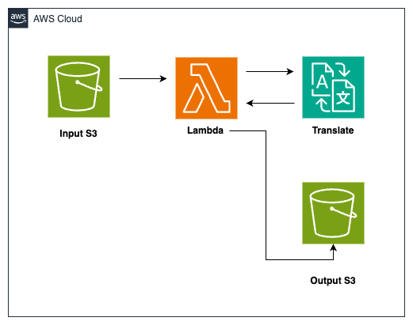

# Translate file with AWS Lambda, Amazon S3, and Amazon Translate
This pattern uses AWS Cloud Development Kit (AWS CDK) to deploy Amazon S3, AWS Lambda, and Amazon Translate to perform document language translation.

## Architecture


### What resources will be created?
This CDK code will create the following:
   - One Lambda function (to invoke the TranslateDocument API)
   - Two S3 buckets (One bucket to accept the user input to trigger the Lambda function and the second bucket to capture the output from Translate service.)
   - One IAM role (for the Lambda function to invoke Translate service, read and upload translated documents to S3 bucket.)

## Requirements

### Development Environment
**Cloud 9**

This demonstration for this pattern is executed in an AWS Cloud9 environment. The EC2 instance used is t2.micro (1 GiB RAM + 1 vCPU). However, users have an option to deploy the application using CDK from local environment as well.

### AWS setup
**Region**

If you have not yet run `aws configure` and set a default region, you must do so, or you can also run `export AWS_DEFAULT_REGION=<your-region>`. The region used in the demonstration is us-east-1. Please make sure the region selected supports both Translate and Comprehend service.
(If the user does not know the source language that needs to be translated, the source language is set as `auto` in the lambda function and Translate service internally invokes Comprehend API to detect the source language.) 

**Authorization**

You must use a role that has sufficient permissions to create IAM roles, as well as CloudFormation resources

#### Python >=3.8
Make sure you have [python3](https://www.python.org/downloads/) installed at a version >=3.8.x in the CDK environment. The demonstration uses python 3.10.
As `TranslateDocument` API is yet to be made available in the latest Boto3 library, a layer `python.zip` with Boto3 version >= 1.28.56 has been attached.

#### AWS CDK
Make sure you have the [AWS CDK](https://docs.aws.amazon.com/cdk/v2/guide/getting_started.html#getting_started_install) installed in the Cloud9 environment.


## Setup

### Set up environment and gather packages

```
cd s3-lambda-translate-cdk-python
```

Install the required dependencies (aws-cdk-lib and constructs) into your Python environment 
```
pip install -r requirements.txt
```

### Gather and deploy resources with the CDK

First synthesize, which executes the application, defines which resources will be created, and translates this into a CloudFormation template
```
cdk synth
```
All AWS CDK v2 deployments use dedicated AWS resources to hold data during deployment. Therefore, your AWS account and Region must be bootstrapped to create these resources before you can deploy. If you haven't already bootstrapped execute the below command
```
cdk bootstrap
```
and deploy with
```
cdk deploy
```

The deployment will create two S3 buckets and a Lambda function.

## How it works
The S3 bucket acts as a placeholder to upload the document, required for performing language translation. In the demonstration, we use the file `AmazonSimpleStorageService.html` inside the `assets` folder. 
Uploading a file to the S3 bucket invokes the Lambda function.
The Lambda function invokes Translate's `TranslateDocument` API  and uploads the  response document with the naming pattern `target_language`-`source_file_name`. 
The target language for translation is set to French by default and users are requested to change it as per their use-case.
At the time of creating this pattern, `TranslateDocument` API supports three formats of document:
   - `text/html` - The input data consists of HTML content. Amazon Translate translates only the text in the HTML element.
   - `text/plain` -  The input data consists of unformatted text. Amazon Translate translates every character in the content.
   - `application/vnd.openxmlformats-officedocument.wordprocessingml.document` - The input data consists of a Word document (.docx).

In this demonstration, we've chosen the `text/html` document format.

## Testing
Upon successful deployment of the stack, the Output section would provide the names of the S3 buckets from the variables `S3InputBucket` and `S3OutputBucket` in the CDK environment. 
Alternatively, these values can be found from the Output section of the `CloudFormation` stack.
Upload the sample file `assets\AmazonSimpleStorageService.html` to the input S3 bucket. The upload action invokes the Lambda function and the document is analyzed. 
The translated document is stored in the output S3 bucket. In this demonstration, we have chosen to convert an html document to `French. 
Hence, the converted document would look similar to `assets\fr-AmazonSimpleStorageService.html`.

## Cleanup
To clean up the resources created as part of this demonstration, run the command `cdk destroy` in the directory `s3-lambda-translate-cdk-python`. In addition, users are advised to terminate the Cloud9 EC2 instance to avoid any unexpected charges.
