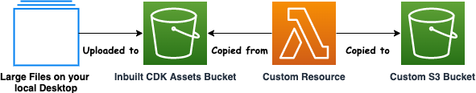

# S3 Large Deployments in CDK using Assets Bucket and Custom Resource
The samples in this project demonstrate how to upload large file to S3 Bucket using CDK using the inbuilt CDK Assets Bucket and Custom Resource

Assets are local files, directories, or Docker images that can be bundled into AWS CDK libraries and apps; for example, a directory that contains the handler code for an AWS Lambda function. Assets can represent any artifact that the app needs to operate. You can define local files and directories as assets, and the AWS CDK packages and uploads them to Amazon S3 through the aws-s3-assets module.

A Lambda Backed Custom Resource can be used to copy your large file from the assets bucket to your custom s3 bucket





## Requirements

### Basic Configuration

- CDK v2 installed: See [Getting Started With the AWS CDK](https://docs.aws.amazon.com/cdk/latest/guide/getting_started.html) 
- AWS Account
- Git installed
- Clone this repo!
- Python CDK required libraries: (install with pip install -r requirements.txt)
- Sample File you want to upload to S3

### Clone this repository
```bash
git clone https://github.com/aws-samples/aws-cdk-large-deployments-to-s3
cd aws-cdk-large-deployments-to-s3
```

### Create Python virtual environment and install the dependencies

```bash
python3.7 -m venv .venv
source .venv/bin/activate
pip install pip-licenses
pip-licenses --output NOTICE.txt
pip install safety
safety check
pip install -r requirements.txt
```

#### Note:
The ```safety check``` command will check your currently selected virtual environment for dependencies with known security vulnerabilites

### Running the Sample Code

1. Create a assets folder in the root directory and place the sample file you want to upload to S3 Bucket
 
2. Run the below command
```bash
cdk deploy --context filename=<sample file name> --context s3bucketname=<the name of the s3 bucket> --all
```
The code consists of two stacks - StorageStack and S3LargeDeploymentStack.  The StorageStack will handle the creation of the S3 Bucket while the S3LargeDeploymentStack will handle the uploading of the file to S3Bucket.  The ```--all``` flag will deploy both the stacks.

## License

This library is licensed under the MIT-0 License. See the LICENSE file.