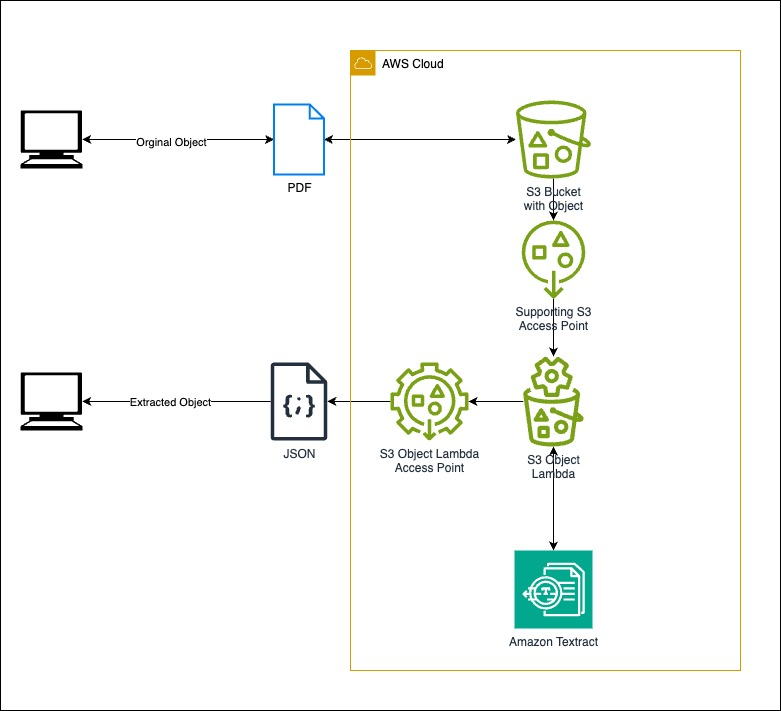

# AWS S3 Object Lambda to Amazon textract

This pattern allows you to upload a document documents such as PDFs, images, tables, and forms into an S3 bucket the text (key value paid) from the document can be extract using S3 Object Lambda using Amazon Textract

This pattern provides a simple on-demand mechanism of extracting key value pair from document for intelligent document processing. 

Example Use case : If an enterprise has a large volume of PDF document and does not want to run a batch job due to the cost of processing of extracting / processing all the document, S3 Object Lambda provides a good mechanism to extract only the OCR document on need basis without major changes to the architecture and in a serverless fashion, optimising cost.

Learn more about this pattern at Serverless Land Patterns: https://serverlessland.com/patterns/s3-object-lambda-textract

Important: this application uses various AWS services and there are costs associated with these services after the Free Tier usage - please see the [AWS Pricing page](https://aws.amazon.com/pricing/) for details. You are responsible for any AWS costs incurred. No warranty is implied in this example.

## Requirements

* [Create an AWS account](https://portal.aws.amazon.com/gp/aws/developer/registration/index.html) if you do not already have one and log in. The IAM user that you use must have sufficient permissions to make necessary AWS service calls and manage AWS resources.
* [AWS CLI](https://docs.aws.amazon.com/cli/latest/userguide/install-cliv2.html) installed and configured
* [Git Installed](https://git-scm.com/book/en/v2/Getting-Started-Installing-Git)
* [AWS Serverless Application Model](https://docs.aws.amazon.com/serverless-application-model/latest/developerguide/serverless-sam-cli-install.html) (AWS SAM) installed
* Install python 3.11 - to test
* Install boto3 - to test

## Deployment Instructions

1. Create a new directory, navigate to that directory in a terminal and clone the GitHub repository:
    ```bash 
    git clone https://github.com/aws-samples/serverless-patterns
    ```
1. Change directory to the pattern directory:
    ```bash
    cd s3-object-lambda-textract
    ```
1. From the command line, use AWS SAM to deploy the AWS resources for the pattern as specified in the template.yml file:
    ```bash
    sam deploy --guided
    ```
1. During the prompts:
    * Enter a stack name
    * Enter the desired AWS Region
    * Allow SAM CLI to create IAM roles with the required permissions.

    Once you have run `sam deploy --guided` mode once and saved arguments to a configuration file (samconfig.toml), you can use `sam deploy` in future to use these defaults.

1. Note the outputs from the SAM deployment process. These contain the resource names and/or ARNs which are used for testing.

## How it works

The architecture for the pattern is as follows: The pattern create an access point for the S3 bucket allowing the Lambda to access 
The pattern allows an object in the S3 bucket to be access via an Access point to invoke a Lambda (S3 object Lambda). 
The lambda invokes Amazon Textact to analysie the document for key value pair using OCR. This allows extraction
of the text from the object (such as pdf and image file). The S3 Object Lambda Access point can be used to download 
the extracted output of the original document.



## Testing

1. Upload the sample file / your own test file into the S3 bucket
   Use your S3BucketName
```
 aws s3 cp ./tests/docs/Drivers_License.pdf s3://[S3BucketName see-output-from-deployment]
```
1. Now S3 Object Lambda using the access point. The accesspoint arn can be found in the output section of the cloud formation template
   Use your S3ObjectLambdaAccessPointArn 
```
python3 ./tests/app_test.py [your S3ObjectLambdaAccessPointArn]  
```


## Cleanup
 
1. Delete the stack
    ```bash
    sam delete
    ```
----
Copyright 2023 Amazon.com, Inc. or its affiliates. All Rights Reserved.

SPDX-License-Identifier: MIT-0
