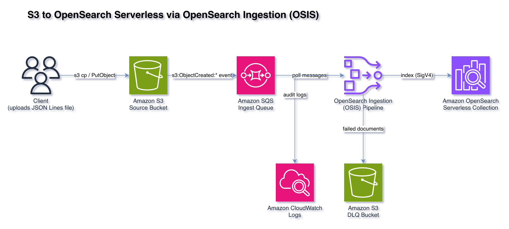

# Amazon S3 to Amazon OpenSearch Serverless with OpenSearch Ingestion

This sample project demonstrates how to ingest JSON objects from an Amazon S3 bucket into an Amazon OpenSearch Serverless collection using an Amazon OpenSearch Ingestion (OSIS) pipeline with an S3 source.

Learn more about this pattern at Serverless Land Patterns: https://serverlessland.com/patterns/s3-opensearch-serverless-osis-sam



Important: this application uses various AWS services and there are costs associated with these services after the Free Tier usage - please see the [AWS Pricing page](https://aws.amazon.com/pricing/) for details. You are responsible for any AWS costs incurred. No warranty is implied in this example.

## Requirements

* [Create an AWS account](https://portal.aws.amazon.com/gp/aws/developer/registration/index.html) if you do not already have one and log in. The IAM user that you use must have sufficient permissions to make necessary AWS service calls and manage AWS resources.
* [AWS CLI](https://docs.aws.amazon.com/cli/latest/userguide/install-cliv2.html) installed and configured
* [Git Installed](https://git-scm.com/book/en/v2/Getting-Started-Installing-Git)
* [AWS Serverless Application Model](https://docs.aws.amazon.com/serverless-application-model/latest/developerguide/serverless-sam-cli-install.html) (AWS SAM) installed

## Deployment Instructions

1. Create a new directory, navigate to that directory in a terminal and clone the GitHub repository:
    ```
    git clone https://github.com/aws-samples/serverless-patterns
    ```
1. Change directory to the pattern directory:
    ```
    cd s3-opensearch-serverless-osis-sam
    ```
1. From the command line, use AWS SAM to deploy the AWS resources for the pattern as specified in the template.yaml file:
    ```
    sam deploy --capabilities CAPABILITY_NAMED_IAM --guided
    ```

1. Identify the ARN of the role (or user) being used to access the console for this deployment. If it does not have the `AdministratorAccess` AWS managed policy (or a similarly permissive equivalent), attach the `AmazonOpenSearchServiceFullAccess` AWS managed policy. Access for allowed principals can be edited later via the `DataAccessPolicyEditURL` from the stack outputs.

1. During the prompts:
    * Enter a stack name
    * Enter the desired AWS Region
    * Enter the ARN identified in the previous step in the `AccessARN` parameter
    * Enter the `DeploymentName` parameter (up to 32 characters without spaces; "a-z", "0-9", or "-")
    * Allow SAM CLI to create IAM roles with the required permissions.

    Once you have run `sam deploy --guided` mode once and saved arguments to a configuration file (samconfig.toml), you can use `sam deploy` in future to use these defaults.

1. Note the outputs from the SAM deployment process. These contain the resource names and URLs which are used for testing.

## How it works

* A source S3 bucket is configured to publish `s3:ObjectCreated:*` event notifications to an Amazon SQS queue.
* An OpenSearch Ingestion (OSIS) pipeline uses the [Amazon S3 source](https://docs.aws.amazon.com/opensearch-service/latest/developerguide/configure-client-s3.html). It polls the SQS queue, and when a message indicates a new object was created, it reads the object from the source bucket.
* Each object is expected to be newline-delimited JSON (JSON Lines). The pipeline reads it line by line (`newline` codec) and the `parse_json` processor converts each line into a structured document.
* The documents are indexed into the OpenSearch Serverless collection (the `serverless: true` flag is set on the sink), into an index named `s3-logs`.
* Any documents that fail to be indexed are written to a separate dead-letter S3 bucket. A separate DLQ bucket is used deliberately: writing DLQ objects back into the source bucket would re-trigger the S3 to SQS notification and create an ingestion loop.

The pipeline assumes an IAM role that grants it read access to the source bucket, consume access to the SQS queue, write access to the DLQ bucket, and data access to the OpenSearch Serverless collection.

## Testing

A sample newline-delimited JSON (JSON Lines) file, `sample.json`, is included in this pattern directory. Each line is a single JSON document:

```json
{"timestamp": "2024-01-01T10:00:00Z", "level": "INFO", "service": "checkout", "message": "order placed", "order_id": "1001"}
{"timestamp": "2024-01-01T10:00:05Z", "level": "ERROR", "service": "checkout", "message": "payment failed", "order_id": "1002"}
{"timestamp": "2024-01-01T10:00:09Z", "level": "INFO", "service": "shipping", "message": "label created", "order_id": "1001"}
```

1. Upload the included `sample.json` to the source bucket (`DataBucketName` from the stack outputs). Replace the bucket name and region with your values:
    ```bash
    aws s3 cp sample.json s3://<DataBucketName>/ --region <your-region>
    ```

1. Wait a short time for the pipeline to poll the SQS queue and ingest the object (typically under a minute).

1. From the OpenSearch dashboard Dev Tools console (`DevToolsURL` from the stack outputs), search the index. You should see the three documents from the uploaded file, each parsed into structured fields with the S3 source metadata (`bucket` and `key`) added by the pipeline:
    ```
    GET s3-logs/_search
    ```

## Cleanup

1. From the [S3 console](https://console.aws.amazon.com/s3/home), empty both buckets created by this project (`DataBucketName` and `DlqBucketName` from the stack outputs).

1. Delete the stack:
    ```bash
    sam delete
    ```

----
Copyright 2025 Amazon.com, Inc. or its affiliates. All Rights Reserved.

SPDX-License-Identifier: MIT-0
