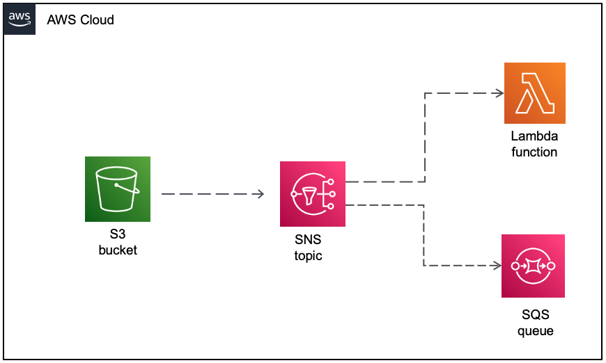

## Description
## S3 - SNS - SQS - Lambda

This SAM template creates one S3 bucket, one SNS topic, one SQS queue and one Lambda function.

Important: this application uses various AWS services and there are costs associated with these services after the Free Tier usage - please see the AWS Pricing page for details. You are responsible for any AWS costs incurred.

## Language:
####This is a Maven project which uses Java 11 and AWS SDK

## Framework

The framework used to deploy the infrastructure is SAM

## Services used

The AWS services used in this pattern are
#### Amazon S3 - Amazon SNS - Amazon SQS - AWS Lambda



## Description
The SAM template contains all the information to deploy AWS resources(one S3 bucket, one SQS queue and one Lambda function)
and also the permission required by these service to communicate.

You will be able to create and delete the CloudFormation stack using the CLI commands.

The S3 will send notifications to an SNS topic whenever an .png object is deleted.
SNS has two subscribers, one SQS queue and one Lambda function.
The Lambda function will be triggered whenever a new file is deleted in the S3 bucket.
The SQS will also receive the deleted object event from the SNS topic.

This is fully functional example implemented in Java 11.

## Deployment commands

````
mvn clean package

# create an S3 bucket where the source code will be stored:
aws s3 mb s3://gvtsydy238uaisucaks

# copy the source code located in the target folder:
aws s3 cp target/sourceCode.zip s3://gvtsydy238uaisucaks

# SAM will deploy the CloudFormation stack described in the template.yml file:
sam deploy --s3-bucket gvtsydy238uaisucaks --stack-name fanout-pattern --capabilities CAPABILITY_IAM

````

## Testing

````
## copy 3 png files to S3

aws s3 cp files/s3-icon.png s3://filebucket78273ueoiqwdadui
aws s3 cp files/sqs-icon.png s3://filebucket78273ueoiqwdadui
aws s3 cp files/lambda-icon.png s3://filebucket78273ueoiqwdadui

## delete all png files from the S3 bucket
aws s3 rm s3://filebucket78273ueoiqwdadui --recursive

## open the CloudWatch Log Group of the Lambda Function and see the log events for the deleted files

aws sqs get-queue-url --queue-name AuditQueue

aws sqs receive-message --queue-url QUEUE_URL

````

## Cleanup

Run the given command to delete the resources that were created. It might take some time for the CloudFormation stack to get deleted.
```
aws cloudformation delete-stack --stack-name fanout-pattern

aws s3 rm s3://gvtsydy238uaisucaks --recursive

aws s3 rb s3://gvtsydy238uaisucaks
```

## Requirements

* [Create an AWS account](https://portal.aws.amazon.com/gp/aws/developer/registration/index.html) if you do not already have one and log in. The IAM user that you use must have sufficient permissions to make necessary AWS service calls and manage AWS resources.
* [AWS CLI](https://docs.aws.amazon.com/cli/latest/userguide/install-cliv2.html) installed and configured
* [AWS Serverless Application Model](https://docs.aws.amazon.com/serverless-application-model/latest/developerguide/serverless-sam-cli-install.html) (AWS SAM) installed

## Author bio
Razvan Minciuna
Software Architect
https://www.linkedin.com/in/razvanminciuna/
