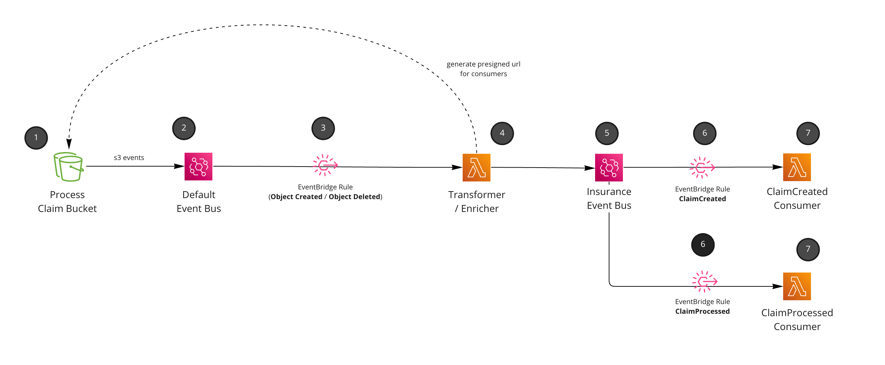

<div align="center">

<h1>📂 Claim Check pattern with S3 and EventBridge</h1>

<hr />



  <h3>An example of the claim check pattern in an event-driven architecture. Using S3 and EventBridge with presigned URLS for downstream consumers.</h3>

</div>

---

## Understanding the pattern

1. User uploads information into a bucket. In this example an insurance claim has been inserted to be processed.
1. S3 has been configured to send events to EventBridge. This is your `default` event bus (all AWS accounts have one).
1. Setup an EventBridge rule to only listen for files inserted into the `claims` folder and S3 objects that have been `Created` or `Deleted`
1. Custom code picks up the events, and transforms it into a `Domain Event`. Events are enriched with data, and the S3 document is presigned with a url for an hour (for downstream consumers).
1. Events are sent to custom domain event bus. In this example our `Insurance` event bus.
1. Rules are setup for downstream consumers of our `Domain Events (ClaimCreated, ClaimProcessed)`. We make assumptions that when files are removed from this `Claim` bucket that means that have been processed.
1. Consumers receive the `Domain Events` and process as they see fit. (This example just logs out, but you could email, send to other targets etc).

## Why the claim check pattern?

Claim check allows us to attach data onto events that we may not want to include on our payloads themself. This pattern shows us how to react to S3 events and use presigned urls on the events to access data downstream, this saves us from having to put all the information onto the event itself.

Other reasons you might want to use this pattern is if the message size is too big for EventBridges limits (256kb). You can first store the data, and raise your event with a reference back to the location of the data for downstream consumers (in our example it's the presigned URL).


[Read more about the Claim Check Pattern](https://www.enterpriseintegrationpatterns.com/StoreInLibrary.html)


## Deploying and testing this pattern
Clone the project an run:

`npm run build && cdk deploy`

Once deployed then upload a file into your new S3 Bucket.

Make sure your file/folders look like this

```
/claims/{user-id}

e.g
/claims/57cca127-2962-403e-b165-8dba144887a0/my-claim.txt
```

_The EventBridge rule listens for every S3 event with the `claims` prefix and gets the userId from the bucket key. This is just an example of some structure, you can change or do what you want here, but you would need to change the code_.

Once your file has been uploaded, your event will pass through your architecture, and reach your `ClaimCreated` consumer (Lambda function in this example). View the CloudWatch log groups for the Lambda function to see it being triggered with the enriched event.


### Why would you use this pattern?

Claim check patterns are great to pass large information around your event-driven architectures. This pattern is an example of an event-driven approach to handling files and triggering domain events downstream into your architecture. 


### Assumptions and things to consider
- Some "business requirements" were assumed for this pattern. This assumes that users would upload some claim form to the bucket. The bucket is only used for claims that are currently being processed. `Object Delete` from S3 is used to trigger `ClaimProcessed` as the "business" were happy with that pattern.
- Presigned URLS for downstream consuemrs are only valid for `1 hour`. You can configure this yourself to a time that could suit you. Or remove the presigned URL and have downstream consumers have the right premission to get the file from S3.