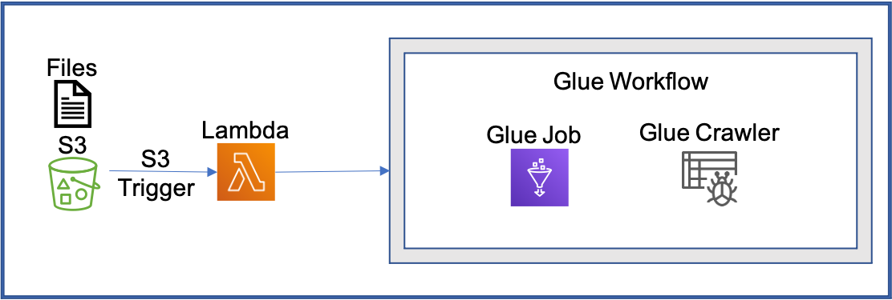

# AWS S3 Trigger to AWS Lambda to AWS Glue workflow

This pattern creates an s3 bucket trigger that triggers a Lambda function(Whenever file lands), The Lambda function is used for triggering a Glue workflow with input parameters such as file key and bucket names. All elements covered in this pattern are built using Terraform.

Important: this application uses various AWS services and there are costs associated with these services after the Free Tier usage - please see the [AWS Pricing page](https://aws.amazon.com/pricing/) for details. You are responsible for any AWS costs incurred. No warranty is implied in this example.



## How it works

For cases where we need to process files using Glue jobs, we can use Glue Workflows to orchestrate our Glue jobs and Glue crawlers. S3 trigger is set up to trigger the Lambda on file upload event. To be able to trigger a Glue workflow with certain parameters, we use AWS Lambda to start glue workflows with parameters.

## Requirements

* [Create an AWS account](https://portal.aws.amazon.com/gp/aws/developer/registration/index.html) if you do not already have one and log in. The IAM user that you use must have sufficient permissions to make necessary AWS service calls and manage AWS resources.
* [AWS CLI](https://docs.aws.amazon.com/cli/latest/userguide/install-cliv2.html) installed and configured
* [Git Installed](https://git-scm.com/book/en/v2/Getting-Started-Installing-Git)
* [Terraform](https://docs.aws.amazon.com/serverless-application-model/latest/developerguide/serverless-sam-cli-install.html) (AWS SAM) installed

## Getting started with Terraform Serverless Patterns

Read more about general requirements and deployment instructions for Terraform Serverless Patterns [here](https://github.com/aws-samples/serverless-patterns/blob/main/terraform-fixtures/docs/README.md). 


## Deployment Instructions (Review input variables at variables.tf)

1. Change directory to the module directory:
    ```
    cd serverless-patterns/s3-trigger-lambda-glue-workflow-terraform
    ```
1. From the command line, initialize terraform to download and install the providers defined in the configuration:
    ```
    terraform init
    ```
1. From the command line, apply the configuration in the main.tf file:
    ```
    terraform apply
    ```
1. During the prompts:
    * Enter yes

## Cleanup
 
1. Change directory to the pattern directory:
    ```
    cd serverless-patterns/s3-trigger-lambda-glue-workflow-terraform
    ```
1. Delete all created resources
    ```
    terraform destroy
    ```
1. During the prompts:
    * Enter yes
1. Confirm all created resources has been deleted
    ```
    terraform show
    ```
----
Copyright 2023 Amazon.com, Inc. or its affiliates. All Rights Reserved.

SPDX-License-Identifier: MIT-0


