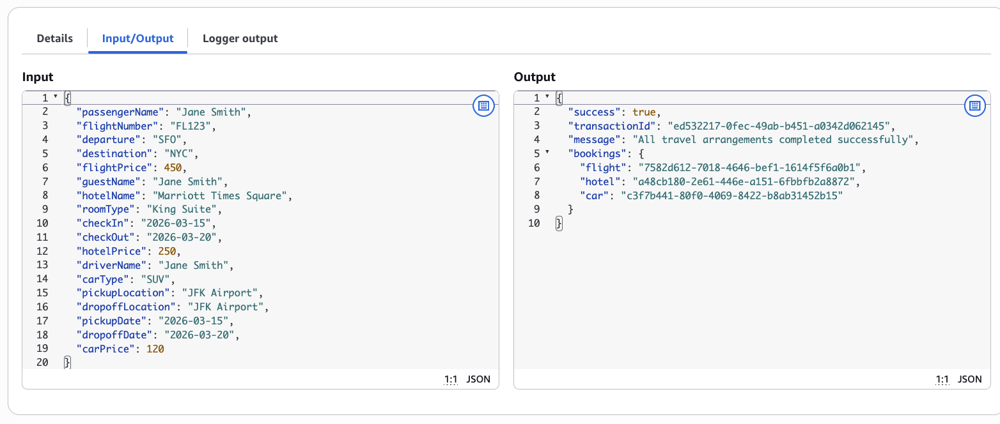
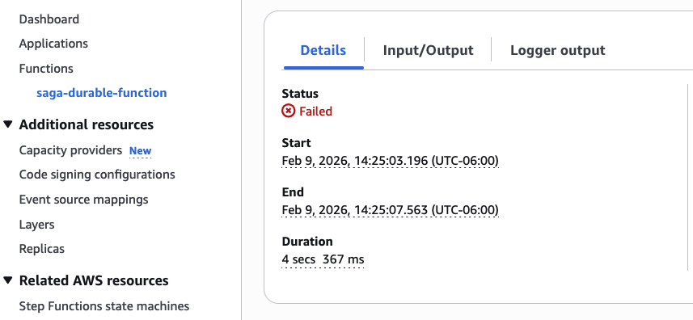

# Saga Pattern with Lambda durable functions

This pattern demonstrates how to implement the Saga pattern for distributed transactions using AWS Lambda durable functions. The example implements a travel booking system that coordinates flight, hotel, and car reservations with automatic compensating transactions (rollbacks) on failure.

Durable functions are regular Lambda functions that allow you to write sequential code in your preferred programming language. They track progress, automatically retry on failures, and suspend execution for up to one year at defined points, without paying for idle compute during waits.

This saga is built using the `aws-durable-execution-sdk` with Python 3.14 runtime and deployed using AWS CDK (TypeScript).

**Important:** This application uses various AWS services and there are costs associated with these services after the Free Tier usage. Please see the [AWS Pricing page](https://aws.amazon.com/pricing/) for details. You are responsible for any AWS costs incurred. No warranty is implied in this example.

## Architecture


### Components

- **Saga Orchestrator**: Durable Lambda function that coordinates the distributed transaction
- **Service Functions**: Individual Lambda functions for each service (flight, hotel, car)
  - Reserve functions: Create reservations in DynamoDB
  - Cancel functions: Rollback reservations (compensating transactions)
- **DynamoDB Tables**: Store reservation state for each service

### Saga Flow

**Success Path:**
```
Reserve Flight → Reserve Hotel → Reserve Car → Complete
```

**Failure Path (with Compensation):**
```
Reserve Flight → Reserve Hotel → Reserve Car (FAILS)
                                           ↓
                    Compensation (Reverse Order):
                           ↓
                    Cancel Hotel
                           ↓
                    Cancel Flight
```

## Requirements

- [AWS Account](https://aws.amazon.com/free/)
- [AWS CLI](https://aws.amazon.com/cli/) installed and configured
- [Node.js 18+](https://nodejs.org/) installed
- [AWS CDK](https://aws.amazon.com/cdk/) installed (`npm install -g aws-cdk`)
- [Git](https://git-scm.com/) installed

## Deployment Instructions

### 1. Clone the Repository

```bash
git clone https://github.com/aws-samples/serverless-patterns
cd serverless-patterns/saga-pattern-lambda-durable-functions/saga-pattern-cdk
```

### 2. Install Dependencies

```bash
npm install
```

### 3. Bootstrap AWS CDK (First Time Only)

```bash
cdk bootstrap
```

Or with a specific profile:

```bash
cdk bootstrap --profile your-profile-name
```

### 4. Deploy the Stack

```bash
npm run build
cdk deploy
```

The deployment creates:
- 3 DynamoDB tables (flight-bookings, hotel-reservations, car-rentals)
- 7 Lambda functions (1 orchestrator + 6 service functions)
- IAM roles and permissions

### 5. Note the Outputs

After deployment, save the function ARNs from the stack outputs:
- `SagaDurableFunctionArn` - Main orchestrator function
- `ReserveFlightFunctionArn` - Flight reservation service
- `CancelFlightFunctionArn` - Flight cancellation service
- `ReserveHotelFunctionArn` - Hotel reservation service
- `CancelHotelFunctionArn` - Hotel cancellation service
- `ReserveCarFunctionArn` - Car rental service
- `CancelCarFunctionArn` - Car cancellation service

## How It Works

The Saga pattern maintains data consistency across microservices without using distributed transactions. Instead, it uses:

1. **Sequential Execution**: Services are invoked one after another
2. **State Tracking**: Each successful operation is tracked
3. **Compensating Transactions**: On failure, successful operations are undone in reverse order
4. **Idempotency**: Operations can be safely retried

### Key Features

- **No Distributed Locks**: Each service manages its own data independently
- **Eventual Consistency**: System reaches consistent state through compensations
- **Fault Tolerance**: Handles partial failures gracefully
- **Auditability**: Complete log trail of all operations
- **Automatic Retry**: Durable functions handle retries automatically

## Testing

The saga pattern implementation includes built-in failure flags for easy testing of compensating transactions.

### Failure Flags

Each reserve function supports a failure flag that simulates service failures:
- `failBookFlight` - Causes flight reservation to fail
- `failBookHotel` - Causes hotel reservation to fail  
- `failBookCar` - Causes car reservation to fail

When set to `true`, the service throws an exception before creating any records, triggering the saga compensation logic.

### Test Scenario 1: Success Path (All Services Work)

**Using AWS CLI (Async Invocation):**

```bash
aws lambda invoke \
  --function-name saga-durable-function \
  --invocation-type Event \
  --cli-binary-format raw-in-base64-out \
  --payload file://test-success.json \
  response.json
```

**test-success.json:**
```json
{
  "passengerName": "Michael Johnson",
  "flightNumber": "AA456",
  "departure": "LAX",
  "destination": "MIA",
  "flightPrice": 380.00,
  "guestName": "Michael Johnson",
  "hotelName": "Hilton Downtown Miami",
  "roomType": "Ocean View Suite",
  "checkIn": "2026-04-10",
  "checkOut": "2026-04-15",
  "hotelPrice": 320.00,
  "driverName": "Michael Johnson",
  "carType": "Convertible",
  "pickupLocation": "Miami Airport",
  "dropoffLocation": "Miami Airport",
  "pickupDate": "2026-04-10",
  "dropoffDate": "2026-04-15",
  "carPrice": 150.00
}
```

**Expected Response:**
```json
{
  "success": true,
  "transactionId": "uuid-here",
  "message": "All travel arrangements completed successfully",
  "bookings": {
    "flight": "booking-id",
    "hotel": "reservation-id",
    "car": "rental-id"
  }
}
```
You can view the function output in the AWS Lambda Durable console as well:


**Validation:**
- All three services succeed
- DynamoDB records show `status: "RESERVED"`
- No compensations triggered

### Test Scenario 2: Flight Fails Immediately

**Using AWS CLI:**

```bash
aws lambda invoke \
  --function-name saga-durable-function \
  --invocation-type Event \
  --cli-binary-format raw-in-base64-out \
  --payload file://test-fail-flight-booking.json \
  response.json
```

**test-fail-flight-booking.json:**
```json
{
  "passengerName": "Sarah Williams",
  "departure": "ORD",
  "destination": "SEA",
  "failBookFlight": true
}
```

**Using Lambda Console:**

1. Navigate to AWS Lambda Console
2. Open `saga-durable-function`
3. Go to "Test" tab
4. Click "Create new event"
5. Name it (e.g., "FailFlightTest")
6. Select invocation type: "Event" (for async execution)
7. Paste the JSON payload above
8. Click "Save" then "Test"

**Expected Behavior:**
- Flight fails immediately
- Hotel and car never attempted
- No compensations needed (nothing to rollback)
- DynamoDB: No records created

### Test Scenario 3: Hotel Fails After Flight Succeeds

**Using AWS CLI:**

```bash
aws lambda invoke \
  --function-name saga-durable-function \
  --invocation-type Event \
  --cli-binary-format raw-in-base64-out \
  --payload file://test-fail-hotel-booking.json \
  response.json
```

**test-fail-hotel-booking.json:**
```json
{
  "passengerName": "David Martinez",
  "departure": "DFW",
  "destination": "BOS",
  "flightPrice": 420.00,
  "guestName": "David Martinez",
  "hotelName": "Boston Harbor Hotel",
  "failBookHotel": true
}
```

**Using Lambda Console:**

Create a test event named "FailHotelTest" with invocation type "Event" (async) and the JSON payload above.

**Expected Behavior:**
- Flight reserved
- Hotel fails
- Car never attempted
- Compensation: Flight gets cancelled
- DynamoDB: Flight record with `status: "CANCELLED"`

**Console View:**

After the failure, you should see the error state in the Lambda console showing the compensation process:


### Test Scenario 4: Car Fails After Flight and Hotel Succeed

**Using AWS CLI:**

```bash
aws lambda invoke \
  --function-name saga-durable-function \
  --invocation-type Event \
  --cli-binary-format raw-in-base64-out \
  --payload file://test-fail-car-booking.json \
  response.json
```

**test-fail-car-booking.json:**
```json
{
  "passengerName": "Jane Smith",
  "departure": "SFO",
  "destination": "NYC",
  "guestName": "Jane Smith",
  "hotelName": "Marriott Times Square",
  "driverName": "Jane Smith",
  "failBookCar": true
}
```

**Using Lambda Console:**

Create a test event named "FailCarTest" with invocation type "Event" (async) and the JSON payload above.

**Expected Behavior:**
- Flight reserved
- Hotel reserved
- Car fails
- Compensation: Hotel cancelled, then flight cancelled (reverse order)
- DynamoDB: Flight and hotel records with `status: "CANCELLED"`

**Console View:**

After the failure, you should see the error state in the Lambda console showing the compensation process:


**CloudWatch Logs:**
```
Step 1: Reserving flight...
Flight reserved successfully: <booking-id>
Step 2: Reserving hotel...
Hotel reserved successfully: <reservation-id>
Step 3: Reserving car...
SIMULATED FAILURE: failBookCar flag is set to True
Error in saga workflow: Simulated car rental failure
Starting compensation (rollback) process...
Compensating: Cancelling hotel reservation <reservation-id>
Compensating: Cancelling flight booking <booking-id>
Compensation process completed
```

### Verify Compensation in DynamoDB

After triggering a failure, verify the compensation worked:

```bash
# Check flight bookings
aws dynamodb scan --table-name saga-flight-bookings \
  --projection-expression "bookingId, #s, updatedAt" \
  --expression-attribute-names '{"#s":"status"}'

# Check hotel reservations
aws dynamodb scan --table-name saga-hotel-reservations \
  --projection-expression "reservationId, #s, updatedAt" \
  --expression-attribute-names '{"#s":"status"}'

# Check car rentals
aws dynamodb scan --table-name saga-car-rentals \
  --projection-expression "rentalId, #s, updatedAt" \
  --expression-attribute-names '{"#s":"status"}'
```

Look for:
- `status` field: `"RESERVED"` or `"CANCELLED"`
- `updatedAt` timestamp changes after cancellation
- No orphaned records

### Testing in Lambda Console

1. Navigate to AWS Lambda Console
2. Open `saga-durable-function`
3. Go to "Test" tab
4. Click "Create new event"
5. Name your test event (e.g., "SuccessTest", "FailCarTest")
6. **Important:** Select invocation type "Event" for async execution (recommended for durable functions)
7. Paste the JSON payload from any test scenario above
8. Click "Save"
9. Click "Test" to execute
10. Check CloudWatch Logs for execution results (async invocations return immediately)

### Async vs Sync Invocation

**Async Invocation (Event) - Recommended:**
- Lambda returns immediately with 202 Accepted
- Function executes in the background
- Check CloudWatch Logs for results
- Use `--invocation-type Event` in CLI
- Select "Event" in Lambda Console test configuration

**Sync Invocation (RequestResponse):**
- Lambda waits for function to complete
- Returns the actual response
- Use `--invocation-type RequestResponse` in CLI (default)
- Select "RequestResponse" in Lambda Console test configuration

For durable functions that can run for extended periods, async invocation is recommended.

### Additional Test Files

See `saga-pattern-cdk/lambda/test-events.json` for more test scenarios and `saga-pattern-cdk/TESTING.md` for comprehensive testing documentation.

## Monitoring

### CloudWatch Logs

Each Lambda function logs to CloudWatch:
- `/aws/lambda/saga-durable-function` - Orchestrator logs
- `/aws/lambda/saga-reserve-flight` - Flight service logs
- `/aws/lambda/saga-reserve-hotel` - Hotel service logs
- `/aws/lambda/saga-reserve-car` - Car service logs

### CloudWatch Insights Query

Find all compensation events:

```
fields @timestamp, @message
| filter @message like /compensation/
| sort @timestamp desc
| limit 100
```

## Cleanup

To avoid incurring charges, delete all resources:

```bash
cdk destroy
```

Confirm the deletion when prompted. This will remove:
- All Lambda functions
- All DynamoDB tables and their data
- IAM roles and policies

## Additional Resources

- [AWS Lambda Durable Functions Documentation](https://docs.aws.amazon.com/lambda/latest/dg/durable-functions.html)
- [Saga Pattern Overview](https://microservices.io/patterns/data/saga.html)
- [AWS CDK Documentation](https://docs.aws.amazon.com/cdk/)


---

Copyright 2026 Amazon.com, Inc. or its affiliates. All Rights Reserved.

SPDX-License-Identifier: MIT-0
