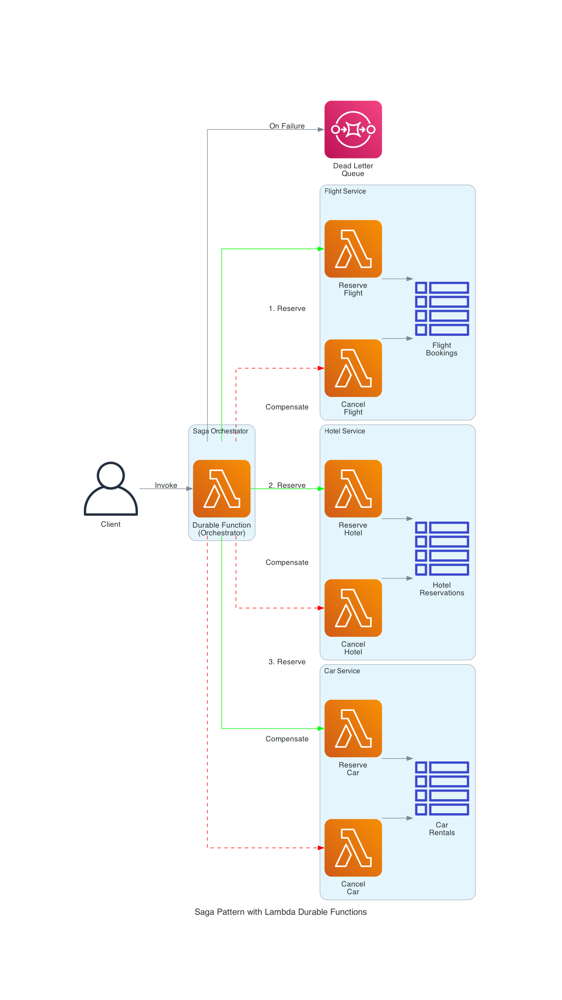
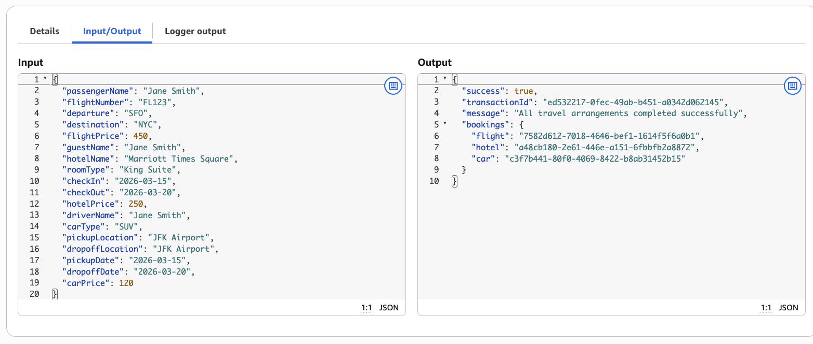
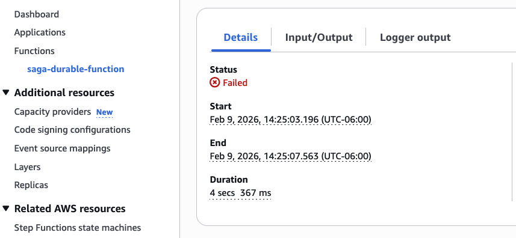

# Saga Pattern with AWS Lambda durable functions

This pattern implements the saga pattern for distributed transactions using AWS Lambda durable functions. The example deploys a travel booking system that coordinates flight, hotel, and car reservations with automatic compensating transactions on failure. If any reservation step fails, the orchestrator rolls back all previously completed steps in reverse order.

Important: this application uses various AWS services and there are costs associated with these services after the Free Tier usage - please see the [AWS Pricing page](https://aws.amazon.com/pricing/) for details. You are responsible for any AWS costs incurred. No warranty is implied in this example.

## Requirements

* [Create an AWS account](https://portal.aws.amazon.com/gp/aws/developer/registration/index.html) if you do not already have one and log in. The IAM user that you use must have sufficient permissions to make necessary AWS service calls and manage AWS resources.
* [AWS CLI](https://docs.aws.amazon.com/cli/latest/userguide/install-cliv2.html) installed and configured
* [Git](https://git-scm.com/book/en/v2/Getting-Started-Installing-Git) installed
* [Node.js 22+](https://nodejs.org/) installed
* [AWS CDK](https://docs.aws.amazon.com/cdk/v2/guide/getting_started.html) installed (`npm install -g aws-cdk`)
* [Python 3.11+](https://www.python.org/downloads/) installed (required for building the Lambda layer)

## Deployment Instructions

1. Create a new directory, navigate to that directory in a terminal and clone the GitHub repository:
    ```
    git clone https://github.com/aws-samples/serverless-patterns
    ```
1. Change directory to the pattern directory:
    ```
    cd saga-pattern-lambda-durable-functions/saga-pattern-cdk
    ```
1. Install dependencies:
    ```
    npm install
    ```
1. Build the Lambda layer containing the durable execution SDK:
    ```
    ./build-layer.sh
    ```
1. Bootstrap CDK (first time only):
    ```
    cdk bootstrap
    ```
1. Deploy the stack:
    ```
    npm run build
    cdk deploy
    ```

## How it works

The saga orchestrator is an AWS Lambda durable function that invokes six service functions sequentially — reserve flight, reserve hotel, reserve car — using `context.invoke()` calls that are automatically checkpointed. If any step fails, the orchestrator executes compensating transactions in reverse order (cancel car → cancel hotel → cancel flight) to restore consistency. All non-deterministic operations (UUID generation, timestamps) are wrapped in `context.step()` to ensure correct behavior during replay.

The stack deploys one durable orchestrator function, six service AWS Lambda functions, three Amazon DynamoDB tables, and one Amazon SQS dead letter queue for failed executions.



## Testing

The reserve functions include built-in failure flags (`failBookFlight`, `failBookHotel`, `failBookCar`) to simulate failures and trigger compensation. Test payloads are provided in `saga-pattern-cdk/`:

```bash
aws lambda invoke \
  --function-name saga-durable-function \
  --invocation-type Event \
  --cli-binary-format raw-in-base64-out \
  --payload file://test-success.json \
  response.json
```

Use `--invocation-type Event` (async) — the function returns 202 immediately and executes in the background. Check the AWS Lambda durable function console to view execution results:





You can also check Amazon CloudWatch Logs at `/aws/lambda/saga-durable-function` for detailed execution logs.

## Cleanup

```bash
cdk destroy
```

---

Copyright 2026 Amazon.com, Inc. or its affiliates. All Rights Reserved.

SPDX-License-Identifier: MIT-0
