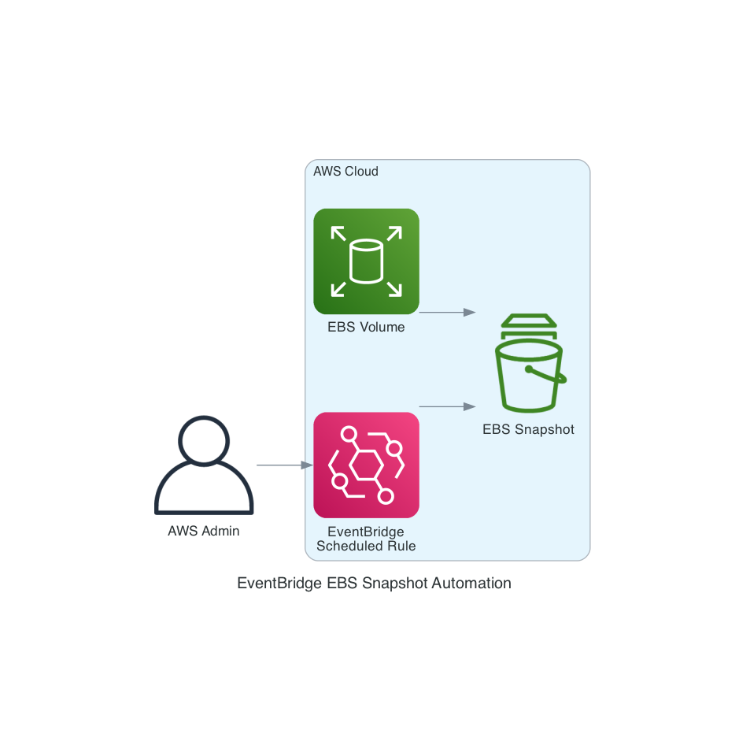

# Automated EBS Snapshot Creation on EC2 Shutdown using EventBridge

This pattern demonstrates how to automatically create EBS snapshots when an EC2 instance shuts down using EventBridge with direct EBS snapshot target integration. It helps protect data on stateful applications or self-managed databases by capturing the volume state during instance shutdown events, reducing data loss risk and increasing recovery flexibility. While this implementation targets a single EBS volume, the pattern can be extended for multiple volumes by either deploying multiple stacks or modifying the template to use a Lambda function that can snapshot all attached volumes.

## Architecture

EC2 Instance State Change → EventBridge Rule → EBS CreateSnapshot (Direct Target)



## Requirements

* [AWS CLI](https://docs.aws.amazon.com/cli/latest/userguide/install-cliv2.html) installed and configured
* [AWS SAM CLI](https://docs.aws.amazon.com/serverless-application-model/latest/developerguide/serverless-sam-cli-install.html) installed
* EBS Volume ID that you want to snapshot
* EC2 Instance ID to monitor for shutdown events

## Deployment

1. Clone and navigate to the pattern directory: sam-eventbridge-ebs-snapshot
2. Build the application:
   ```bash
   sam build
   ```
3. Deploy with guided prompts:
   ```bash
   sam deploy --guided
   ```
4. Follow the deployment prompts:
   - Stack Name: Enter `ebs-snapshot-automation` (default is `sam-app`)
   - AWS Region: Enter `us-east-1` (or your preferred region)
   - Parameter VolumeId: Enter your EBS Volume ID (e.g., `vol-0abcd123456ef7890`)
   - Parameter InstanceId: Enter your EC2 Instance ID (e.g., `i-0abcd123456ef7890`)
   - Confirm changes before deploy: Enter `Y`
   - Allow SAM CLI IAM role creation: Enter `Y`
   - Disable rollback: Enter `N`
   - Save arguments to configuration file: Enter `Y`

## How it Works

- EventBridge rule monitors EC2 instance state changes
- Rule triggers when the specified instance enters "shutting-down" or "stopping" state
- Rule directly targets EBS snapshot creation service using built-in target
- No Lambda functions or custom code required
- Snapshots are created automatically for the specified volume ID
- Pure infrastructure-as-code approach

## Scope and Limitations

- This pattern targets a single EBS volume specified via the VolumeId parameter
- It does not automatically detect or snapshot all volumes attached to an instance
- Works with EBS volumes of any size (snapshot creation is asynchronous and incremental)
- Only triggers on graceful EC2 state changes (stopping, shutting-down, terminated)
- Will not capture snapshots during abrupt failures where no state change event is emitted

### Multi-Volume Extension

To handle multiple volumes, you can:
1. Deploy multiple stacks of this pattern, each targeting a different volume
2. Modify the template to use a Lambda function that queries the EC2 API to discover and snapshot all volumes attached to the instance

## Use Cases

- Protecting stateful applications or self-managed databases running on EC2
- Preserving data during EC2 instance stop/terminate events (patching, maintenance)
- Safeguarding against accidental shutdowns during testing

## Testing

Stop or terminate the monitored EC2 instance, then check your EC2 console snapshots section. A snapshot will be created automatically when the instance shuts down.

## Cleanup

```bash
sam delete
```

**Note:** This will not delete existing snapshots. Clean up snapshots manually if needed.

---
Copyright 2024 Amazon.com, Inc. or its affiliates. All Rights Reserved.
SPDX-License-Identifier: MIT-0