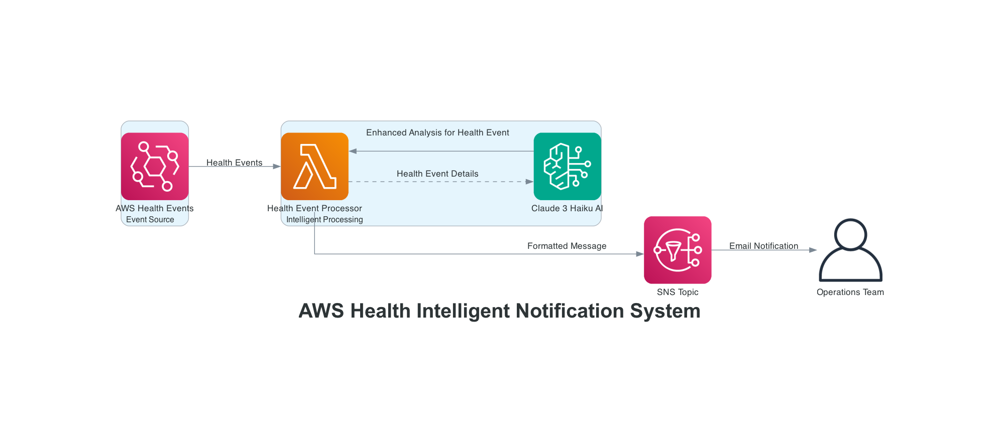

# AWS Health Intelligent Notification using Eventbridge, Lambda and SNS

This pattern demonstrates how to build an intelligent AWS Health event monitoring system that automatically captures health events, analyzes them using AI, and sends enhanced notifications.



Learn more about this pattern at Serverless Land Patterns: https://serverlessland.com/patterns/eventbridge-lambda-bedrock-sns-sam

Important: this application uses various AWS services and there are costs associated with these services after the Free Tier usage - please see the [AWS Pricing page](https://aws.amazon.com/pricing/) for details. You are responsible for any AWS costs incurred. No warranty is implied in this example.

## Requirements

* [Create an AWS account](https://portal.aws.amazon.com/gp/aws/developer/registration/index.html) if you do not already have one and log in. The IAM user that you use must have sufficient permissions to make necessary AWS service calls and manage AWS resources.
* [AWS CLI](https://docs.aws.amazon.com/cli/latest/userguide/install-cliv2.html) installed and configured
* [Git Installed](https://git-scm.com/book/en/v2/Getting-Started-Installing-Git)
* [AWS Serverless Application Model](https://docs.aws.amazon.com/serverless-application-model/latest/developerguide/serverless-sam-cli-install.html) (AWS SAM) installed
* [Amazon Bedrock access](https://docs.aws.amazon.com/bedrock/latest/userguide/model-access.html) with Claude 3 Haiku model enabled

## Deployment Instructions

1. Create a new directory, navigate to that directory in a terminal and clone the GitHub repository:
    ``` 
    git clone https://github.com/aws-samples/serverless-patterns
    ```
2. Change directory to the pattern directory:
    ```
    cd sam-eventbridge-lambda-sns
    ```
3. From the command line, use AWS SAM to build the serverless application:
    ```
    sam build
    ```
4. From the command line, use AWS SAM to deploy the AWS resources for the pattern as specified in the template.yml file:
    ```
    sam deploy --guided
    ```
5. During the prompts:
    * **Stack Name [sam-app]:** Enter a stack name (e.g., `health-notification-setup`)
    * **AWS Region [eu-west-1]:** Enter the AWS Region where you want the stack to be deployed
    * **Parameter EmailAddress [admin@example.com]:** Enter your email address to subscribe to SNS for enhanced health notifications
    * **Confirm changes before deploy [y/N]:** Enter `Y` to confirm deployment
    * **Allow SAM CLI IAM role creation [Y/n]:** Enter `Y` to allow SAM to create necessary IAM roles
    * **Disable rollback [y/N]:** Enter `N` to keep rollback enabled
    * **Save arguments to configuration file [Y/n]:** Enter `Y` to save settings for future deployments

    Once you have run `sam deploy --guided` mode once and saved parameters to a configuration file (samconfig.toml), you can use `sam deploy` in future to use these defaults.

6. Note the outputs from the SAM deployment process. These contain the resource names and/or ARNs which are used for testing.

7. Confirm the SNS email subscription by checking your email and clicking the confirmation link.

## How it works

When AWS Health events occur, EventBridge automatically captures them based on the configured rule pattern. The Lambda function processes these events and leverages Amazon Bedrock's Claude 3 Haiku model to generate intelligent summaries, impact assessments, and actionable recommendations. The enhanced analysis is then formatted and sent via SNS email notifications.

The AI analysis provides three key insights:
- A brief summary of the health event
- Potential impact on your AWS services  
- Specific recommended actions to take

This transforms basic health notifications into actionable intelligence, helping teams respond more effectively to AWS service issues.

## Testing

Since AWS Health events can only be published by AWS services and cannot be simulated through EventBridge, we test the pattern by directly invoking the Lambda function with a simulated health event. This approach demonstrates how the function processes health events, calls Bedrock for AI analysis, and sends enhanced notifications.

Once deployed, you can test the Lambda function directly to see the AI-enhanced notifications:

1. **Invoke the deployed Lambda function:**
   ```bash
   aws lambda invoke \
     --function-name <Your Lambda function Arn> \
     --payload file://test-event.json \
     --cli-binary-format raw-in-base64-out \
     response.json
   ```

2. **Check the results:**
   - View the response: `cat response.json`
   - Check your email for the AI-enhanced notification with:
     - Brief summary of the health event
     - Potential impact assessment
     - Actionable recommendations from Bedrock AI
   - Monitor logs: `aws logs tail /aws/lambda/your-function-name`

This demonstrates the complete workflow: EventBridge event → Lambda processing → Bedrock AI analysis → SNS email notification with intelligent insights.

## Cleanup
 
1. Delete the stack
    ```bash
    sam delete
    ```
2. During the prompts:
    * **Enter stack name you want to delete:** Enter your stack name (e.g., `health-notification-setup`)
    * **Are you sure you want to delete the stack [stack-name] in the region [region]? [y/N]:** Enter `y` to confirm stack deletion
    * **Are you sure you want to delete the folder [stack-name] in S3 which contains the artifacts? [y/N]:** Enter `y` to delete deployment artifacts
----
Copyright 2024 Amazon.com, Inc. or its affiliates. All Rights Reserved.

SPDX-License-Identifier: MIT-0