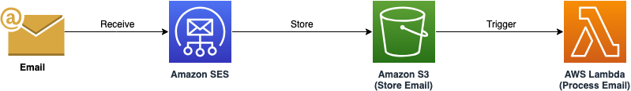

# Receive email by Amazon SES and store in Amazon S3 bucket

This shows how to receive email using Amazon SES and store in an Amazon S3 bucket. The email is processed by AWS Lambda based on S3 event notifications.

Learn more about this pattern at Serverless Land Patterns: https://serverlessland.com/patterns/ses-s3-lambda-sam

Important: this application uses various AWS services and there are costs associated with these services after the Free Tier usage - please see the [AWS Pricing page](https://aws.amazon.com/pricing/) for details. You are responsible for any AWS costs incurred. No warranty is implied in this example.

## Requirements

- [Create an AWS account](https://portal.aws.amazon.com/gp/aws/developer/registration/index.html) if you do not already have one and log in. The IAM user that you use must have sufficient permissions to make necessary AWS service calls and manage AWS resources.
- [AWS CLI](https://docs.aws.amazon.com/cli/latest/userguide/install-cliv2.html) installed and configured
- [Git Installed](https://git-scm.com/book/en/v2/Getting-Started-Installing-Git)
- [AWS Serverless Application Model](https://docs.aws.amazon.com/serverless-application-model/latest/developerguide/serverless-sam-cli-install.html) (AWS SAM) installed

## Prerequisite
- You must have a public hosted zone in Amazon Route 53. Please refer to the AWS documentation [creating a public hosted zone](https://docs.aws.amazon.com/Route53/latest/DeveloperGuide/CreatingHostedZone.html)

## Deployment Instructions

1. Create a new directory, navigate to that directory in a terminal and clone the GitHub repository:
   ```bash
   git clone https://github.com/aws-samples/serverless-patterns
   ```
2. Change directory to the pattern directory:
   ```bash
   cd ses-s3-lambda-sam
   ```
3. From the command line, use AWS SAM to deploy the AWS resources for the pattern as specified in the template.yml file:
   ```bash
   sam deploy -g
   ```
4. During the prompts:

   - Enter a stack name. 
   - Enter the desired AWS Region. Please refer to the [documentation](https://docs.aws.amazon.com/ses/latest/dg/regions.html#region-receive-email) for the list of supported regions.
   - Enter `DomainName`. This is your Route 53 public hosted zone name. Please refer to the prerequisite section for additional details.
   - Enter `ResourceRecords`. Depending on your selected region, please get the Email Receiving Endpoint from this [AWS Documentation](https://docs.aws.amazon.com/ses/latest/dg/regions.html#region-receive-email). Then you need to provide the value as `10 {Email Receiving Endpoint}`. For example, for US East N. Virginia region, please enter `10 inbound-smtp.us-east-1.amazonaws.com`. 
   - Leave rest of the options as default.

5. Note the outputs from the SAM deployment process. This contain the resource names and/or Ids which are used for next step as well as for testing.

6. From the command line, please execute the below command. Please replace `EmailReceiptRuleSet` from the `sam deploy` output and also your region. This will activate the Amazon SES ruleset to invoke the AWS Lambda function once it receives the email.
   ```bash
   aws ses set-active-receipt-rule-set  --rule-set-name {EmailReceiptRuleSet} --region {your-region}
   ```

7. By now, you should receive an email confirmation with subject line `DKIM setup SUCCESS for {DomainName} in {your-region}`. 


## How it works


Please refer to the architecture diagram below:



* User sends email to the configured domain in Amazon SES.
* Amazon SES receives the email and then applies the rule set to store the email in a Amazon S3 bucket. 
* The Amazon S3 bucket object creation event triggers an AWS Lambda function.
* The AWS Lambda processes the email from the Amazon S3 bucket.

## Testing


1. From the command line, please execute the below command to tail logs of the AWS Lambda function. Please replace `FunctionName` from the `sam deploy` output and also your region. 
   ```bash
   aws logs tail --follow /aws/lambda/{FunctionName} --region {your-region}
   ```


2. Make a note of `ReceivingEmailAddress` from the `sam deploy` output and send email to that email id. Send an email to this Id. You can also attach a file in your email.


3. You should see logline similar to following in the Lambda function log: 
   ```bash
     Received email from {your-email}
     Subject: {your-email-subject}
     Body: {your-email-content}
     Attachement: {your-attached-file-name}
   ```

4. Press `Ctrl + C` to come out of the AWS Lambda log tailing.

## Cleanup

1. Disable the Amazon SES rule set using the following CLI command:
   ```bash
   aws ses set-active-receipt-rule-set --region {your-region}
   ```

2. Delete the content in the Amazon S3 bucket using the following command. Please update `EmailBucketName` from the `sam deploy` output. Please *ensure* that the correct bucket name is provided to avoid accidental data loss:
   ```bash
   aws s3 rm s3://{EmailBucketName} --recursive --region {my-region}
   ```

3. To delete the resources deployed to your AWS account via AWS SAM, run the following command:
   ```bash
   sam delete
   ```

---

Copyright 2024 Amazon.com, Inc. or its affiliates. All Rights Reserved.

SPDX-License-Identifier: MIT-0
